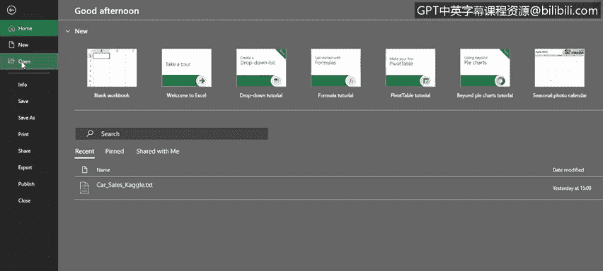
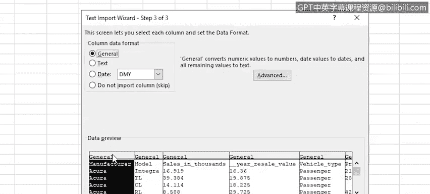
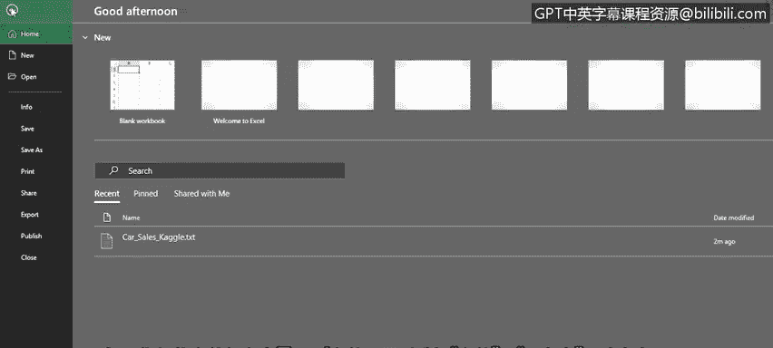
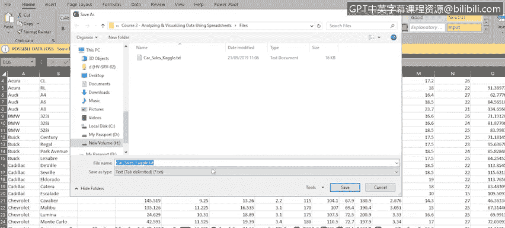
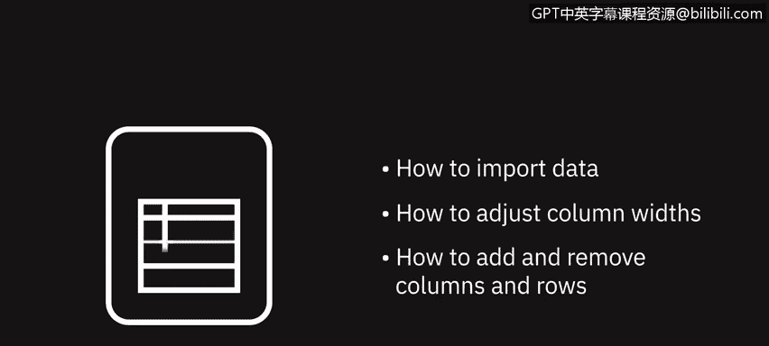

# 012：导入文件数据

在本节课中，我们将学习如何将外部文本文件中的数据导入到Excel中。你将掌握使用文本导入向导处理数据、调整列宽以及增删行列的方法。这些技能对于处理来自不同来源的数据至关重要。


---

## 📁 认识文本文件数据

上一节我们讨论了数据质量的重要性，本节中我们来看看如何从文本文件中导入数据。

默认情况下，Excel处理的是 `.xlsx` 或 `.xls` 格式的工作簿文件。但Excel也能处理其他格式的数据，例如纯文本文件，或使用逗号、制表符分隔的数据文件。这类文件通常以 `.txt` 扩展名保存（称为文本文件），或以 `.csv` 扩展名保存（称为CSV文件）。

以下是一个在记事本中打开的文本文件示例，它包含了汽车销售数据，并使用逗号分隔值（CSV）来分隔每条记录中的各个数据字段。

```
manufacturer,model,engine size,...
```

请注意，首行包含诸如“manufacturer”、“model”、“engine size”等标题，每个标题之间用逗号分隔。我们希望这些在导入Excel后成为列标题。


标题行下方是第一行实际数据。同样，每个数据字段也用逗号分隔。该文件共有16个标题，标题下方的每行数据也包含16个字段。

---

## 🧙‍♂️ 使用文本导入向导

要将文件在Excel中打开，请选择 **文件 > 打开**，然后从最近使用列表中选择文件，或点击“浏览”找到要导入的文件。

打开文件时，**文本导入向导**会自动启动，并尝试判断文件类型。向导检测到这是一个**分隔文件**，即数据字段由特定字符（如逗号或制表符）分隔的文件。

由于我们希望文件中的标题行成为Excel的列标题，需要勾选 **“我的数据包含标题”** 选项。下方的预览框会显示数据的迷你预览。



点击 **“下一步”** 继续。

在向导的第二步中，需要选择**分隔符**，即分隔数据字段的字符。我们选择 **“逗号”** 并取消选择其他选项。此时数据预览会展示导入后的数据样式。

你可以滚动预览窗口，确保数据呈现符合预期。确认无误后，继续向导。

在第三步中，可以为每一列设置**数据格式**，例如将某列改为文本或日期格式。本例中，我们接受默认的“常规”格式，完成导入向导。

---

## 🔧 调整数据布局



数据导入Excel后，文本文件中的标题已成为列标题。但你可能注意到，部分列未能完整显示所有数据：有些标题显示不全，有些数据单元格中只显示一串 `#####` 符号。

这是因为某些列的宽度不足。要解决此问题，可以手动调整列宽，也可以批量调整。

以下是调整列宽与行高的方法：

*   **调整单列/单行**：拖动列标或行号之间的分隔线。
*   **批量调整所有列**：首先选中所有列（点击列标区域左上角的全选按钮或按 `Ctrl+A`），然后双击任意选中的列分隔线。
*   **自动调整行高**：双击行号之间的分隔线。

有时，导入的数据包含不需要的列。例如，我们决定删除“vehicle type”和“latest launch”这两列。

以下是增删行列的操作步骤：

*   **删除列**：选中要删除的列，在 **“开始”** 选项卡的 **“单元格”** 组中，点击 **“删除”** 下拉菜单，选择 **“删除工作表列”**。或者，右键点击选中的列，选择 **“删除”**。
*   **添加列**：在希望插入新列的位置右侧选中一列，右键点击，选择 **“插入”**。然后为新列命名，例如“year”。
*   **删除行**：选中要删除的行，右键点击，选择 **“删除”**。
*   **添加行**：在希望插入新行的位置下方选中一行，右键点击，选择 **“插入”**。

---

## 💾 保存为Excel文件

处理完数据后，你可能希望将其保存为标准的Excel文件格式。

有两种方法：
1.  选择 **文件 > 另存为**。
2.  或者，点击导入文件时出现在工作表顶部的黄色提示条中的 **“另存为”**。

在 **“另存为”** 对话框中，于 **“保存类型”** 框中选择 **“Excel工作簿 (*.xlsx)”**。

---

## 📝 本节总结





本节课中，我们一起学习了：
1.  如何使用**文本导入向导**导入分隔符格式的文本文件数据。
2.  如何通过拖动或双击分隔线来**调整列宽和行高**。
3.  如何通过右键菜单或功能区命令**添加和删除行与列**。

掌握从外部文件导入并初步整理数据的技能，是进行有效数据分析的第一步。

---




在下一视频中，我们将讨论数据隐私的重要性，包括敏感信息和个人身份数据的处理。