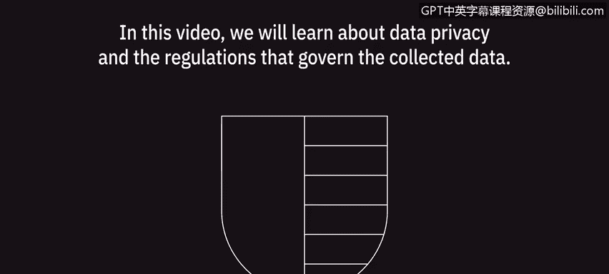
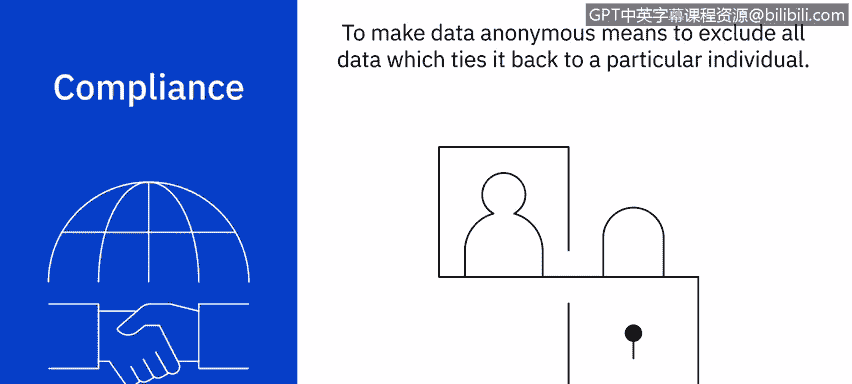
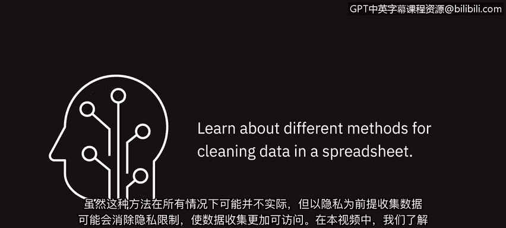

# 013：数据隐私基础 🔒

在本节课中，我们将学习数据隐私以及管理所收集数据的相关法规。理解这些内容对于数据分析师至关重要，它能帮助我们避免法律风险并维护客户信任。

## 数据隐私的重要性与核心原则

当收集客户数据时，有具体的法规规定了这些数据的使用方式。通过理解数据隐私法规并熟悉以下三个基本原则，你可以消除遭受经济处罚的风险并保持客户的信任。

以下是数据隐私的三个核心原则：

1.  **保密性**：这是数据隐私的重要元素，它承认客户的个人信息属于客户本人。
2.  **收集与使用**：必须规范数据的收集方式和用途。
3.  **合规性**：必须遵守所有相关的法律法规。

## 个人数据的类型

上一节我们介绍了数据隐私的基本原则，本节中我们来看看数据分析师在工作中可能接触到的不同类型个人数据。分析师必须能够识别这些数据。

以下是三种主要的个人数据类型：

*   **个人信息**：任何可以追溯到特定个人的信息，例如电子邮件或图像。
*   **个人可识别信息**：可用于识别个人的特定信息，例如社会安全号码或驾驶执照号码。
*   **敏感个人信息**：此类信息不一定能识别特定个人，但包含需要保护的私人信息，因为如果公开，可能会对个人造成伤害。例如关于种族、性取向、生物识别或遗传信息的数据。

通过理解个人数据及其相关法规，我们可以通过移除不必要的信息来有效地**匿名化**我们的数据。这类操作有助于建立客户信心，并促进信息的自由流动。

## 地域与行业特定法规

在筛选数据时，分析师必须了解数据收集公司的所在地以及数据提供者的所在地。了解数据收集地是数据隐私的一个基本要素，也决定了必须适用哪些法规。

以下是几个关键的地域性法规示例：

*   **通用数据保护条例**：这是欧盟的特定法规，仅适用于欧盟境内的个人管辖范围。
*   **巴西通用数据保护法**：巴西的一项新法律，适用于巴西境内的个人，而不考虑数据处理者的位置。
*   **加州消费者隐私法案**：由于美国没有全国统一的数据隐私法，加州制定了此法案以更好地保护客户数据。

此外，还有行业特定的法规来管理敏感和个人数据的收集与使用。例如：

*   在医疗保健领域，**HIPAA**隐私规则管理受保护健康信息的收集和披露。
*   在零售业，**PCI**标准管理信用卡数据，未能保护持卡人信息可能导致巨额罚款。

对这些政策有基本了解后，我们就能在处理任何敏感信息时保持合规。不幸的是，客户数据泄露事件屡见不鲜，因此了解如何保持合规至关重要。

## 合规实践与案例

理解欧盟、美国及其他国家和行业的数据隐私法规是确保数据安全的关键。公司必须始终遵守这些隐私法规，并确保员工能够方便地获取相关政策。

例如，假设一名数据分析师下载了一份包含敏感信息的电子表格。为了在周一早上完成报告，该分析师决定周末将工作笔记本电脑带回家。开车回家后，分析师不小心将笔记本电脑留在了车里。第二天早上，他们发现汽车连同笔记本电脑一起被盗。由于公司有责任保护客户数据安全，当数据离开公司财产时，就构成了隐私泄露。

这种行为不仅可能使公司面临巨额罚款，还可能降低客户信心，从而对收入产生重大影响。

## 数据匿名化

虽然数据隐私适用于大多数收集的数据，但在某些情况下这些法规并不适用。为了使这些法律和法规不适用，特定的数据收集必须是完全匿名的。

使数据匿名化意味着排除所有能将其与特定个人关联起来的数据。虽然这种方法在所有情况下可能都不切实际，但在收集数据时考虑到隐私问题，可以消除隐私限制，使数据收集更加便捷。

## 课程总结

本节课中，我们一起学习了数据隐私的重要性，以及数据分析师在收集和筛选数据时可能面临的挑战。我们探讨了个人数据的类型、关键的地域与行业法规，以及通过匿名化保护数据的方法。在下一课的视-频中，我们将学习在电子表格中清洗数据的不同方法。