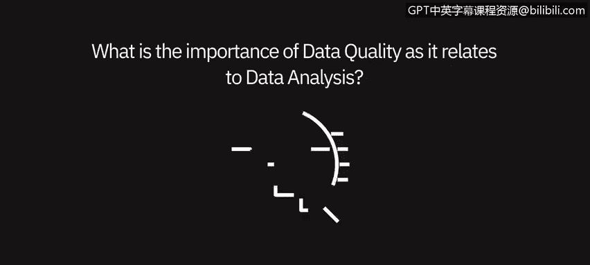
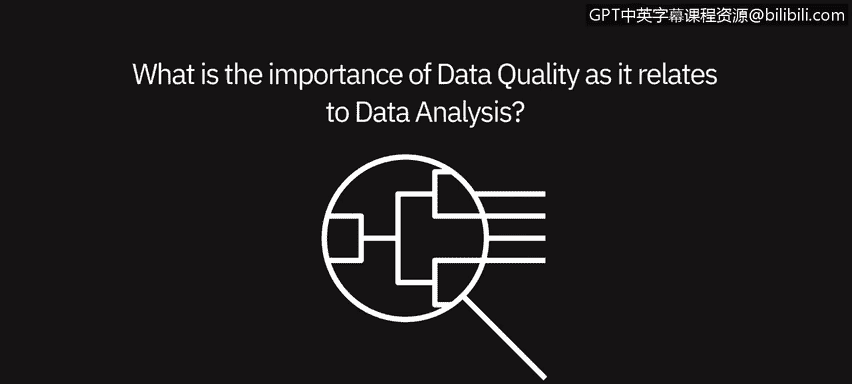
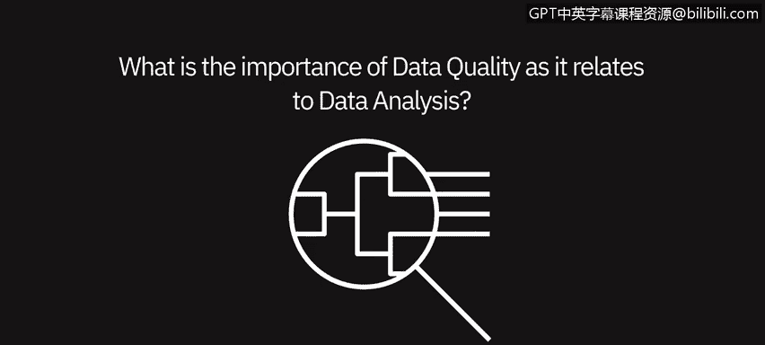
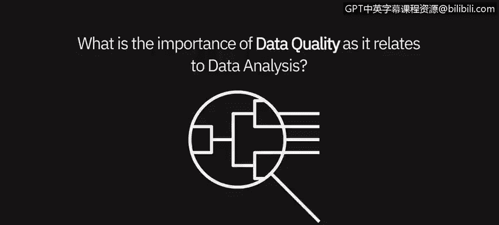
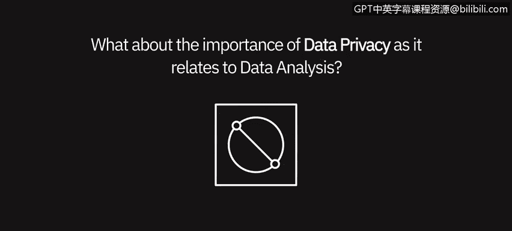

# 014：数据质量与隐私的重要性 🔒📊

在本节课中，我们将聆听几位数据专业人士的见解，探讨数据质量和数据隐私在数据分析中的重要性。

---

## 数据质量的重要性

上一节我们介绍了课程概述，本节中我们来看看数据质量为何如此关键。数据质量对于数据和分析至关重要。原因在于，一旦你呈现的内容与他人预期不符，他们首先会质疑数据的来源、处理过程以及转换方式。

人们通常认为自己了解业务。当你开始挑战这种认知时，如果你没有高质量、干净且来自可信来源的数据作为依据，就会陷入大量讨论和争论，最终导致你想要传达的核心观点被淹没。

任何成功的数据分析项目的基石都是高质量的数据。计算机科学中有一个常见术语：**垃圾进，垃圾出**。其核心含义是，如果你输入低质量的数据，就只能得到低质量的结果。

因此，在进行数据分析时，没有什么比确保你使用的是高质量数据更重要了。亲自对数据进行合理性检查，并确信所用数据质量极高，这一点非常重要。

数据准确性高于一切。分析低质量的数据是浪费时间，并且可能误导业务方向。你所使用或提供给他人使用的数据的完整性至关重要。数据被用来决定产品发布的时间或地点，判断某个部门是否盈利。如果不注意细节，很容易混淆事实。

以下是数据质量不佳可能导致的具体问题：

*   **决策失误**：以库存为例，如果你在SKU级别分析库存，却不小心选错了SKU进行分析，进而得出某个产品不盈利的结论，而事实恰恰相反。这对公司来说是一个重大的决策错误。
*   **资源浪费**：如果从一开始就使用了有问题的数据，并在此基础上进行构建，后来才发现问题，你将损失时间、精力和努力，在某些情况下还会失去信任。

---

## 数据隐私的重要性

了解了数据质量的核心地位后，我们接下来探讨另一个关键议题：数据隐私。数据隐私极其重要，尤其是在制药或医疗保健等行业，但其重要性远不止于此。

我们必须有能力确保用户根据其角色和权限获得相应级别的数据。这可以通过多种方式实现，例如，为每个地区或职能提供特定的数据切片；或者在某些工具（如认知分析工具）中，将其作为模型的一部分进行构建，明确规定谁可以访问什么，无论是精细到“此人可以查看加拿大或美国的数据”，还是简单地控制“此人能否查看完整报告”。

在当今世界，数据隐私是一个重大问题。以税务方面为例，在我们的业务中，有所谓的PII（个人可识别信息），我们必须保护它。因此，我们不能简单地通过电子邮件发送包含此类信息的文件。

我们不会通过电子邮件发送包含敏感PII数据的报税表或任何文件。我们会对其进行加密，确保邮件本身加密，或使用特定软件来隐藏社会安全号码、姓名或出生日期等信息。这些信息会以特定序列呈现，我们通过电话与客户共享该序列，绝不会将其与加密信息放在同一封邮件中，以确保始终安全。我们必须不惜一切代价确保数据受到保护。

---

## 课程总结

本节课中，我们一起学习了数据分析和数据管理中的两个基石概念。

*   **数据质量**是分析有效性的根本。遵循“**垃圾进，垃圾出**”的原则，使用高质量、准确、干净的数据是得出可靠见解和做出正确商业决策的前提。低质量的数据会导致资源浪费和方向误导。
*   **数据隐私**是法律和伦理要求。尤其是在处理个人可识别信息时，必须采取严格措施（如加密、权限控制、安全通信等）来保护数据，遵守法规并维护客户信任。

确保数据质量与维护数据隐私，共同构成了负责任且成功的数据分析实践的基础。