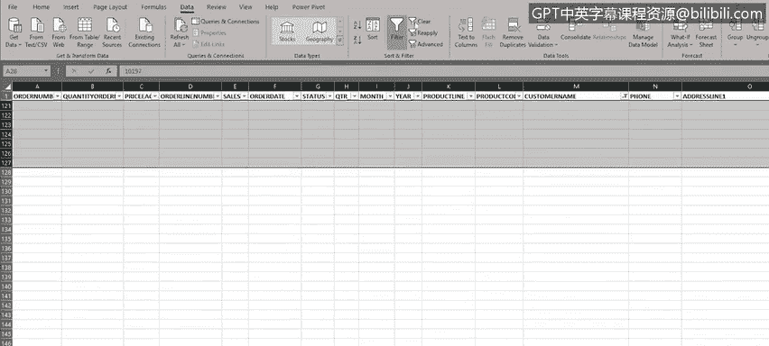
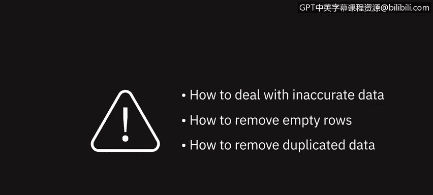

# 015：删除重复或不准确的数据和空行

在本节课中，我们将学习如何处理数据中的不准确信息、删除空行以及移除重复数据。这些操作是数据清洗的基础步骤，能显著提升数据质量，确保后续分析的准确性。

## 概述

数据在收集或导入过程中，常会出现各种错误和不一致。这些错误可能包括拼写错误、多余空格、大小写不一致、空行、缺失值、不准确或重复的数据。这些问题会导致公式失效、排序和筛选操作失败，进而影响数据可视化和分析结果的呈现。因此，执行数据清洗是提高数据可用性的关键。

## 检查并修正拼写错误

上一节我们介绍了数据清洗的重要性，本节中我们来看看如何从基础的拼写检查开始。

Excel的拼写检查功能与Microsoft Word等文字处理软件类似。首先，需要选中希望检查的数据区域。

以下是操作步骤：
1.  选中包含“产品线”数据的K列。
2.  点击“审阅”选项卡中的“拼写检查”按钮。
3.  检查完成后，可继续检查其他列，例如包含国家信息的T列。
4.  当发现拼写错误时，若认可建议的更正，点击“更改”；也可从列表中选择其他建议，或确认数据无误后点击“忽略”。
5.  按此方法，继续检查并修正“交易规模”等列中的拼写错误。

## 查找并删除空行

处理完拼写问题后，接下来我们需要解决数据中的空行。空行会阻碍数据导航、影响公式计算以及排序筛选功能。

例如，使用 `Ctrl + ↓` 快捷键试图跳转到数据列末尾时，光标会在空行处停止，这表明数据集被空行分割成了多个部分。

对于少量数据，可以手动滚动查找并删除空行。但对于海量数据，这种方法效率低下。

以下是利用筛选功能高效删除空行的步骤：
1.  使用鼠标或 `Ctrl + Shift + End` 快捷键选中整个数据区域。
2.  在“数据”选项卡中，点击“筛选”按钮。
3.  点击“客户名称”列（M列）的筛选图标。
4.  取消勾选“全选”，然后滚动到列表底部，勾选“空白”项，点击“确定”。
5.  此时，表格顶部将只显示所有空行（可通过行号识别，如28、29、65等行会以蓝色高亮显示在顶部）。
6.  选中这些空行，右键删除。
7.  最后，清除筛选以恢复查看完整数据。

删除空行后，再次使用 `Ctrl + ↓` 快捷键即可顺利跳转到数据列末尾。

## 识别并删除重复数据

清除了空行，数据看起来整洁了一些。但重复的数据行也是常见问题，通常由人工输入错误或导入过程故障导致。

Excel提供了两种删除重复项的方法，第一种方法更安全，因为它允许我们在删除前预览数据。

**方法一：使用条件格式标记重复项（推荐）**

此方法的关键是选择一个理论上不应出现重复值的列。例如，“销售额”列（E列）比“单价”列更可能具有唯一性。

操作步骤如下：
1.  选中“销售额”列（E列）。
2.  在“开始”选项卡中，点击“条件格式” -> “突出显示单元格规则” -> “重复值”。
3.  点击“确定”后，重复的数值会被标记出来。
4.  检查被标记的行，确认是否为需要删除的完全重复条目（例如，发现第74至78行是第36至40行的重复，且属于错误录入）。
5.  手动选中并删除这些确认的重复行。

**方法二：直接使用“删除重复项”功能**

这种方法更简单快捷，但无法在删除前审查具体是哪些行将被移除。

操作步骤如下：
1.  选中整个数据表。
2.  在“数据”选项卡中，点击“删除重复项”按钮。
3.  在弹出的对话框中，取消勾选所有列，然后仅勾选“销售额”列。
4.  点击“确定”，Excel将直接删除基于该列判断的重复行。

## 使用查找和替换修正数据

最后，我们来看一个使用“查找和替换”功能批量修正特定错误的例子。例如，收到客户反馈，其姓氏在订单中被错误拼写。

操作步骤如下：
1.  在“开始”选项卡中，点击“查找和选择” -> “替换”。
2.  在“查找内容”框中输入拼写错误的姓氏。
3.  点击“查找全部”，所有匹配项会列出。
4.  在“替换为”框中输入正确的姓氏拼写。
5.  点击“全部替换”，即可一次性修正所有错误。

## 总结

本节课中，我们一起学习了数据清洗的几项核心操作：如何利用拼写检查修正文本错误、如何通过筛选功能定位并删除空行、如何使用**条件格式**和**“删除重复项”** 功能两种方式处理重复数据，以及如何运用**查找和替换**工具批量修正特定错误。掌握这些技能，能有效提升原始数据的质量，为后续的数据分析工作打下坚实基础。

在下一视频中，我们将学习如何统一文本大小写、修正日期格式错误以及清理数据中的多余空格。