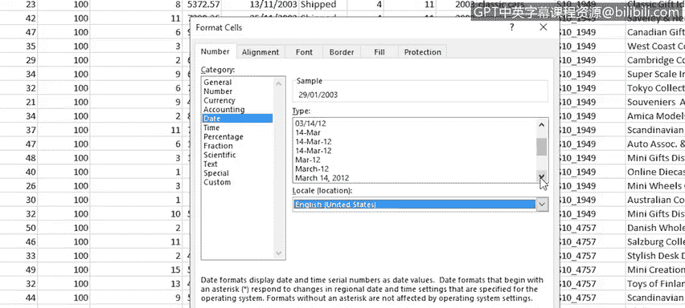

# 016：处理数据中的不一致性 📝

在本节课中，我们将学习如何处理数据中的不一致性问题，包括文本大小写转换、日期格式修正以及清除多余空格。这些技能对于确保数据质量至关重要。

上一节我们介绍了如何处理不准确数据、删除空行和重复行。本节中，我们来看看如何通过改变文本大小写、修正日期格式和修剪数据中的空格来进一步提升数据的一致性。

## 转换文本大小写 🔠

从不同来源收集或接收数据时，数据中的文本大小写常常不一致。有些是大写，有些是小写，有些是首字母大写（也称为句首大写）。Excel没有像Microsoft Word那样的“更改大小写”按钮，因此需要使用函数来执行此数据清理任务。

以下是用于更改文本大小写的三个主要函数：
*   **`UPPER`函数**：将文本转换为全部大写。
*   **`LOWER`函数**：将文本转换为全部小写。
*   **`PROPER`函数**：将文本转换为每个单词首字母大写。

### 使用PROPER函数

假设标题行全部使用大写字符，若想将其转换为首字母大写，需要添加一个辅助行来放置函数。

1.  在辅助行（例如A2）中输入公式：`=PROPER(A1)`
2.  按Enter键，A2单元格将显示转换后的结果。
3.  要快速将公式填充到多列，可以先选中从A2到目标列（如X2）的单元格区域。
4.  按F2将光标聚焦到A2单元格，然后按住Ctrl键并按Enter键，公式将自动填充到所有选中的单元格。
5.  复制辅助行的内容，在原始标题行选择“粘贴值”选项。
6.  最后，删除辅助行。

### 使用UPPER和LOWER函数

处理数据列时，通常插入辅助列。

以下是使用UPPER函数将文本从首字母大写转换为全部大写的步骤：
1.  在要更改的列右侧插入一个辅助列。
2.  在辅助列的第一个数据单元格（例如T2旁的新单元格）输入公式：`=UPPER(T2)`
3.  按Enter键，结果将显示为大写的国家名称。
4.  双击填充柄将公式复制到该列的其余部分。
5.  复制辅助列的内容，在原始列选择“粘贴值”选项。
6.  删除辅助列。

使用LOWER函数将文本转换为小写的步骤与之类似：
1.  插入辅助列。
2.  输入公式：`=LOWER(K2)` （假设K列为产品线数据）
3.  按Enter键并向下填充公式。
4.  复制辅助列的值并粘贴到原始列，然后删除辅助列。

## 修正日期格式 📅

收到的数据经常混合使用不同的日期格式，或使用不适合您所在区域的格式。Excel允许您轻松更改日期显示方式。

例如，当前日期格式为“DD/MM/YYYY”（英国格式），您想改为美国格式。

1.  选中日期单元格，打开“设置单元格格式”对话框。
2.  在“区域设置”中，将“英语（英国）”更改为“英语（美国）”。
3.  从列表中选择所需的日期格式，例如“March 14, 2012”。
4.  点击“确定”应用格式。

若要创建自定义日期格式（如“14 Mar 2012”）：
1.  在“数字”选项卡中选择“自定义”。
2.  选择一个相近的现有格式并进行修改。例如，输入代码：`dd mmm yyyy`
3.  使用格式刷或通过“自定义”格式列表，将此新格式应用到整列。

## 清除多余空格 ✂️

数据中可能存在多余空格，包括开头空格、结尾空格以及单词间的多余空格。

### 使用查找和替换功能

此功能适用于清除明显的多余空格，如双空格。

1.  选中所有数据。
2.  在“开始”选项卡中，点击“查找和选择” -> “替换”。
3.  在“查找内容”框中输入两个空格。
4.  在“替换为”框中输入一个空格。
5.  点击“查找下一个”，然后对每个需要更改的项点击“替换”。若确认所有双空格均需替换，可点击“全部替换”以节省时间。

### 使用TRIM函数

查找和替换无法安全地移除单词开头和结尾的单空格，否则会误删单词间的合法空格。`TRIM`函数专用于清除文本首尾的所有空格，并将文本内部的连续空格减少为一个。

1.  在需要清理的数据列旁插入一个辅助列。
2.  在辅助列的第一个数据单元格输入公式：`=TRIM(M2)` （假设M列包含带空格的数据）
3.  按Enter键，然后双击填充柄将公式复制到该列其余部分。
4.  复制辅助列的内容，在原始列选择“粘贴值”选项。
5.  删除辅助列。此时，多余空格已被成功清除（修剪）。

本节课中，我们一起学习了如何利用`UPPER`、`LOWER`、`PROPER`函数转换文本大小写，如何调整日期格式以适应不同区域或自定义需求，以及如何结合“查找和替换”与`TRIM`函数来清除数据中的多余空格。这些操作能有效提升数据的规范性与一致性，为后续分析打下良好基础。

在下一个视频中，我们将讨论如何使用Excel的“快速填充”和“分列”功能来帮助清理数据。