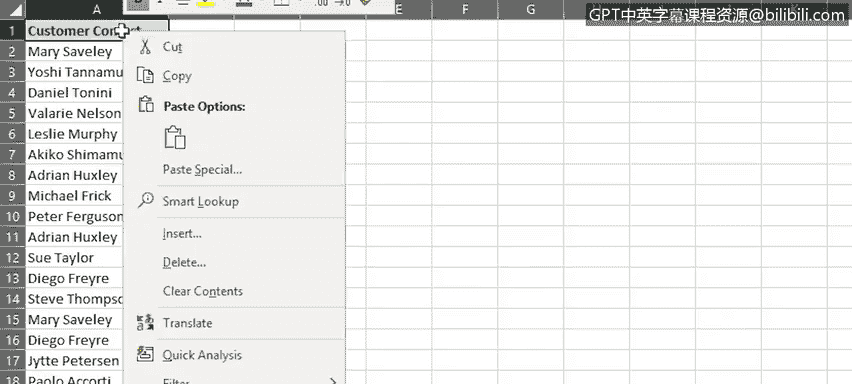
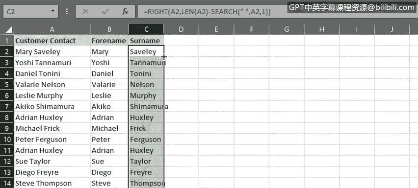

# 017：用于清洗数据的更多Excel功能 🧹

在本节课中，我们将学习如何使用Excel中的“快速填充”和“分列”功能来帮助清洗数据。上一节我们介绍了如何更改文本大小写、调整日期格式以及修剪数据中的空格。本节中，我们将探讨这两个强大的工具，它们能高效地处理数据拆分与合并任务。

## 使用“快速填充”合并数据列

“快速填充”功能能识别数据模式并自动填充。在之前的课程中，我们曾简要使用它来快速输入符合特定模式的数据，例如月份或星期名称。它同样可作为数据清洗工具，例如将包含全名的列拆分为“名”和“姓”两列，或修改列中名称的命名约定。

以下是使用“快速填充”将两列姓名合并为一列的操作步骤：

1.  首先，插入一个辅助列，可将其命名为“联系人姓名”。
2.  在新列的第一行，以您希望的格式输入第一个联系人的全名。例如，可以是“姓, 名”或“名 姓”等格式。本例中，我们使用“名 姓”的标准格式，中间用空格分隔，然后按回车键。
3.  接下来，开始输入第二个联系人的姓名。此时，“快速填充”会显示剩余姓名的预览。
4.  如果对预览内容满意，只需按回车键，Excel便会自动填充该列中剩余的姓名。

此功能甚至能处理其中一列包含两个名字的情况（例如“Wing C”或“Dauna”）。操作完成后，如果不再需要原始列，可以将其删除。

## 使用“快速填充”修改命名约定

在上一任务中，我们看到了如何使用“快速填充”将两列数据合并为一列。现在，让我们看看如何使用它来修改列中的命名约定。

1.  切换到目标工作表（例如“客户联系人”工作表）。
2.  在下一列（例如B列）的第一个数据行（B2单元格）中，键入第一个联系人的姓名，使用您想要的任何命名约定（例如“姓, 名”），然后按回车键。
3.  同样，当我们在下一行（B3单元格）开始输入第二个联系人姓名时，“快速填充”会检测到模式，并在我们按回车键后自动填充B列中剩余的姓名。

之后，您可以复制粘贴列标题，并删除原始的A列。

**注意**：“快速填充”无法将包含两个名字的单个列拆分为两个单独的列。要完成此操作，我们需要使用“分列”功能。

## 使用“分列”功能拆分数据

顾名思义，“分列”功能可以将包含多部分文本的列拆分为一个或多个其他列。这与“快速填充”不同。这对于将任何多部分文本（如姓名或地址）拆分为单独的组成部分非常有用。

以下是使用“分列”功能拆分姓名的步骤：

1.  打开目标工作表（例如“客户联系人”工作表）。
2.  为接下来的两列添加列标题，并复制第一列标题使用的单元格格式，然后调整列宽。
3.  选择A列中从A2到A23的数据。
4.  在“数据”选项卡上，单击“分列”，这将启动向导。
5.  在向导的第一页，确保选择“分隔符号”。
6.  在第二页，确保仅选择“空格”作为分隔符。
7.  在向导的第三页，单击“目标区域”旁边的小箭头，在工作表上选择B2单元格，然后单击小箭头返回向导。至此，向导设置完成。

现在，您可以看到A列中的完整客户联系人姓名已成功拆分为B列和C列中的两个新列。如果不再需要A列，可以将其删除。

## 使用函数实现相同效果

您也可以使用函数实现相同的结果。如果您使用的是Excel网页版（在线版本），这将非常必要，因为该版本没有“分列”功能。此外，使用函数提供了更大的灵活性，这在处理复杂和混合的姓名时尤其有用（例如包含连字符的姓名、有些有中间名、有些有两个中间名首字母、有些没有中间名首字母）。

以下是使用函数拆分姓名的示例步骤：

1.  再次打开“客户联系人”工作表。
2.  为接下来的两列添加列标题，复制第一列标题的单元格格式，并调整列宽。
3.  在B2单元格中输入公式以提取名字部分。例如，公式 `=LEFT(A2, 5)` 可以从A2单元格的左侧开始提取5个字符（包括空格）。
4.  在C2单元格中输入公式以提取姓氏部分。例如，公式 `=RIGHT(A2, 7)` 可以从A2单元格的右侧开始提取7个字符。
5.  双击B2单元格的填充柄，使用“自动填充”完成该列。
6.  对C2单元格的填充柄执行相同操作，以完成该列的填充。

## 总结

本节课中，我们一起学习了如何使用Excel中的“快速填充”和“分列”功能来帮助清洗数据。我们探讨了如何利用“快速填充”合并列或修改数据格式，以及如何使用“分列”功能将单列数据拆分为多列。此外，我们还了解了在特定情况下如何使用函数替代“分列”功能来完成数据拆分任务。掌握这些工具将大大提高您处理和组织数据的效率。