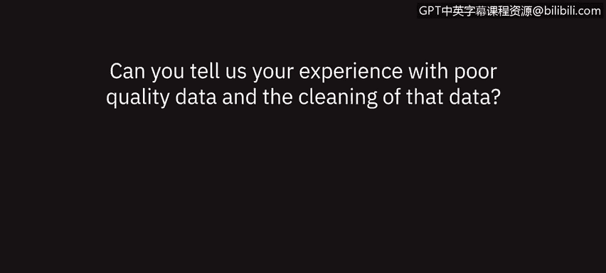

# 018：数据质量问题 👁️🗨️

在本节课中，我们将聆听几位数据专业人士围绕数据质量问题的讨论，了解低质量数据带来的挑战以及数据清洗的重要性。

## 概述

数据质量是数据分析工作的基石。低质量的数据会导致分析结果不准确，甚至引发错误的商业决策。本节我们将通过专业人士的亲身经历，理解数据质量问题的常见表现、影响以及确保数据质量的最佳实践。

## 数据质量问题的普遍性与影响

多位专家指出，处理低质量数据是数据分析工作中的常态。一位在医疗保健领域工作的分析师提到，其大部分时间都花在了数据清洗和验证上。

> 人类无法被标准化校准。两个人面对相似的情况，看法可能略有不同。因此，需要由我来确保，如果一个人将某物描述为“海军蓝”，而另一个人描述为“深蓝色”，我会将其统一为“蓝色”。

这个例子说明，在分析之前，必须检查信息的完整性，以确保结果的准确性。现实世界中，没有数据是完美的。数据通常为最广泛的目的而收集，但往往存在缺失，或格式不符合特定分析需求的情况。

## 数据清洗与转换的必要性

以下是数据清洗中常见的活动：

*   **格式标准化**：例如，将日期和时间从单个字段中拆分出来，以便按日、月、季度进行分析。
*   **数据验证**：确保所有数据已被正确捕获，例如，某个月份的收入数据是否完整。
*   **逻辑一致性检查**：在财务分析中，需核实所有成本是否与所分析期间相关，数据在方向上是否正确。

通过这些清洗和转换活动，可以使数据变得具体、可用，并符合你的工作方式。

## 低质量数据的具体案例与后果

一位有财务背景的专业人士分享了其经历：在审查财务报表、计算利润率时，低质量数据会带来严重问题。

> 如果数据不正确或不属于当期，就需要对存储数据的总账进行调整，以正确反映实际情况。

低质量数据会引发不必要的讨论，导致你对自己的分析产生怀疑，无法坚定、可靠地呈现你的案例和数据。这会直接影响决策的效率和信心。

## 应对策略与最佳实践

如果遇到数据质量问题，可以采取以下几种应对策略：

*   **追溯源头**：回到数据源头，确保源数据被正确提取。
*   **明确记录**：使用类似知识目录的工具，清晰、直接地记录对数据所做的所有转换或更改，并向受众展示这些过程。
*   **及时修正**：在筛选和排序数据时，如果发现错误，必须返回修正。否则，本可用于其他工作的时间就被浪费了。

不断重做或重复数据的某些部分，会使数据完整性受到质疑，并且坦白说，如果习惯性地这样做，会令人感到沮丧。

## 总结

本节课中，我们一起学习了数据质量在数据分析中的核心地位。我们了解到，低质量数据普遍存在，可能导致分析错误、决策延误和信任危机。通过注重细节、在早期进行数据清洗和验证、并清晰记录数据处理过程，可以显著提升数据质量，从而节省时间，增强分析结果的可靠性和说服力。确保良好的数据质量，是每位数据分析师高效、准确工作的基本保障。