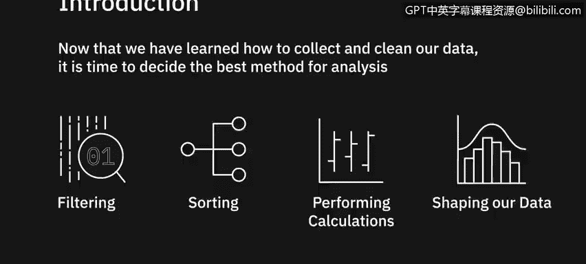
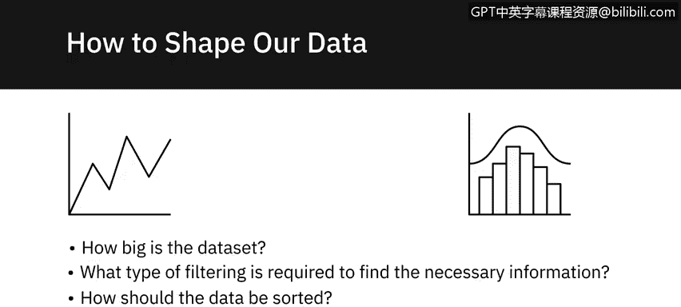
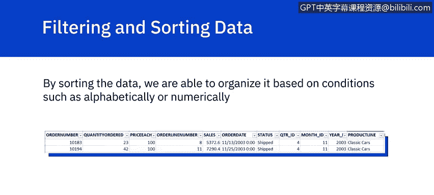
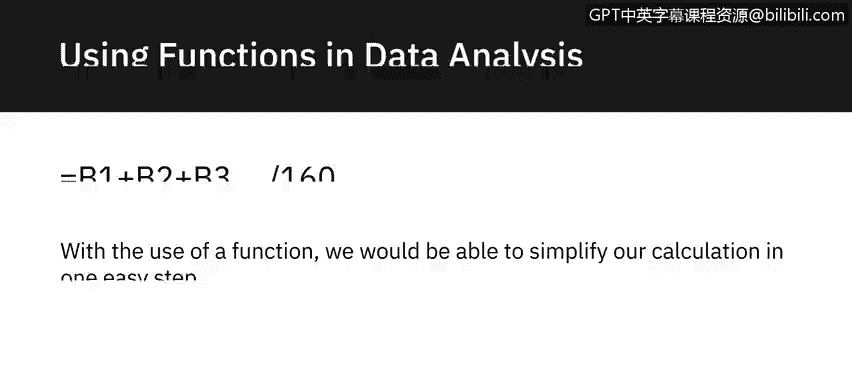
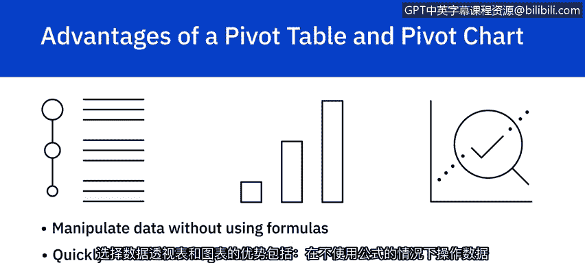
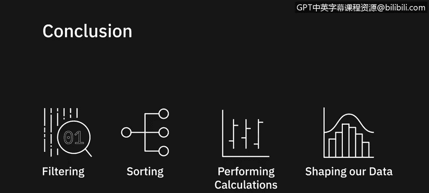

# 019：使用电子表格分析数据介绍

在本节课中，我们将学习如何对已收集和清洗的数据进行分析。我们将重点讨论筛选、排序、执行计算以及重塑数据的重要性，以从中提取有意义的信息。

---

决定如何操作数据有时可能具有挑战性。在进行任何更改或调整之前，我们需要先设想最终输出的结果。以下是开始分析任务前需要考虑的几个问题：数据集有多大？需要何种筛选才能找到必要信息？数据应如何排序？需要进行何种类型的计算？

既然我们已经设想了最终输出，接下来就必须决定塑造数据的最佳方法。最基础的步骤是筛选和排序数据。

通过排序，我们可以根据特定条件（如字母顺序或数字大小）来组织数据。

例如，如果我们想检查是否存在重复的订单号，可以通过排序数据来快速发现重复项。在排序并删除重复行之后，我们发现视图需要更具体以满足需求。

现在我们决定只查看十一月份的数据。通过添加筛选器，我们可以选择只显示月份ID等于11的数据行。通过筛选数据，我们现在只能看到符合筛选条件的行，这有助于我们更好地分析信息。

---

熟悉所有数据分析工具可能看起来令人望而生畏，但使用电子表格的一个关键优势是能够使用函数。

Excel中的函数按多个类别组织，包括数学、统计、逻辑、财务以及日期和时间函数。假设我们想计算公司六月份的平均收入。

我们意识到有超过100个项目需要计算。在正常情况下，要计算平均值，我们必须创建一个公式来将每一行相加，然后除以总行数。这种计算不仅非常冗长，还可能使分析人员容易出错。

通过使用函数，我们可以简化计算，只需一步即可完成：`=AVERAGE(B1:B160)`。

---

虽然单独在电子表格上排序和筛选数据很有用，但首先将数据转换为表格具有更多优势。当我们将数据转换为表格时，能够更高效地筛选和计算数据。

一个例子是能够轻松计算列的总和。对于“MSRP”列，我们选择“求和”，就能快速计算出该列的总和。

如果我们随后查看数据，并且只想计算基于“日本”的MSRP总和，我们可以筛选“国家”列，使其仅显示日本。这样，该列将只累加与日本相关的行中的值。

虽然并非所有数据都适合放入表格，但将数据格式化为表格有相当多的优点：自动计算、筛选时列标题不会消失、使用交替行颜色使阅读更轻松、添加新行时表格会自动扩展。

---

有时，数据需要比基本表格格式更高级的组织方式，而创建数据透视表及其图表可能是分析和展示所需信息的更好方法。

在Excel中，我们可以选择创建数据透视表来显示和分析数据，并可选择性地创建关联的数据透视图。例如，假设我们想知道十月份有哪些公司从原始数据表中订购了产品。

我们创建一个数据透视表来组织和分析所需数据，同时创建一个数据透视图来展示信息。然后，通过将月份筛选器添加到新创建的数据透视表中，我们不仅可以在表格中看到十月份的结果，而且这些更改会自动更新到数据透视图中。

当需要从大型数据集中提取特定信息时，数据透视表是一种很好的方式，可以只显示所需的信息。这使我们能够快速、轻松地浏览关键信息。

数据透视图是数据透视表的有力补充，因为它们允许我们以视觉方式处理数据，并且在大多数情况下，能让观众更快地掌握信息。选择使用数据透视表和图表的好处包括：无需使用公式即可操作数据、快速汇总大型数据集、能够展示引人入胜的图表和图形。

---

在本节课中，我们学习了筛选、排序、执行计算以及重塑数据以提供有意义信息的重要性，并了解了一些开始分析数据的工具。在下一个视频中，我们将更深入地学习如何筛选和排序数据。