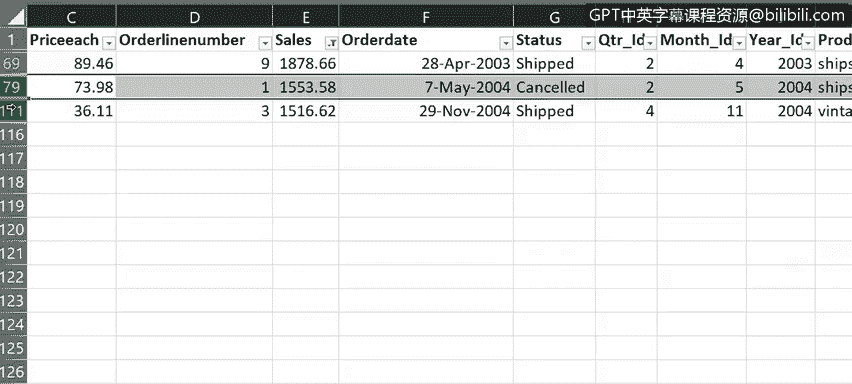

# 020：在Excel中筛选和排序数据

在本节课中，我们将学习如何使用Excel的筛选和排序功能来控制工作表中显示哪些信息以及如何显示这些信息。掌握这些技能能帮助你更高效地查看和分析数据。

---

## 🔍 数据筛选

上一节我们介绍了如何使用“快速填充”和“分列”功能来清理数据。本节中，我们来看看如何通过筛选功能，仅显示符合特定条件的数据行。

筛选功能让你能更灵活地控制数据在工作表中的显示范围。它通过设定标准和参数来缩小数据视图，有助于提升数据的可读性，并方便你查找特定信息。

以下是启用筛选功能的步骤：

1.  在 **“数据”** 选项卡中，点击 **“筛选”** 按钮。
2.  点击后，每个列标题旁都会出现一个小的筛选图标。

**补充说明：**
*   若只想对特定列启用筛选，请先选中这些列，再点击“筛选”按钮。
*   如果将数据区域设置为 **表格**，筛选控件会自动添加到每一列。

现在，每一列都可以应用筛选器。例如，在“订单日期”列可以按年份筛选，在“产品线”列可以按产品类型筛选，在“客户名称”列可以按客户姓名筛选。

让我们先按年份筛选，仅显示2004年的订单：

1.  点击“订单日期”列的筛选图标。
2.  在列表中，取消勾选其他年份，仅保留“2004”。

此时，查看工作表底部的状态栏，你会发现现在仅显示了114条记录中的50条。

若要清除筛选，有两种方法：
*   点击该列筛选图标，选择 **“从…中清除筛选”**。
*   或在筛选列表中勾选 **“全选”**。

接下来，我们筛选“产品线”列，仅显示“经典汽车”的销售数据，然后清除该筛选。最后，筛选“客户名称”列，仅显示对“Many Gifts Distributors Ltd.”的销售记录，之后同样清除筛选。

目前我们只应用了单一筛选。但假设你想进行更精细的筛选，可以同时启用多个筛选条件。例如，我们可以同时筛选出“2004年”、“经典汽车”产品线、且客户为“Many Gifts Distributors Ltd.”的所有销售记录。

**请注意：**
*   若只想清除单个筛选，点击该列标题的筛选按钮，选择“从…中清除筛选”。
*   若要快速清除所有筛选，可以使用 **“数据”** 选项卡下 **“排序和筛选”** 组中的 **“清除”** 按钮。

---

## ⚙️ 自定义筛选

到目前为止，我们使用的是通常被称为“自动筛选”的功能。但你也可以使用“自定义筛选”为文本或数字数据指定更复杂的筛选条件。

例如，如果你想查看销售额高于或低于特定值的订单，可以使用自定义筛选。

对“销售额”列应用数字筛选，仅显示超过2000美元的销售记录：

1.  点击“销售额”列的筛选图标。
2.  选择 **“数字筛选”** -> **“大于”**。
3.  在弹出的对话框中输入 `2000`。

查看状态栏，现在显示了114条记录中的111条。

清除该筛选，然后反向操作，筛选出销售额低于2000美元的订单。可以看到，只有3个订单低于2000美元。

**重要提示：** 被筛选隐藏的数据行并未被删除，它们仍然存在，只是暂时不可见。这一点可以通过左侧蓝色的行号来确认：行号从69开始，并以较大间隔跳跃，表明数据集中存在比当前显示更多的数据行。

清除所有筛选。对于包含文本的列，其筛选菜单项会变为 **“文本筛选”**，并提供多种文本筛选选项，如“包含”、“开头是”、“结尾是”等。

若要完全关闭工作表的筛选功能，只需再次点击 **“数据”** 选项卡中的 **“筛选”** 按钮即可。

---

## 🔄 数据排序

现在，让我们来看看Excel的基本排序功能。排序是数据分析师工作中的重要环节。通过将文本数据按字母顺序、数字数据按数值大小、日期数据按时间先后进行排序，可以使数据更易于理解和分析，并以更有意义的方式呈现。

排序时，首先需要选择要排序的数据范围。以下是几种常见的排序操作：

*   **按客户名称字母排序：** 先选中“客户名称”列中的一个单元格，然后点击 **“升序”** 或 **“降序”**。
*   **按销售额数值排序：** 先选中“销售额”列中的一个单元格，然后点击 **“升序”** 或 **“降序”**。
*   **按订单日期时间排序：** 先选中“订单日期”列中的一个单元格，然后点击 **“升序”** 或 **“降序”**。

---

## 🎯 多级排序

你还可以同时按多个列进行排序，这称为多级排序。

1.  选中数据区域内的任意单元格。
2.  在 **“数据”** 选项卡中，点击 **“排序”** 按钮。
3.  在弹出的“排序”对话框中：
    *   在 **“主要关键字”** 下拉列表中选择第一排序列，例如“订单日期”，并在 **“次序”** 中选择“升序”。
    *   点击 **“添加条件”** 按钮，添加次要排序级别。
    *   在新增的 **“次要关键字”** 下拉列表中选择第二排序列，例如“销售额”，并在 **“次序”** 中选择“降序”。
4.  如果数据包含标题行（本例中即是），请确保勾选 **“数据包含标题”** 复选框。
5.  点击 **“确定”** 开始排序。

执行上述操作后，数据将首先按订单日期从早到晚排序。对于同一订单日期的多条记录，则会再按销售额从大到小进行排序。

---

## 📝 总结

本节课中，我们一起学习了如何使用Excel的筛选和排序工具来控制工作表中信息的显示内容和显示方式。筛选功能帮助你聚焦于符合特定条件的数据子集，而排序功能则能按逻辑顺序组织数据，使其更清晰、更易于分析。掌握这些基础操作是进行有效数据分析的重要一步。