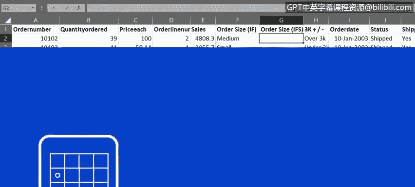
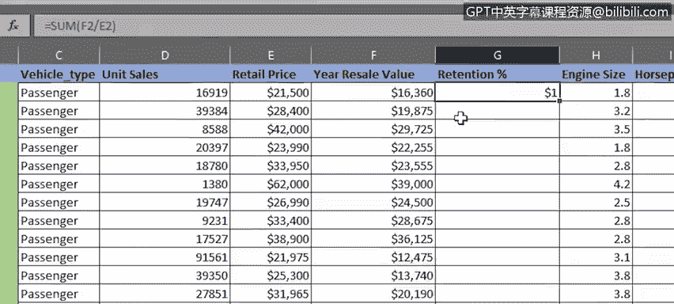
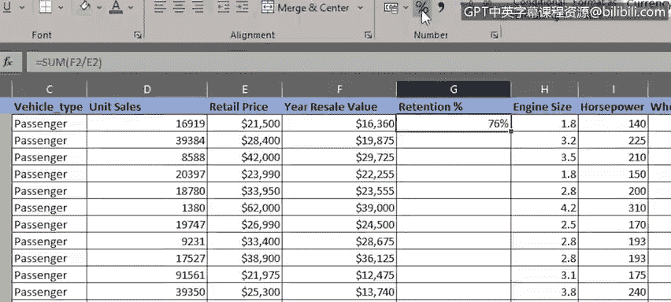
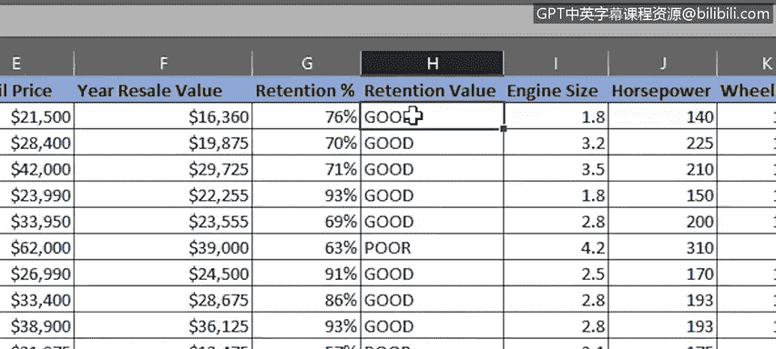
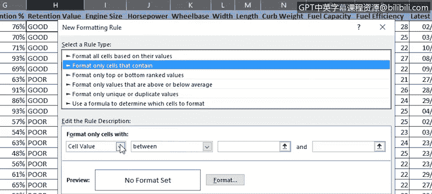
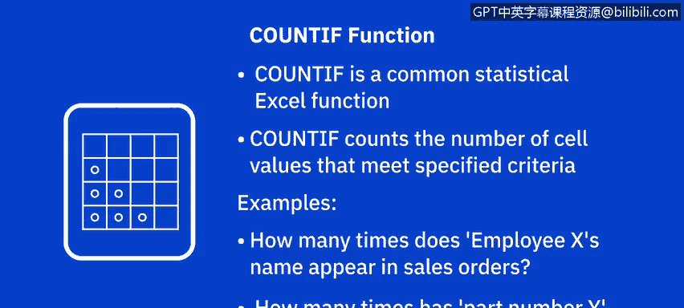
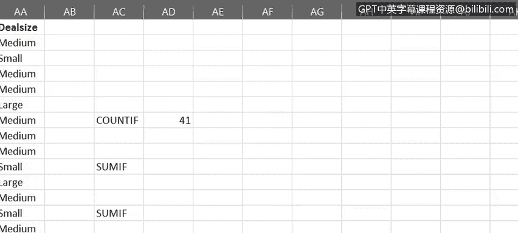
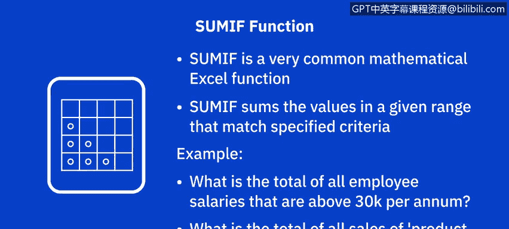
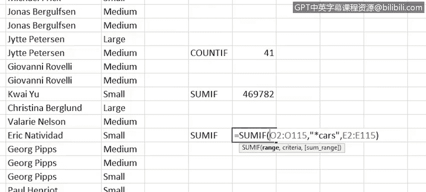

# 022：用于数据分析的有用函数 📊

在本节课中，我们将学习Excel中几个对数据分析至关重要的函数：`IF`、`IFS`、`COUNTIF`和`SUMIF`。这些函数能帮助我们根据特定条件进行逻辑判断、计数和求和，从而更高效地处理和分析数据。

---

上一节我们介绍了如何使用筛选和排序工具来控制工作表中信息的显示。本节中，我们来看看如何运用函数来执行更复杂的逻辑和数据计算。

首先，让我们了解如何使用 `IF` 函数。

`IF` 函数是Excel中最常用的逻辑函数之一。它允许你将一个值与设定的标准进行逻辑比较，然后根据比较结果是真（TRUE）还是假（FALSE）来返回相应的结果。这些结果可以是文本值或数值。

`IF` 函数的基本逻辑是：**如果某个条件成立，则返回一个值（或执行一个操作）；如果不成立，则返回另一个值（或执行另一个操作）**。

以下是 `IF` 函数的基本语法：
```
=IF(logical_test, value_if_true, value_if_false)
```

例如，在我们的“车辆玩具销售”工作表中，如果想添加一列来记录订单是否已发货，可以执行以下操作：
*   在现有列右侧添加新列，命名为“已发货”。
*   在单元格H2中输入公式：`=IF(G2=“已发货”, “是”, “否”)`。这个公式的意思是：如果G2单元格的文本是“已发货”，则返回“是”；否则返回“否”。
*   然后使用填充柄将此公式复制到整列。

我们还可以用 `IF` 函数来强调订单的规模。例如，添加一个名为“3K以上/以下”的列，并输入公式：`=IF(F2>3000, “超过3K”, “低于3K”)`，以标记销售额是否超过3000。

---

在理想情况下，`IF` 函数只用于应用一两个条件。但有时你可能需要应用多个条件。这时，可以利用函数的嵌套功能，将多个 `IF` 语句组合在一个公式中，这被称为嵌套 `IF` 函数。

例如，要按销售额将订单分为“大”、“中”、“小”，可以使用如下嵌套公式：
```
=IF(F2>5000, “大”, IF(F2>2000, “中”, “小”))
```
这个公式包含多个 `IF` 函数，每个条件对应一个，因此需要多组括号，相对较长且复杂。

尽管Excel技术上支持在一个公式中嵌套多达64个不同的 `IF` 函数，但这并非推荐的最佳实践。在单个公式中使用多个 `IF` 函数会使其变得极难管理和理解，尤其是当公式由他人创建或长时间未使用时。此外，如果条件增加，就需要向本已复杂的公式中添加更多条件，这只会让事情变得更糟。




为了解决这个问题，Excel引入了一个新函数：`IFS`。`IFS` 函数仅在 Excel 2019、Microsoft 365 版 Excel 和 Excel 网页版中受支持。

顾名思义，`IFS` 函数可以替代单个公式中使用的多个嵌套 `IF` 函数，从而简化问题。使用 `IFS` 函数重写上面的订单大小分类公式如下：
```
=IFS(F2>5000, “大”, F2>2000, “中”, TRUE, “小”)
```
这个公式只有一组括号，使用一个函数就清晰表达了所有条件。

---

现在，让我们看另一个结合 `IF` 函数和条件格式的示例。

切换到“汽车销售”工作表，在“年转售价值”列右侧添加新列“残值率”，输入公式 `=G2/F2`（用年转售价值除以原始零售价），并将其格式设置为百分比。然后复制到整列。





接下来，添加一列来突出显示每辆车的残值表现。在H2单元格输入公式：`=IF(G2>0.69, “良好”, “不佳”)`。如果残值率大于69%，则标记为“良好”，否则标记为“不佳”。再次复制公式到整列。



我们还可以使用条件格式来进一步突出显示这些“良好”或“不佳”的标签。
1.  选中H2单元格，在“开始”选项卡中点击“条件格式”->“新建规则”。
2.  选择“只为包含以下内容的单元格设置格式”。
3.  设置条件为：单元格值等于“良好”。
4.  将格式设置为深绿色字体和浅绿色填充。
5.  将此条件格式复制到整列。
6.  再次打开“条件格式”->“管理规则”，添加一个新规则，条件为单元格值等于“不佳”，格式设置为红色字体和粉色填充，并应用到整列。



现在，所有标记为“良好”和“不佳”的单元格都通过颜色被清晰地区分出来。

---

接下来，我们快速了解如何使用 `COUNTIF` 函数。

`COUNTIF` 是Excel提供的统计函数之一，用于计算满足特定条件的单元格数量。例如，统计员工姓名在销售发票列表中出现的次数，或特定零件号在采购订单列表中出现的次数。

以下是 `COUNTIF` 函数的基本语法：
```
=COUNTIF(range, criteria)
```



假设你想知道“车辆玩具销售”工作表中，有多少销售订单的客户位于英国。我们在单元格AD7中输入公式：`=COUNTIF(C2:C100, “United Kingdom”)`。请注意，当使用文本作为条件时，必须将文本用引号括起来。结果显示有6个英国订单。

同样，要查找法国客户的数量，可以编辑公式为：`=COUNTIF(C2:C100, “france”)`。注意，这次输入的文本是小写，但函数仍然有效，因为此函数中的名称不区分大小写。结果显示有14个法国订单。美国客户的订单数则为41个。

还有一个较新的函数叫 `COUNTIFS`，它可以对多个区域应用条件，并统计所有条件均满足的次数。这避免了在单个复杂公式中使用多个 `COUNTIF` 函数的需要。`COUNTIFS` 函数同样仅在 Excel 2019、Microsoft 365 版 Excel 和 Excel 网页版中受支持。



---

现在，让我们看看如何使用 `SUMIF` 函数，这是Excel中非常常用的数学函数。

`SUMIF` 函数用于对指定范围内满足特定条件的值进行求和。例如，你只想汇总超过特定水平的工资，或者想找出某个特定产品类别的总销售额。



以下是 `SUMIF` 函数的基本语法：
```
=SUMIF(range, criteria, [sum_range])
```

我们在单元格AD10中输入公式：`=SUMIF(F2:F100, “>3000”)`。这个公式将汇总所有销售额超过3000美元的订单。再次注意，因为使用了算术运算符（大于号），所以必须将条件用引号括起来。如果条件只是一个数字，则不需要引号。计算结果显示，所有超过3000美元的订单总额接近470，000美元。

你还可以在搜索部分匹配时使用通配符，如问号（?）和星号（*）。此外，你可以指定从与条件列不同的列中提取值进行求和。

例如，输入公式：`=SUMIF(B2:B100, “*cars”, E2:E100)`。这个公式将对E列（销售额）中，所有B列（产品线）以“cars”结尾的产品对应的销售额进行求和。



同样，也有一个较新的函数叫 `SUMIFS`，可用于根据多个条件对单元格求和。这避免了在单个复杂公式中使用多个 `SUMIF` 函数的需要。`SUMIFS` 函数也仅在 Excel 2019、Microsoft 365 版 Excel 和 Excel 网页版中受支持。


---


本节课中，我们一起学习了 `IF`、`IFS`、`COUNTIF` 和 `SUMIF` 这几个核心函数在Excel数据分析中的应用。它们能帮助我们基于条件进行逻辑判断、数据计数和汇总，是处理复杂数据集的强大工具。在下一视频中，我们将探讨如何使用 `VLOOKUP` 和 `HLOOKUP` 这两个引用函数。