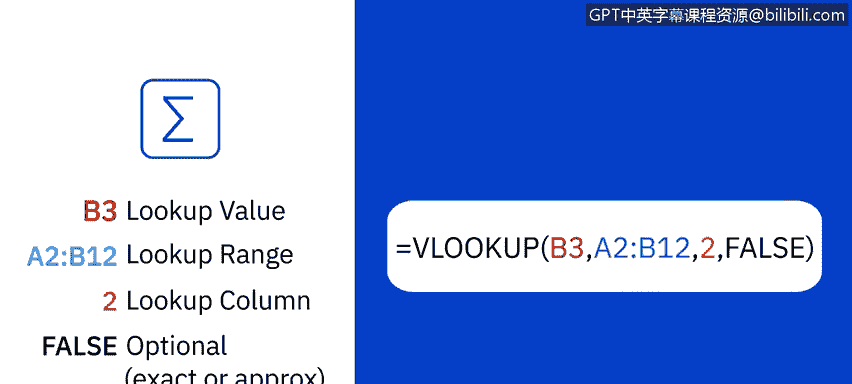
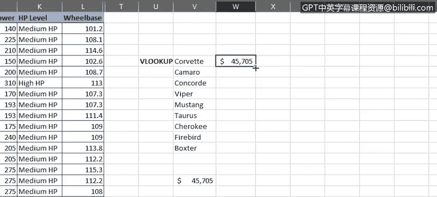
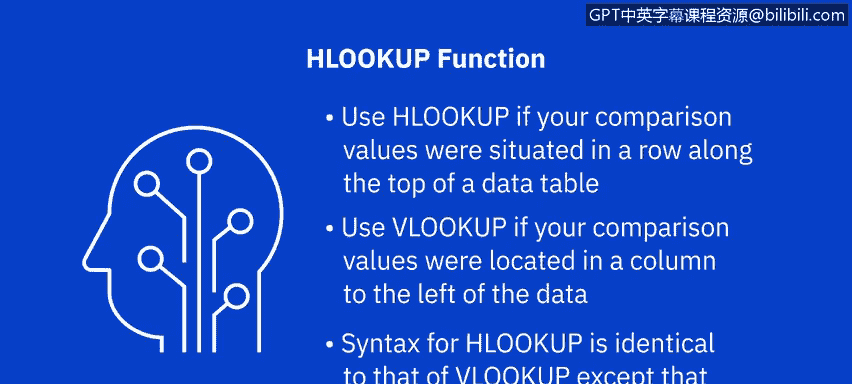
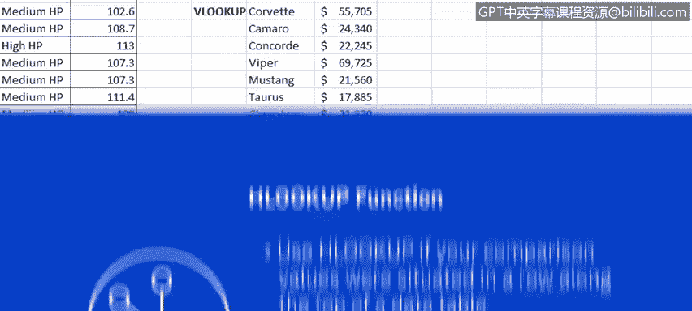
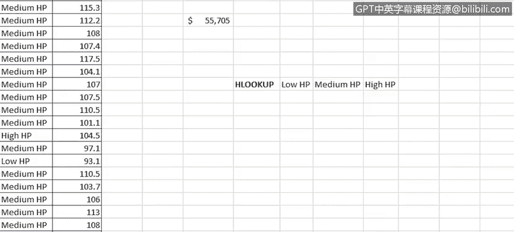
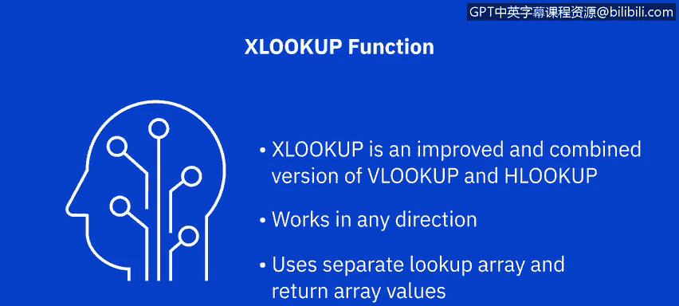

# 023：使用VLOOKUP与HLOOKUP函数 📊

在本节课中，我们将学习如何使用Excel中的VLOOKUP和HLOOKUP这两个重要的查找与引用函数。它们能帮助你在表格中快速查找并返回所需的数据。

上一节我们介绍了IF、COUNTIF等逻辑与统计函数，本节中我们来看看如何利用查找函数连接不同表格中的数据。

## VLOOKUP函数：垂直查找

VLOOKUP是Excel中最常用的引用函数之一，它代表“垂直查找”。当你需要在一个表格或区域中按行查找数据时，这个工具非常有用。


VLOOKUP的工作原理是，利用源数据和查找表之间的一个共享关键值进行匹配。一个典型的VLOOKUP公式结构如下：

```
=VLOOKUP(lookup_value, table_array, col_index_num, [range_lookup])
```

以下是公式中各个参数的含义：



*   **`lookup_value`**：查找值。即你想要查找的值或词语。
*   **`table_array`**：查找表或区域。即包含查找值的单元格区域。公式中，Excel将其引用为`table_array`。查找表可以位于同一工作表或另一个独立的工作表中。
*   **`col_index_num`**：列索引号。即查找表中包含你所需返回值的列序号。公式中，Excel将其引用为`col_index_num`。
*   **`[range_lookup]`**：这是一个可选参数，决定匹配是精确匹配（用`FALSE`表示）还是近似匹配（用`TRUE`表示）。公式中，Excel将其引用为`[range_lookup]`。参数周围的方括号表示它是可选的，而其他参数是必需的。如果在公式中不指定此参数，默认值为`FALSE`，即要求精确匹配。你也可以用数字`0`代替`FALSE`，用数字`1`代替`TRUE`。

现在，让我们看看VLOOKUP函数的实际应用。

在“汽车销售”工作表中，假设我们想快速生成一份心仪汽车的价格列表。首先，我们需要将包含查找值的列放在最左侧，因为VLOOKUP函数要求如此。然后，我们可以删除原始列。

接着，我们在单元格V16中输入公式。该公式在单元格A2到G156的表格数组中查找“Corvette”这个词，然后在包含“Corvette”的行中查找第五列（即价格列）的值，并返回精确值`$45705`。

请注意，在这个例子中，我们使用了现有数据表的一部分作为查找表或表格数组。

让我们将其格式设置为美元货币，并保留零位小数。实际上，与其在公式中使用引用A25，不如使用工作表中我们心仪汽车列表小表格里“corvette”这个词的引用（即V5），这样更方便，公式同样有效。

现在，让我们将公式复制到工作表中上方的心仪汽车表格里。但出现了问题：复制公式时，单元格引用发生了变化。这是因为，正如我们在本课程前面学到的，单元格引用的默认状态是相对的，而在这个案例中，我们需要它们是绝对的。

让我们撤销复制操作。为了使单元格引用变为绝对引用，我们需要在公式中的所有单元格引用前添加美元符号`$`。这可以手动完成，也可以将光标依次放在公式中的每个单元格引用上，然后按`F4`键自动添加美元符号。

让我们再次尝试复制公式。这次，它成功了。

如果我们使用单元格W5的填充手柄将其向下复制到其他汽车行，它没有正常工作。实际上，每个单元格都得到了相同的结果。为什么？因为每个公式都引用了查找值中的相同单元格，因为我们使用了绝对引用。现在，我们只需要修改公式，仅移除查找值部分中行参数的绝对引用（即删除美元符号）。



因此，在单元格W5中，我们将`$V$5`改为`$V5`。然后，当我们向下拖动填充手柄时，公式将被正确复制，所有价格都会更新以反映其正确的零售价。

最后，为了展示这两个表格现在通过VLOOKUP函数连接起来了，如果我们在主数据表的单元格E25中更改雪佛兰科尔维特的零售价，心仪汽车价格列表中的价格也会随之改变。

## HLOOKUP函数：水平查找

现在让我们看看HLOOKUP函数。正如前面提到的，它的功能与VLOOKUP函数几乎相同，但它是按列查找数据，而不是按行。

HLOOKUP在表格的顶行中查找一个词或值，然后从表格数组中指定的行返回同一列中的值。因此，如果你的比较值位于数据表顶部的行中，你会使用HLOOKUP。相反，如果你的比较值位于你想要查找的数据左侧的列中（如上一个任务那样），你会使用VLOOKUP。

在这两个函数中，由于大多数数据表的性质，VLOOKUP的使用频率远高于HLOOKUP。





HLOOKUP的语法与VLOOKUP相同，只是你指定的是行索引号（公式中Excel引用为`row_index_num`）。这表示查找表中包含你所需返回值的行号。

让我们在主数据表右侧创建一个小型查找表。为了便于查看，此工作表中隐藏了几列。



现在，我们的查找表顶行有了“低HP”、“中HP”和“高HP”。接下来，我们将添加Wingdings符号作为三个马力等级的评级：1个悲伤表情代表低马力，2个中性表情代表中等，3个笑脸代表高马力。

现在，让我们在“HP等级”列右侧添加一个新列，命名为“HP评级”。然后在单元格L2中输入HLOOKUP函数。此函数将查找单元格K2中的值（本例中为“中HP”），并在单元格范围Y21到AA22（即我们的小查找表）中查找它，然后返回它在表中“中HP”下方第2行找到的答案，并使用精确值。注意，我们在此公式中使用了一些绝对引用。

现在返回的是文本“KK”，因此我们需要使用Wingdings字体格式化该单元格。当我们双击填充手柄时，整列将显示与每行HP等级值相关的HP评级符号，这样就完成了。

## 关于XLOOKUP函数

尽管VLOOKUP和HLOOKUP仍然是Excel中查找引用的常用函数，但有一个更新的函数叫XLOOKUP。此版本仅在Excel桌面版（从Microsoft 365版开始）、Excel网页版、Excel for iPad/iPhone以及Excel for Android平板电脑/手机上受支持。

XLOOKUP是VLOOKUP和HLOOKUP的改进和结合版本。它可以在任何方向（垂直或水平）工作。它还使用独立的查找数组和返回数组值，而不是单一的表格数组和列/行索引号。



## 总结


本节课中，我们一起学习了如何在Excel中使用VLOOKUP和HLOOKUP函数，在垂直和水平的查找表中查找并连接数据。在下一课的后续视频中，我们将开始学习在Excel中使用数据透视表。