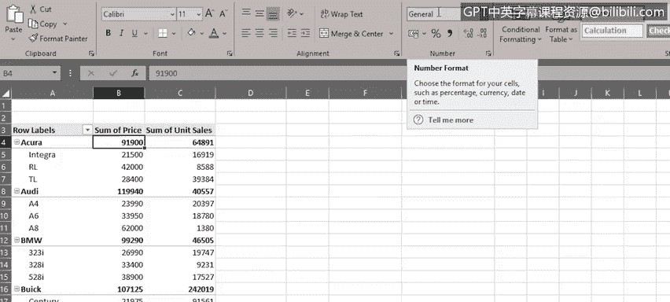

# 024：在Excel中创建数据透视表介绍

在本节课中，我们将学习如何在Excel中创建和使用数据透视表。我们将首先了解如何将数据格式化为表格，然后学习如何创建数据透视表，并利用字段来分析数据。最后，我们将探讨如何在数据透视表中执行计算。

拥有一个充满信息的工作表固然重要，但要真正从中获取价值，我们需要从不同角度分析数据，以找到与数据相关问题的答案。

之前我们已经使用了筛选器和公式等功能来对数据进行数学和逻辑分析，但并非所有问题都能仅通过筛选器和公式轻松解答。

为了获得可用且易于呈现的数据洞察，我们需要借助另一种工具——数据透视表。数据透视表为电子表格提供了一种简单快捷的方式来汇总和分析数据，从而观察数据中的趋势和模式，并进行数据比较。

数据透视表是动态的。因此，当您更改或向数据透视表所基于的原始数据集添加数据时，分析和汇总信息也会随之更新。

数据分析师可以使用数据透视表来得出有用且相关的结论，并创建对组织数据的洞察，以便向公司内部的相关方展示这些洞察。

在Excel中开始创建数据透视表之前，首先将数据格式化为表格会非常有帮助。这样做不仅是为了让数据更有组织、更清晰，并为其添加表格样式，更重要的是，在向数据集添加记录时，这会变得容易得多。

在汽车销售工作表中，我们首先选择数据内的任意单元格。然后，在“开始”选项卡的“样式”组中，选择“格式化为表格”。接着，从库中选择一种样式。请注意，Excel会自动识别我们数据范围的边界，但如有需要，我们可以更改此范围。同时，请确保选中“我的表包含标题”（如果确实包含的话）。

点击“确定”后，数据已被格式化为表格。请注意每列顶部的筛选下拉箭头，这些在您将数据格式化为表格时会自动添加。

如果我们现在滚动到表格底部，并开始为另一辆车添加一行新数据，当您按下Tab键或Enter键时，请注意新行会自动被格式化并包含在我们的表格中。

现在，让我们看看如何创建一个基本的数据透视表，以及如何使用字段在数据透视表中排列数据。

在开始之前，您应该使用一个检查清单来确保您的数据处于适合创建数据透视表的状态。以下是清单内容：

*   为获得最佳效果，请将数据格式化为表格。
*   确保列标题正确无误，并且只有一个标题行，因为这些列标题将成为数据透视表中的字段名称。
*   删除任何空行和空列，并尽量消除空白单元格。
*   确保值字段格式为数字，而非文本。
*   确保日期字段格式为日期，而非文本。

在工作表中，我们只需选择表格内的任意单元格。然后，在“插入”选项卡上，点击“数据透视表”。请注意，在“选择一个表或区域”框中，已经为我们输入了表名“表1”。如果我们没有事先将数据格式化为表格，则需要在此处指定单元格区域。

接下来，我们需要决定是在一个新的空白工作表上创建数据透视表，还是在当前工作表上创建。默认选项是新建工作表，这也是最常用的选项。因此，一个新的空白工作表会打开，在工作表左侧的图形中显示一些基本的数据透视表说明，右侧则显示数据透视表字段窗格。

如果您愿意，可以为数据透视表所在的工作表重命名。

要构建数据透视表报告，我们需要将数据透视表字段窗格顶部的某些字段添加到底部窗格的一个或多个区域中。例如，如果我们想找出每种车型的总销售额，我们可以将“制造商”字段拖到报告的“行”区域，然后将“型号”字段也拖到那里。

但这并不是我们想要的样子。因此，我们将“制造商”字段拖到“行”区域的顶部，位于“型号”之上，这样更符合我们数据的逻辑。

接下来，我们将“价格”字段添加到“列”区域。但这同样不是我们想要查看数据的方式。因此，我们将“价格”字段拖到“值”区域，这样更合理，看起来也更好。

接着，我们也将“单位销量”字段添加到“值”区域。现在，我们可以看到每种型号的单独价格以及每种型号的单位销量。

让我们将“车辆类型”字段添加到“列”区域，但这似乎不太有用。因此，让我们移除该字段，这可以通过两种方式完成：要么使用下拉菜单，或者如果我们撤销上一步操作，也可以通过简单地将字段拖出“列”区域来实现，可以拖到左侧的工作表区域，也可以拖到上方字段列表的顶部。

现在，让我们看看如何在数据透视表中执行一个简单的计算。如果我们查看数据透视表中的“价格总和”列，可以看到这些数字的格式是“常规”。因此，首先让我们将这些数字的格式更改为美元货币。

这可以通过修改数据透视表字段窗格相应区域中该字段的“值字段设置”来完成。我们将该字段格式设置为美元，并且不显示小数位。

接下来，我们将从“数据透视表分析”选项卡使用“字段、项目和集”按钮添加一个计算字段。我们希望这个字段通过将价格乘以单位销量来计算每个型号的总销售额。

当我们创建并添加这个公式时，它会作为一个名为“总型号销售额”的字段添加到数据透视表字段窗格中。我们可以再次更改其格式为美元。

现在，工作表中的数据透视表里出现了一个名为“总型号销售额总和”的新列。在第5行，我们可以看到Acura Integra型号的销售额已超过3.6亿美元。在第7行，我们可以看到Acura TL型号的销售额已超过10亿美元。

在本节课中，我们学习了如何将数据格式化为表格，如何创建数据透视表并使用字段分析数据，以及如何利用数据透视表数据执行计算。

在下一个视频中，我们将探讨数据透视表的其他一些功能。