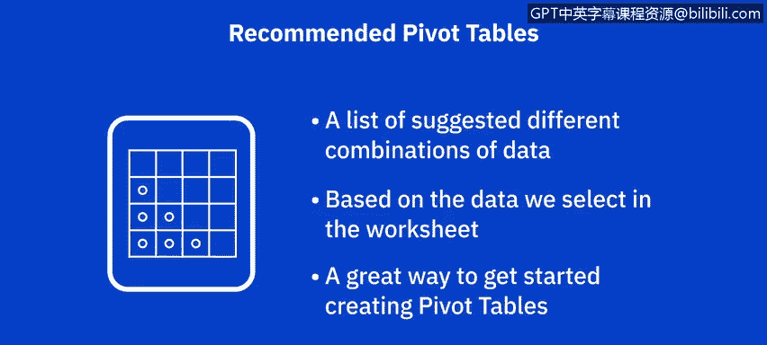
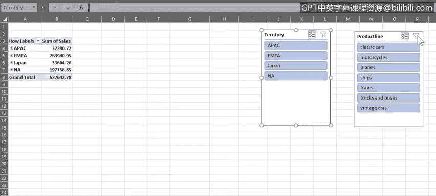
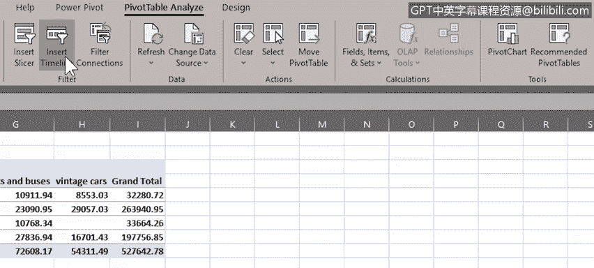
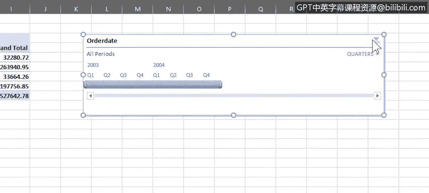

# 026：数据透视表进阶功能

在本节课中，我们将学习数据透视表的一些进阶功能，包括“推荐的数据透视表”、筛选器、切片器以及时间线。这些工具能帮助你更高效地分析和探索数据。

上一节我们介绍了如何创建和使用基础的数据透视表。本节中，我们来看看如何利用Excel提供的其他功能来增强数据透视表的分析能力。

## 🔍 推荐的数据透视表

“推荐的数据透视表”并非一个独立的功能，它更像是一个根据你选中的数据，智能推荐不同数据组合的列表。如果你对创建数据透视表经验不足，这是一个极佳的起点。

以下是其工作原理：

*   在“车辆玩具销售”工作表中，若我们选中包含“订单数量”数据的B列，然后从“插入”选项卡选择“推荐的数据透视表”，系统会提供一系列与订单数量相关的潜在数据组合。
*   如果选中包含“订单规模”信息的F列，推荐的列表则会相应变化，反映该数据。
*   选中包含“销售额”的E列时，推荐的透视表则与销售数据相关。

我们选择列表中的第三个选项：“按区域汇总的销售额”，这听起来能通过数据透视表获得有价值的洞察。

请注意，系统会新建一个工作表来放置这个推荐的数据透视表，同时右侧会打开“数据透视表字段”窗格。我们可以将工作表重命名为更有意义的名称。

在字段窗格中，可以看到一些字段已被自动添加到“行”和“值”区域。即使是推荐生成的透视表，我们仍可以自定义它，例如通过拖拽将“产品线”字段添加到“列”区域。现在，透视表中就为摩托车、轮船、火车等每条产品线都创建了单独的列。

在数据透视表中，我们可以手动展开任意字段以查看其内容。例如，可以看到订单日期位于区域名称之下，这与字段窗格中“行”区域的字段顺序一致。我们也可以手动折叠字段，或者使用“展开整个字段”和“折叠整个字段”选项一次性操作。

## 🎯 数据透视表筛选

数据透视表的筛选功能与我们在课程前期使用的标准筛选器工作原理基本相同。

以下是筛选操作方式：

*   注意，此透视表已内置了一些筛选功能。例如，“行标签”标题本身就是一个筛选器，我们可以像使用标准筛选器一样，筛选出特定区域（如日本）的数据。清除筛选也非常简单。
*   我们还有一个“列标签”筛选器，允许我们筛选此透视表中的任何产品线项目，例如仅显示“火车”产品的数据。
*   此外，我们还可以将“产品线”字段作为标准筛选器使用，方法是将其拖拽到字段窗格的“筛选器”区域。然后，它就可以像课程前期那样作为标准筛选器使用。此筛选器也允许选择多个项目，但因为它现在是标准筛选器而非列标题，我们无法看到不同产品线的数据拆分，只能看到合并的总计。而作为列标题时，每个产品线的信息会单独显示在各列中。

让我们再次显示所有字段总计，并将“产品线”字段拖回之前的“列”区域，以便在透视表中看到不同产品线的数据拆分。

## 🎛️ 切片器

切片器本质上是屏幕上的图形化筛选对象，允许你通过按钮来筛选数据。它们使快速筛选数据透视表数据变得容易，并能直观显示当前的筛选状态，让你一目了然地知道当前显示和隐藏了哪些数据。

以下是使用切片器的步骤：

1.  首先，将“产品线”字段从数据透视表字段窗格中拖出以移除它。
2.  然后，在“数据透视表分析”选项卡中，点击“插入切片器”，并选择“区域”字段作为我们的切片器。
3.  切片器可以自由移动到工作表的任何位置，它包含了EMEA、北美、日本等每个区域名称的按钮。
4.  如果需要，可以点击“多选”按钮来筛选多个区域。点击“清除筛选器”按钮可以清除所有切片器筛选。

让我们为“产品线”字段再添加一个切片器。但请注意，务必先选中数据透视表中的一个单元格，否则“插入切片器”按钮可能无法使用。切片器也可以从“插入”选项卡的“筛选器”组中添加。

这次我们选择“产品线”字段作为切片器，并将其拖到工作表顶部附近。和之前一样，我们可以选择单个项目，也可以开启多选并选择多个项目进行筛选。

清除切片器筛选后，现在让我们同时使用两个切片器进行筛选。请注意，在使用多选筛选时，选择一个项目实际上是将其**筛选出来**，即定义哪些项目**不**显示在数据透视表中。这与在切片器中单选项目的行为相反。

现在，我们仅显示EMEA和北美区域中，经典汽车、火车以及卡车和巴士产品的数据。让我们清除这些筛选，并将“产品线”字段放回数据透视表的“列”区域，为接下来要探索的功能做好准备。同时，将这些切片器移到工作表下方以免碍事。

## 📅 时间线

时间线是另一种筛选工具，专门用于筛选数据透视表中与日期相关的数据。这是一种比在日期列上创建和调整筛选器更快捷、更有效的动态日期筛选方式。

我们可以从“数据透视表分析”选项卡或“插入”选项卡为数据透视表添加时间线。再次提醒，请确保先选中数据透视表中的任意单元格。

以下是时间线的使用方法：

1.  我们选择“订单日期”字段作为时间线筛选器。
2.  将其拖到工作表上方并放大。
3.  此时间线默认按月显示数据，但你也可以按天或按季度筛选。
4.  你可以选择单个季度，也可以选择一个季度范围。例如，我们可以选择2003年第三季度到2004年第二季度之间的12个月。
5.  使用“清除筛选器”按钮可以清除时间线筛选。
6.  你也可以按年份筛选，例如，这里我们仅选择了2003年。

你可以在一个数据透视表中组合使用切片器和时间线作为筛选器。例如，我们可以用切片器筛选，仅显示EMEA和北美区域的火车产品数据，同时用时间线筛选仅显示2003年的数据。如果我们将时间线筛选改为2004年，会发现没有数据显示，这意味着在2004年，EMEA或北美区域都没有火车产品的销售记录。

当你选中时间线或切片器时，功能区会出现它们专属的选项卡，你可以修改其属性以改变外观和工作方式。例如，可以将时间线改为浅绿色，将切片器改为橙色。最后，要删除时间线或切片器，可以选中后按`Delete`键，或右键点击并选择“剪切”。

## 📝 总结

本节课中，我们一起学习了Excel中可与数据透视表配合使用的一些进阶功能，包括推荐的数据透视表、筛选器、切片器以及时间线。这些工具极大地提升了数据交互分析和可视化的效率与灵活性，是进行深入数据分析的得力助手。