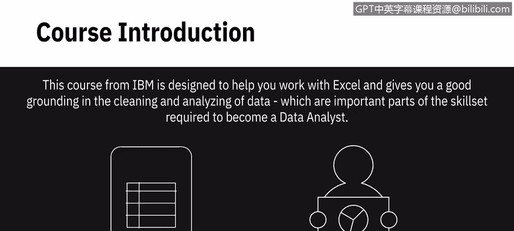
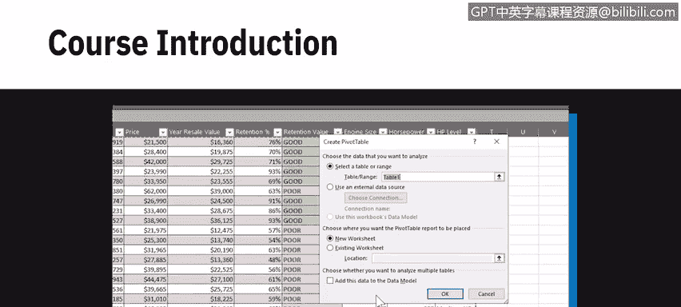
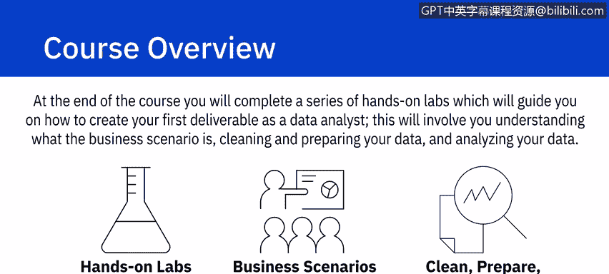
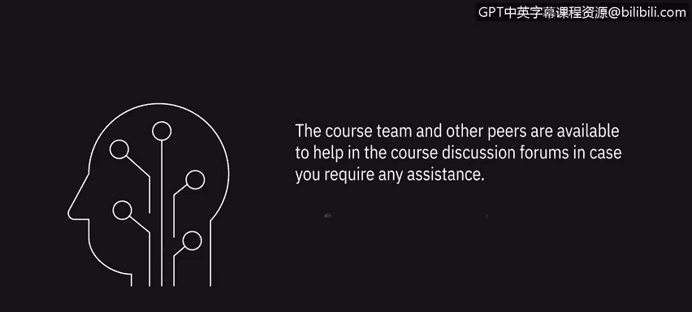

# 027：《数据分析Excel基础》｜课程介绍

在本节课中，我们将要学习IBM数据分析师专业证书第二门课程《数据分析Excel基础》的整体内容与学习目标。这门课程旨在帮助你掌握使用Excel电子表格进行数据分析的基础技能，包括数据清洗、整理与分析的核心操作。

## 🎯 课程概述

这门IBM课程旨在帮助你使用Excel，并为数据清洗与分析打下坚实基础。数据清洗与分析是成为数据分析师所需技能组合的重要组成部分。

你不仅将学习使用电子表格进行数据分析的技术，还将在整个课程中通过多个动手实验进行实践。

## 📚 课程模块详解

上一节我们介绍了课程的整体目标，本节中我们来看看课程的具体模块安排。

### 模块 1：电子表格基础

在模块1中，你将学习电子表格的基础知识。

以下是该模块涵盖的核心内容：
*   电子表格术语
*   界面介绍
*   在工作表和工作簿中的导航操作

### 模块 2：数据处理基础

掌握了基础操作后，模块2将深入数据处理的核心功能。

以下是该模块涵盖的核心内容：
*   选择数据
*   输入与编辑数据
*   复制与自动填充数据
*   格式化数据
*   使用函数与公式，例如求和公式 `=SUM(A1:A10)`

### 模块 3：数据清洗与整理

理解了如何操作数据后，模块3将专注于数据清洗与整理。

以下是该模块涵盖的核心内容：
*   数据质量与数据隐私基础
*   删除重复和不准确的数据
*   删除空行
*   消除数据不一致和空格
*   使用快速填充和分列功能

### 模块 4：数据分析

完成数据清洗后，模块4将教你如何使用电子表格分析数据。

以下是该模块涵盖的核心内容：
*   筛选数据
*   排序数据
*   使用常见的数据分析函数
*   创建与使用数据透视表
*   创建与使用切片器与时间线

### 模块 5：实战项目

在课程最后的模块5中，你将完成一系列动手实验，指导你如何创建作为数据分析师的第一个交付成果。

以下是项目涉及的关键步骤：
*   理解业务场景
*   清洗和准备数据
*   分析数据

## 🔄 课程实践方式

在整个课程中，你将跟随两个不同的业务场景，每个场景使用其自己的数据集。这些不同的场景和数据集将用于课程视频和动手实验。

## ✅ 学习成果

完成本课程后，你将能够达成以下目标：

以下是完成课程后你将掌握的能力：
*   理解电子表格如何作为数据分析工具使用。
*   理解何时使用电子表格作为数据分析工具及其局限性。
*   创建电子表格并解释其基本功能。
*   使用Excel执行数据整理和数据清洗任务。
*   使用Excel电子表格中的筛选、排序和数据透视表功能分析数据。
*   执行一些中级水平的数据整理和数据分析任务来解决业务场景。

## 🤝 学习支持

课程团队和其他学员可以在课程讨论论坛中提供帮助，以防你需要任何协助。

让我们开始下一个视频，你将在其中获得对电子表格的介绍。

---

本节课中我们一起学习了《数据分析Excel基础》课程的整体框架、五个核心模块的内容、实践方式以及完成课程后能够获得的关键技能。接下来，我们将进入具体的学习环节。