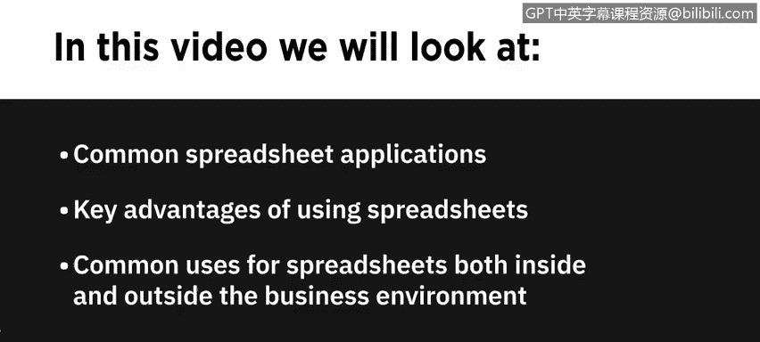
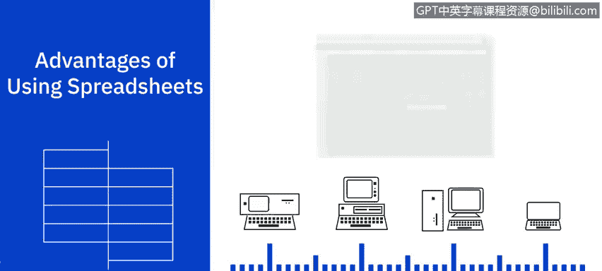
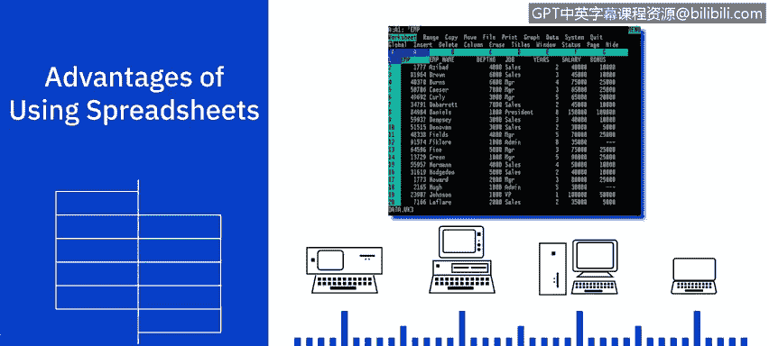
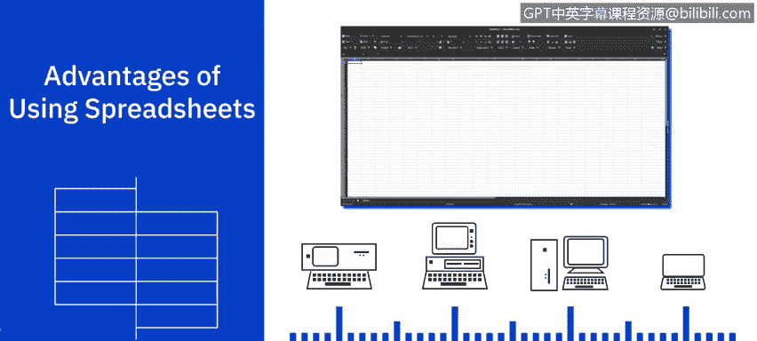
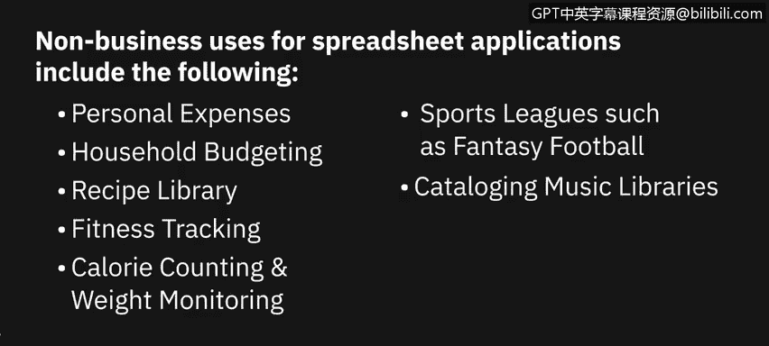
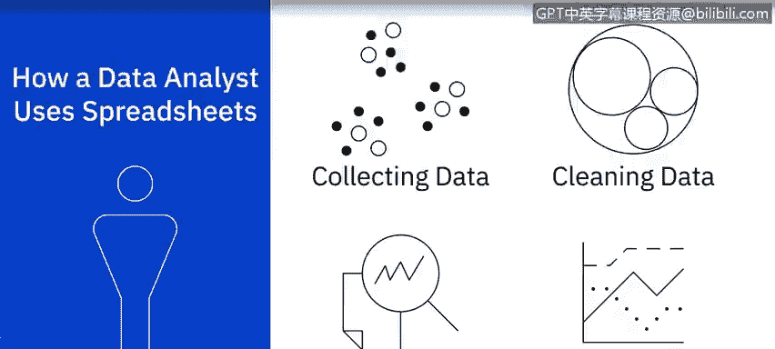
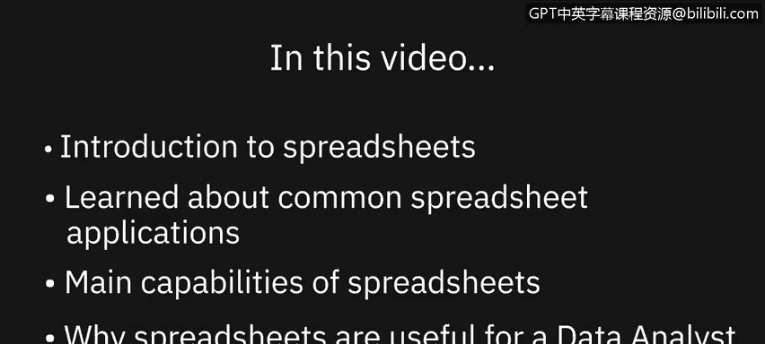

# 028：电子表格简介

在本节课中，我们将介绍电子表格的基础知识。我们将列举一些常见的电子表格应用程序，了解电子表格的核心功能，并讨论为什么电子表格是数据分析师的有用工具。

---

## 🖥️ 常见的电子表格应用程序

市场上有多种电子表格应用程序可供选择。其中一些比其他应用程序更广为人知和使用，有些是免费的，而另一些则需要付费。

目前，最常用且功能最全面的电子表格应用程序是 **Microsoft Excel**。其桌面版本作为 Office 套件和部分 Microsoft 365 订阅的一部分，需要付费使用。同时，还有一个名为 **Excel for the web**（也称为 Excel online）的网页版简化版本。在线版本对拥有 Microsoft 帐户的用户免费，但不提供桌面版本的所有高级功能。

其次最流行的是 **Google Sheets**。它提供了许多（虽然不是全部）Excel 的功能，并且对拥有 Google 帐户的用户免费。这是一个基于网页的应用程序，能很好地与 Google 表单、Google Analytics 和 Google Data Studio 等其他 Google 应用集成。

此外，还有 **LibreOffice Calc**。这是一个完全免费、开源的桌面电子表格应用程序，其功能比 Excel 或 Google Sheets 更基础，但仍然包含许多数据分析所需的工具，例如图表、条件格式和数据透视表。

其他电子表格应用程序还包括：
*   **Zoho Sheet**：一个功能齐全、可与 Google Sheets 媲美的网页版应用程序。
*   **OpenOffice Calc**
*   **Quip for Salesforce**
*   **Smartsheet**：主要用于项目管理。
*   **Apple Numbers**：随 Mac 电脑等 Apple 设备提供，也可在 App Store 上为其他 Apple 设备下载。

因此，您有许多电子表格应用程序选项，从功能齐全到基础版，从云端应用到桌面应用，从付费版本到免费版本。您可以根据自己的需求和预算来决定使用哪一款。

---

## 🔑 电子表格的核心功能

上一节我们了解了有哪些电子表格软件，本节中我们来看看电子表格的核心功能。电子表格相对于手动计算方法有几个优势。

例如，一旦您正确编写了公式，就可以确保计算是准确的，并且计算会自动为您执行。电子表格还有助于保持数据的有序性和易于访问性。您的数据可以轻松地进行格式化、筛选和排序以满足需求。

如果您在数据输入或计算中出错，可以轻松地编辑、撤销或使用错误检查工具来纠正这些错误。最后，您可以在电子表格中分析数据，并创建图表、图形和报告，以帮助可视化您的数据分析。

自 20 世纪 70 年代 VisiCalc 在 Apple II 个人电脑上问世以来，电子表格软件在功能和特性方面已经取得了长足的进步。从简单的表格和相对基础的计算，发展成为用于分析、管理和可视化海量数据集的强大工具。

---

## 💼 电子表格的常见用途

了解了电子表格的强大功能后，我们来看看它在实际中有哪些应用。电子表格最常见的商业用途包括以下内容：

以下是电子表格在商业中的常见应用列表：
*   数据录入与存储
*   比较大型数据集
*   建模与规划
*   图表制作
*   识别趋势
*   业务流程流程图
*   跟踪业务销售
*   财务预测
*   统计分析
*   损益会计
*   预算编制
*   法务审计
*   薪资与税务报告
*   开具发票
*   日程安排

除了商业用途，其他典型用途还包括：
*   个人开支管理
*   家庭预算
*   食谱库
*   健身追踪
*   卡路里计数与体重监测
*   体育联赛（如梦幻足球）管理
*   音乐库编目
*   甚至包括联系人列表、购物清单和圣诞贺卡清单

---

## 📈 数据分析师如何运用电子表格

作为数据分析师，您可以将电子表格用作数据分析任务的工具，包括：

以下是数据分析师使用电子表格的主要环节：
*   **收集与获取数据**：从一个或多个来源收集和获取数据。
*   **清理数据**：清理数据以移除重复项、不准确之处、错误，并解决缺失值问题，从而提高数据质量。
*   **分析数据**：通过筛选、排序和解释数据，以确定可以从数据中获取哪些有用信息。
*   **可视化数据**：帮助您向关键业务利益相关者及组织内任何其他相关方讲述数据分析发现的故事。

---

## ✅ 课程总结

本节课中，我们一起学习了电子表格的简介。我们了解了一些常见的电子表格应用程序、电子表格的主要功能以及为什么电子表格可能是数据分析师的有用工具。

在下一个视频中，我们将学习电子表格的基础知识，包括常见的电子表格术语。