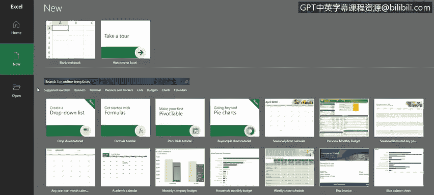
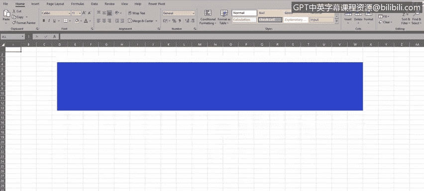
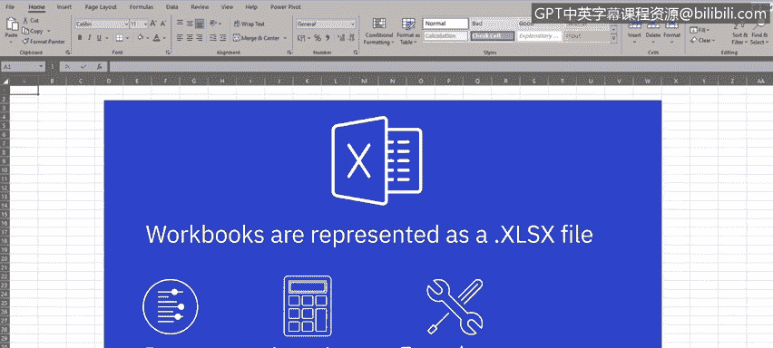
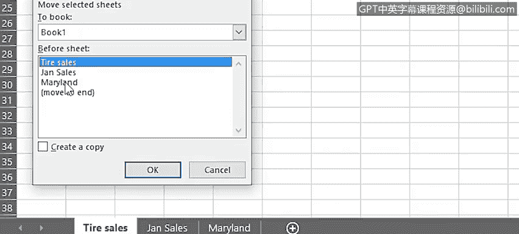
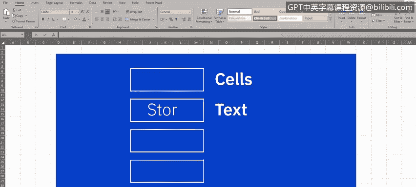
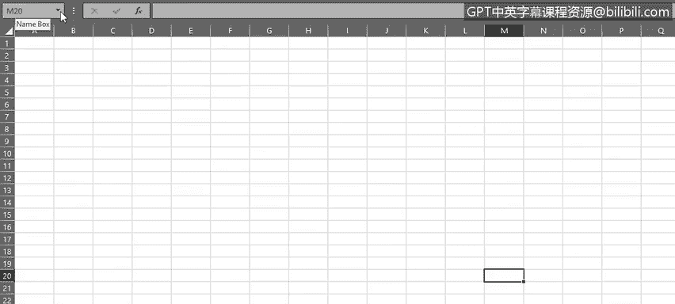
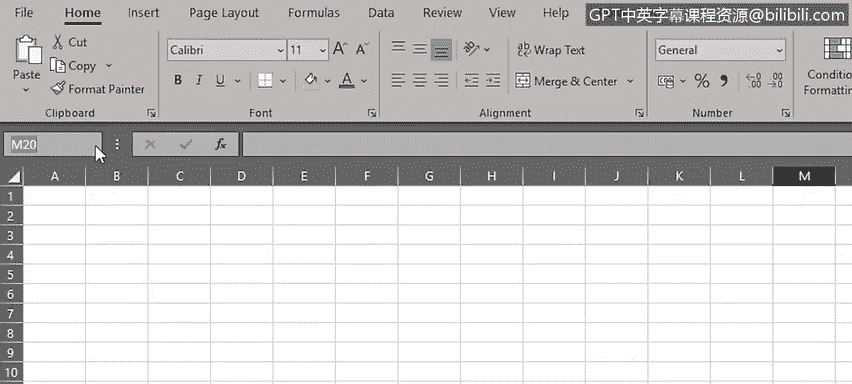
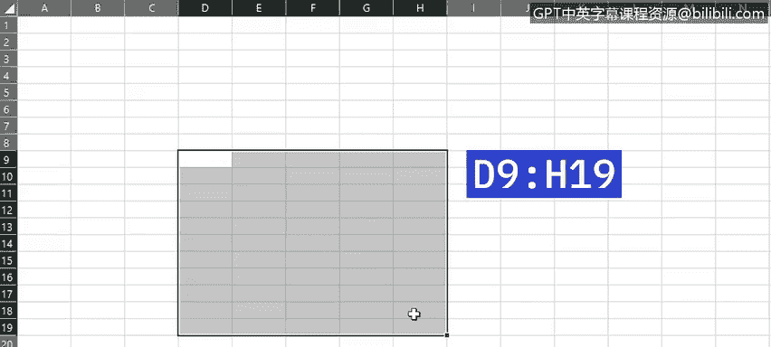
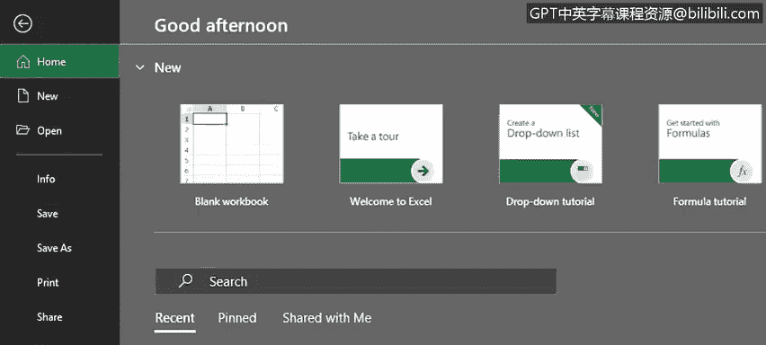

# 029：电子表格基础（第一部分）

在本节课中，我们将开始学习使用电子表格应用程序的基础知识。我们已经了解了可用的电子表格软件以及为何电子表格是数据分析师的有用工具，现在让我们深入探讨一些基本操作。

我们将使用完整桌面版的Excel进行演示，但所涉及的大部分任务同样可以在Excel Online及其他电子表格应用程序（如Google Sheets）中完成。

## 📚 基础术语介绍

首先，我们来了解一些基础的电子表格术语。

当您打开Excel时，可以选择创建一个新的空白工作簿或打开一个现有的工作簿。我们将选择“新建”一个“空白工作簿”。

**工作簿**是Excel中的最高层级组件，以 `.xlsx` 文件形式存在。因此，当您打开或创建一个工作簿时，实际上就是在操作一个 `.xlsx` 文件。

工作簿包含了您的所有数据、计算和函数，并由多个底层元素构成。

## 📄 工作表与标签

一个工作簿由一个或多个**工作表**组成，每个工作表在Excel中由一个标签页表示。

每个工作表都有一个名称，默认显示在对应的标签页上，例如 `Sheet1`、`Sheet2` 等。为了使工作表标签更具意义，通常会对它们进行重命名，以更好地反映工作表的目的。

以下是重命名工作表的方法：
*   右键单击标签页，选择“重命名”。
*   或者，直接双击工作表标签页的名称进行重命名。

工作表标签可以命名为任何符合您特定需求的名称，以便于理解该工作表所代表的内容。

请注意，当前被突出显示的工作表标签所对应的工作表，被称为**活动工作表**。

## 🔀 调整工作表顺序

如果您想以不同的方式排列工作表，操作非常简单。

您可以通过拖动工作表标签页到左侧或右侧，并将其放置在由小黑箭头指示的位置来完成。如果您不习惯拖放操作，也可以通过以下步骤实现：
1.  右键单击工作表标签。
2.  选择“移动或复制”。
3.  在“下列选定工作表之前”的列表中，选择您希望放置该工作表的位置。
4.  点击“确定”。

## 📍 单元格、行、列与引用

每个工作表都由大量称为**单元格**的矩形框组成。这些单元格将包含您的数据，数据可以是文本、数字、公式或计算结果。

单元格按**列**（垂直向下，使用字母系统，例如B列）和**行**（水平向右，使用数字系统，例如第7行）进行组织。

每个单元格由一个**单元格引用**表示，它本质上是列字母和行数字的组合。例如，如果我们点击工作表中心附近的某个位置，现在选中的是单元格 `M20`。这通常被称为**活动单元格**。

活动单元格不仅通过单元格高亮边框指示，而且在工作表的左上角，您会看到其单元格引用被记录在一个小方框中（显示为 `M20`）。

需要记住的一个重要点是，单元格引用总是**先列后行**，即先写列字母（M），再写行号（20）。

## 🔲 单元格区域

工作簿中我想提到的最后一个元素是**单元格区域**。它标识了多个被一起选中的单元格集合。

这个集合可以是同一行或同一列的几个单元格，也可以是几行和几列的组合。您可以通过鼠标操作（选中第一个单元格，然后向下或向右拖动以包含其他单元格）或使用 `Shift` 加方向键来选择单元格区域。

这个单元格范围通常被称为**数组**，最常用作计算和公式中的引用。例如，如果您想对D9到D19单元格之间的所有值求和，您可以在公式中指定这个单元格区域。

请注意，单元格区域使用单元格引用之间的**冒号**来标记。因此，在这个例子中，它将是 `D9:D19`。要指定同一行中的几个单元格，可能是 `D9:H9`。要选择多行和多列，可能是 `D9:H19`。我们将在后续课程中开始学习计算和公式时看到这种表示法的应用。

这些单元格区域甚至可以引用另一个工作表中的单元格，这通常被称为**三维引用**。

现在我们可以关闭这个工作簿，本视频中无需保存它。

## 🎯 本节总结

在本视频中，我们学习了电子表格元素的一些基本术语，包括工作簿、工作表、单元格、单元格引用和单元格区域。

在下一个视频中，我们将讨论如何在电子表格中导航、如何使用功能区与菜单以及如何选择数据。