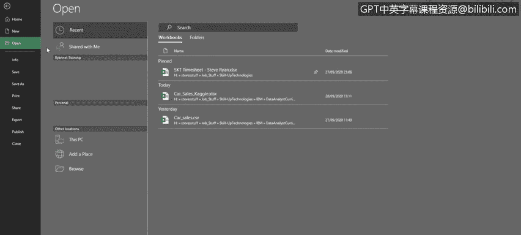
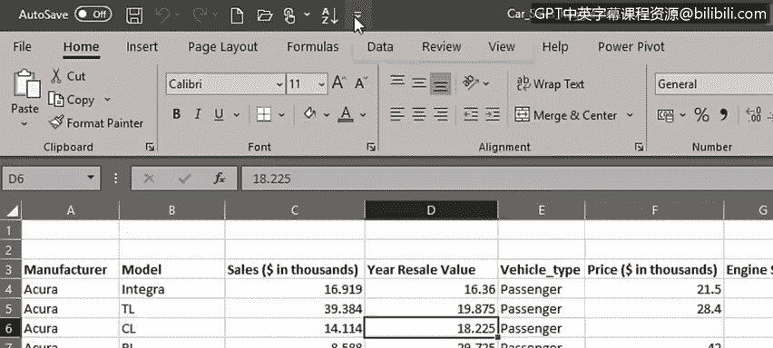
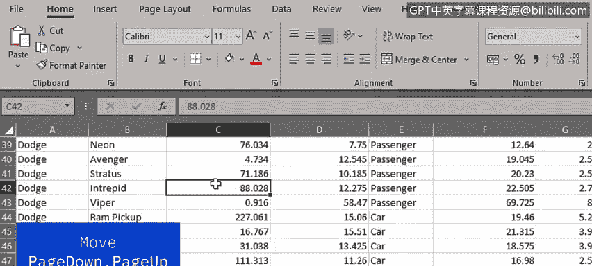
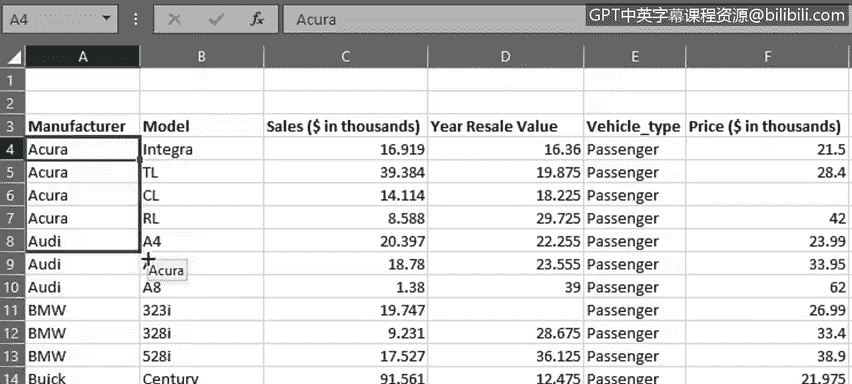

# 030：电子表格基础（第二部分）📊

在本节课中，我们将学习如何在Excel工作表中移动、熟悉功能区与菜单，并掌握选择数据的方法。这些是高效使用Excel进行数据分析的基础操作。

---

上一节我们介绍了工作表的基本构成元素，本节中我们来看看如何在实际操作中驾驭一个工作表。

要打开示例文件，我们点击“文件”。这会打开后台视图，在这里可以创建新工作簿、打开、保存或打印工作簿，也可以访问Excel选项。现在我们要打开示例文件，因此点击“打开”，然后从“最近使用的文件”列表中选择，或点击“浏览”来查找所需的数据文件。

我们首先应该熟悉功能区与菜单。请注意，顶部的功能区包含多个选项卡。其中一些选项卡（如“开始”、“插入”、“视图”）可能在其他Office产品中很熟悉，而另一些（如“公式”、“数据”、“Power Pivot”）可能是新的。

为了给自己腾出更多工作空间，我们可以通过双击任意选项卡来隐藏功能区；要取消隐藏，执行相同操作。另一个选项是使用快捷键 `Ctrl + F1`。

功能区被组织成按钮组以便查找。例如，在“开始”选项卡下，有“字体”、“对齐方式”、“数字”、“样式”等组。其中一些组（如“样式”和“单元格”）在全屏视图下包含了功能区上所有可用按钮，但其他组有更多选项，可通过点击组右下角的小箭头图标来访问，例如这里的“数字”组。

接下来要指出的是屏幕顶部、功能区上方的“快速访问工具栏”。顾名思义，这里可以快速访问最常用的工具。可以看到工具栏中已有一些工具，如“保存”、“撤销”、“恢复”、“新建”和“打开”，但我们也可以根据需要添加其他工具。点击工具栏的下拉箭头，然后选择一个常用工具（如“升序排序”），它就会被添加进来。我们也可以添加“降序排序”按钮。

---

现在我们需要熟练地在工作表中移动。

以下是移动工作表的基本方法：
*   可以使用方向键一次向左、右、上、下移动一个单元格。
*   也可以使用 `Page Down` 和 `Page Up` 键更快地移动，这在数据行数很多时特别有用。
*   要在大型数据表中更快地上下移动，请使用垂直滚动条。
*   要左右移动，请使用水平滚动条。在处理大型数据集时，这些滚动条非常有用。

还有一些有用的快捷键：
*   `Ctrl + Home`：返回工作表的起始位置，即单元格A1。
*   `Ctrl + End`：跳转到工作表中数据的末尾单元格。
*   `Ctrl + 向下箭头`：跳转到当前列的末尾。
*   `Ctrl + 向上箭头`：跳转回该列的顶部。

快速找出工作表中数据行数的方法是：定位到数据的第一个单元格，然后按 `Ctrl + 向下箭头` 查看最后一行数据。这里可以看到我们有160行数据。要返回顶部，按 `Ctrl + Home` 即可。

---

到目前为止，我们已经了解了如何在工作表及其数据中导航。现在我们需要看看如何选择数据。这非常重要，因为经常需要选择数据来移动、复制或在公式中引用。

以下是选择数据的不同方法：
*   **选择单个单元格**：通常用鼠标点击或使用方向键完成。
*   **选择多个相邻单元格**：可以用鼠标从一个单元格拖拽到其他相邻单元格，或者使用 `Shift` 键配合方向键进行选择。
*   **选择单列或单行**：只需点击列顶部的字母或行左侧的数字。
*   **选择多列或多行**：点击鼠标并按住拖拽过更多列；如果不习惯拖拽，也可以先选择一列，然后按住 `Shift` 键并使用方向键选择多列，对行同样适用。
*   **选择不连续的行或列**：如果数据位于不相邻的行或列，可以先选择第一列，然后使用 `Ctrl` 键选择其他不相连的列，例如这里的C列和F列。
*   **选择整个工作表**：可以点击单元格区域的左上角。但这会选中整个工作表，包括所有空行和空列。
*   **仅选择工作表中的数据区域**：可以使用快捷键 `Ctrl + A`。

---

关于在单元格、行和列中选择数据的一个警告：在处理选中的单元格时，可能会看到三种类型的十字形符号。

以下是三种十字形符号的含义：
*   **第一种是选择单元格时看到的大白色十字**，如单元格A4中所示。这是我们在本视频中一直使用的“选择”十字。
*   **第二种是当鼠标悬停在单元格底部边缘时看到的、带有箭头的细黑十字形符号**。这是“移动”符号，用于将单元格数据移动到另一个位置。
*   **最后一种是当鼠标悬停在单元格右下角时看到的细小黑色十字**。这是“填充柄”或“复制”符号，用于将单元格数据填充或复制到另一个位置。

---

在本节课中，我们一起学习了如何在电子表格中移动、熟悉了功能区与菜单，并掌握了在工作表中选择数据的方法。在接下来的视频中，我们将讨论如何输入数据、如何复制和粘贴数据，以及如何在电子表格中格式化数据。