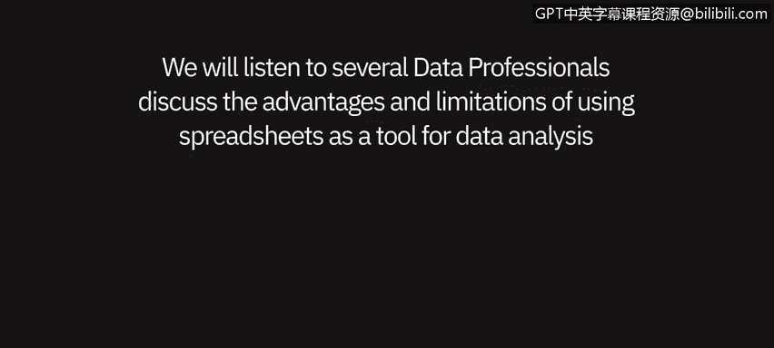
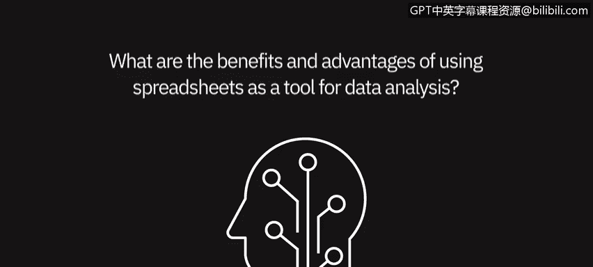

# 031：4_06 观点——将电子表格作为数据分析工具 📊

在本节课中，我们将聆听几位数据专业人士的讨论，了解将电子表格作为数据分析工具的优势与局限性。

## 概述
本节内容将分为两部分：首先探讨使用电子表格进行数据分析的优点，然后分析其缺点与限制。我们将通过专业人士的实际经验，帮助你全面理解电子表格在数据分析中的适用场景。

## 电子表格的优势 ✅

上一节我们介绍了课程主题，本节中我们来看看使用电子表格进行数据分析的主要优点。多位专业人士分享了他们的积极体验。

以下是使用电子表格作为数据分析工具的主要优势：

*   **数据呈现清晰直观**：电子表格能将所有数据清晰地以表格形式呈现出来。任何查看电子表格的人都能清楚地了解数据内容及其格式，便于进行直观的视觉检查。
*   **功能强大且全面**：以微软Excel为例，其数据透视表、图表等功能，以及公式（如专业人士偏爱的 **`INDEX-MATCH`** 函数）都非常实用。它是一个“一站式”工具，能执行计算、分析财务比率，并能从ERP系统导出报告进行自定义。
*   **适用于中小型数据集**：对于数据量大约在0到20,000行之间的数据集，电子表格是一个很好的选择。它能有效帮助用户梳理数据，例如从上千条交易记录中汇总客户月收入。
*   **化繁为简的管理能力**：通过排序、筛选、美化数据以及使用数据透视表，可以将看似难以管理的海量数据变得易于掌控。关键在于将庞杂的数据分解为可管理的部分。
*   **普及性与易用性**：电子表格是分析和呈现数据最简单的方式之一，无需任何复杂的工具或额外软件。它就像一种通用的沟通语言。

## 电子表格的局限性 ⚠️

了解了电子表格的优势后，接下来我们看看其另一面。使用电子表格进行数据分析也存在一些明显的缺点和挑战。

以下是使用电子表格作为数据分析工具的主要局限性：

*   **可复现性差**：在电子表格中分析数据的一个主要缺点是很难复现操作步骤。例如，当你加载数据、筛选异常值或填补缺失值时，无法明确告知同事或未来的自己，为了生成或修改这些数据具体采取了哪些步骤。
*   **可能导致“分析瘫痪”**：Excel提供了大量旨在简化工作的函数和选项，但几乎不可能掌握所有内容。这可能导致所谓的“分析瘫痪”，即因为对某个特定函数不熟悉而花费过多时间和精力去研究，而使用其他方法或手动操作可能更快找到解决方案。
*   **复杂公式的稳定性问题**：当使用复杂的公式（如 **`VLOOKUP`**、**`IF`** 语句）时，它们有时会停止工作，迫使你不得不重新构建，这影响了工作的可靠性。
*   **处理大规模数据的能力有限**：当数据行数超过10,000到20,000行时，操作会变得棘手，电子表格可能会崩溃。对于极大型的数据集，电子表格处理起来非常困难。
*   **复杂分析与呈现灵活性不足**：对于非常复杂的分析和高级数据呈现需求，电子表格的灵活性相对较低。

## 总结
本节课中，我们一起学习了数据专业人士对使用电子表格进行数据分析的观点。我们了解到，电子表格在数据呈现清晰度、功能集成度以及处理中小型数据集方面具有显著优势，是入门和快速分析的利器。然而，它在操作可复现性、处理大规模数据的能力以及进行复杂分析方面存在局限性。因此，在实际工作中，应根据数据规模和分析复杂度来选择合适的工具，电子表格更适用于相对简单和中小规模的数据分析任务。