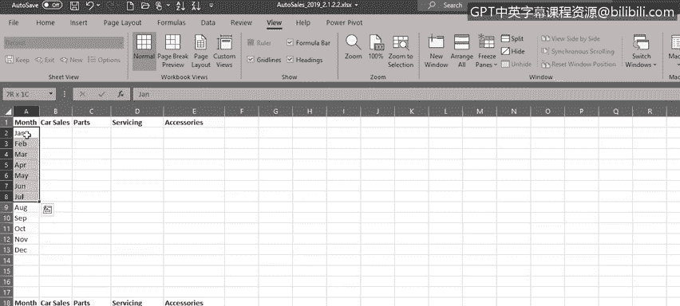
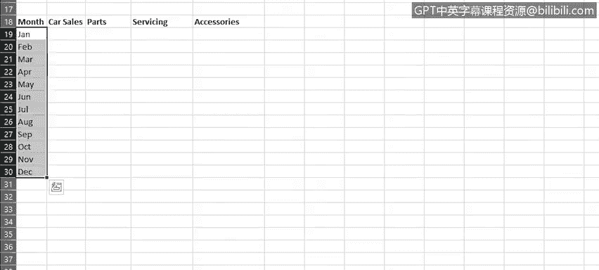
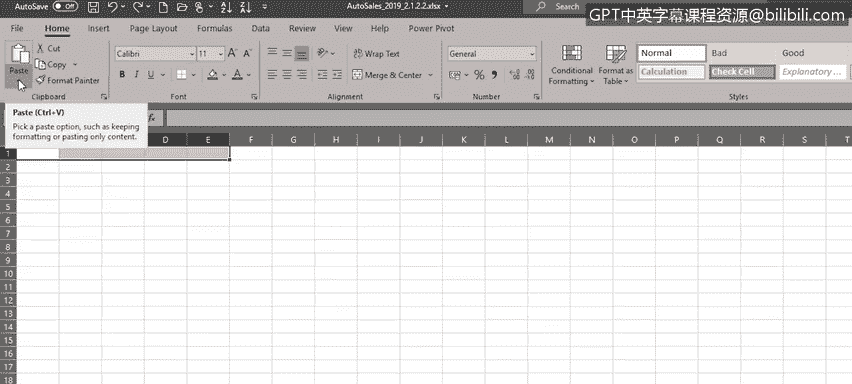
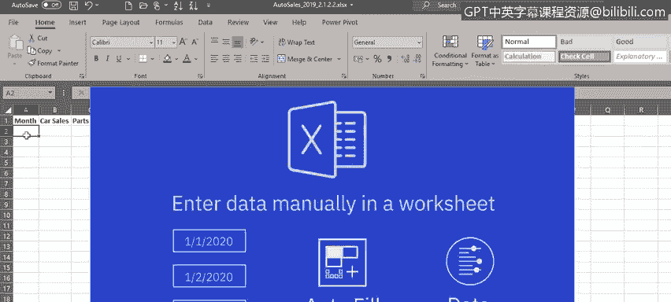
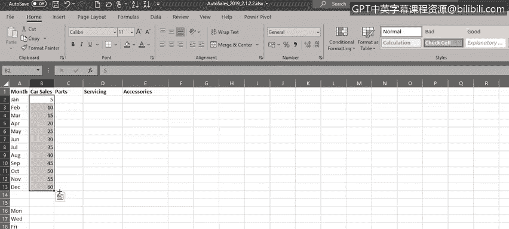
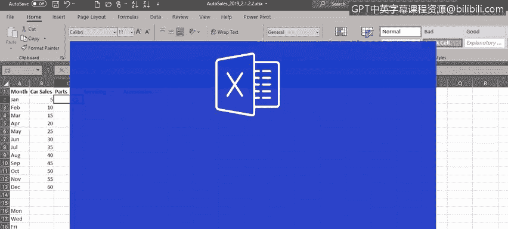
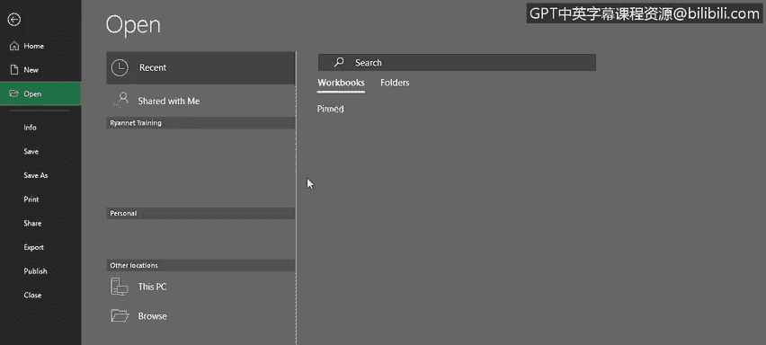

# 033：单元格与数据的复制、填充与格式化

在本节课中，我们将学习如何在Excel中移动、复制和填充数据，以及如何格式化单元格和数据以满足我们的需求。掌握这些基础操作是高效使用Excel进行数据分析的重要前提。

---

## 🚀 移动与复制数据

上一节我们介绍了Excel的视图功能以及数据的输入与编辑。本节中，我们来看看如何移动和复制数据。

首先，要移动数据，你可以选中一个单元格区域（例如标题行A1:E1），然后将鼠标悬停在选中区域的边缘，直到出现移动指针，接着将其拖动到工作表中的新位置。

如果你想复制数据，操作类似，但在拖动时需要同时按住 `Ctrl` 键，此时会出现复制指针。

如果你不习惯拖动操作，也可以使用菜单命令或键盘快捷键进行复制和粘贴。

以下是具体操作步骤：

1.  选中A列的部分数据，将其复制到剪贴板。
2.  选择新的目标位置，粘贴已复制的数据。

你还可以在不同工作表之间移动或复制数据。例如，创建一个新工作表，从“Sheet1”中选择一些数据，使用 `Ctrl + C` 快捷键复制，切换到另一个工作表，再使用 `Ctrl + V` 快捷键粘贴。

但请注意，默认粘贴时，目标位置的列宽设置可能与源数据不同。你可以撤销操作，尝试另一种粘贴选项。在“粘贴”命令下选择“保留源列宽”，即可保持源数据的列宽。

---

## 🔄 使用自动填充功能

除了手动输入，Excel的“自动填充”功能可以根据序列或模式自动填充单元格数据，这在需要输入大量重复或规律数据（如日期）时尤其有用。

例如，在一个单元格中输入月份名称（即使是缩写），然后使用填充柄向下拖动，自动填充功能会根据所选数据推断出序列。

让我们用星期几再试一次。在单元格中输入“Monday”，然后拖动填充柄，Excel会判断你想要按顺序输入星期几。

然而，如果你在下一个单元格中输入“Wednesday”，然后同时选中这两个单元格（A16和A17），再拖动填充柄，自动填充功能会判断序列模式已变为每隔一天，并据此为你填充数据。

**在使用自动填充时，务必选中所有能确定模式的单元格，这样Excel才能准确推断出规律。**

对于数字模式也是如此。如果在一个单元格中输入“5”，然后使用填充柄向下填充，由于数据不是日期或月份名称，自动填充无法判断模式，因此只会将数值“5”复制到每个选中的单元格。

但是，如果你在B3单元格输入“10”，然后使用填充柄向下填充，自动填充会判断出每次递增5的模式，并为你填充剩余的数据。

---

## 🎨 格式化单元格与数据

现在，我们来看看如何格式化数据。这主要分为两个部分：一是格式化单元格本身（如填充颜色、边框、加粗文本），二是格式化单元格中的数据（如文本格式、数字格式、特定货币或会计格式）。

让我们打开之前使用过的汽车销售工作表，然后选中标题行A3:P3。

以下是格式化单元格的步骤：

1.  在“开始”选项卡中，点击“样式”下拉箭头，为选中的单元格选择一种样式颜色，然后将其加粗。
2.  选中“制造商”列的数据，在“样式”下拉箭头中选择另一种样式颜色，同样可以加粗。
3.  选中“型号”列的数据，选择另一种样式颜色，这次可以将其设为斜体，并更改字体大小和样式。
4.  最后，选中数据区域的所有其他单元格，为其应用边框。

接下来是格式化单元格数据。例如，C列和D列的销售数据可以格式化为只显示一位小数，只需选中数据并点击“减少小数位数”按钮。

此外，我们还需要处理B129和B130单元格的问题。这两个单元格本应显示车型名称，但现在显示为两个日期。查看其数字格式，显示为“自定义”。这是因为车型号本应是“9.5”和“9.3”，但在从CSV文件导入时，这两个单元格被错误地识别为日期值。

你可以通过以下步骤修复：
1.  将这两个单元格的格式设置为“文本”。
2.  重新输入正确的值“9.5”和“9.3”。

最后，我们还需要将一些数据格式化为货币。查看F列的标题，它显示“价格（千美元）”，而F4单元格使用的是“常规”格式。

让我们将这一列的格式更改为美国货币格式：
1.  选中F列。
2.  从数字格式下拉列表中选择“更多数字格式”。
3.  选择“货币”选项，并选择正确的货币符号和格式。

---

## 📝 课程总结

本节课中，我们一起学习了如何在Excel中移动、复制和填充数据，以及如何格式化单元格和单元格数据以满足分析需求。这些基础操作是构建整洁、易读数据表格的关键。

在下一节课中，我们将学习公式的基础知识，了解如何执行简单计算，以及如何选择区域和复制公式。