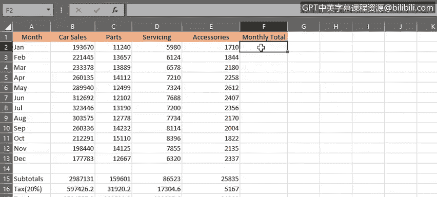
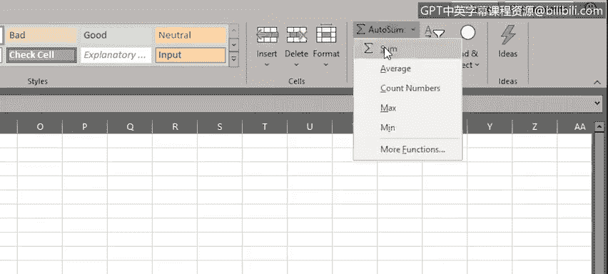
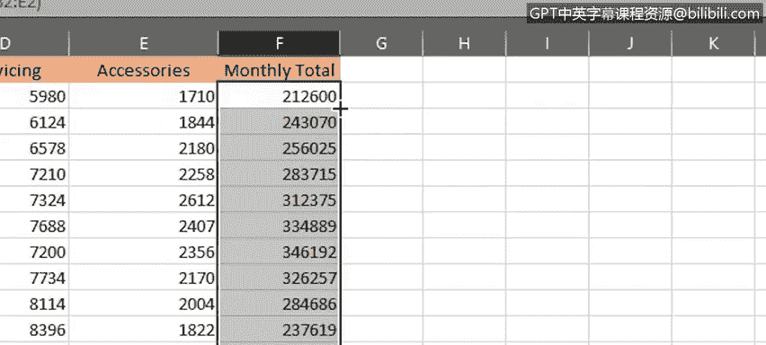
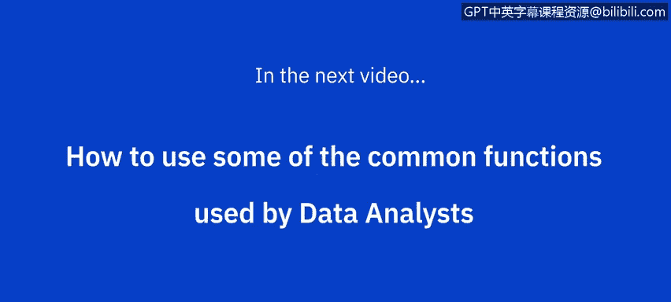

# 034：公式基础 📊

在本节课中，我们将要学习Excel公式的基础知识，包括公式的构成、如何进行基本计算、如何在公式中选择单元格区域以及如何复制公式。

---

## 公式的组成部分

上一节我们学习了如何移动、复制、填充数据以及如何设置单元格和数据的格式。本节中，我们来看看公式的基础。一个典型的公式由几个关键部分组成。

以下是公式的核心组件：

*   **等号 (`=`)**：以等号开始，告知Excel你正在该单元格中创建公式。
*   **函数**：执行计算的部分。例如，`SUM` 函数用于对引用的单元格或区域中的值进行求和。
*   **引用**：要包含在计算中的单元格或单元格区域，需要用括号括起来。
*   **运算符**：指定要执行的计算类型。常见的算术运算符包括：
    *   加法：`+`
    *   减法：`-`
    *   乘法：`*`
    *   除法：`/`
*   **常量**：可以直接输入到公式中且不会改变的数字或值。例如，整数 `5`、百分比 `10%` 或一个日期。

因此，一个典型的公式可能如下所示：`=SUM(B5*20)`，该公式将取单元格B5中的值并乘以20。

---

## 执行基本计算

了解了公式的构成后，我们开始进行一些基本计算。假设你想汇总一月份和二月份的配件销售额。

以下是操作步骤：

1.  输入等号 `=`，开始公式。
2.  输入要使用的函数，例如 `SUM`。
3.  输入左括号 `(`。
4.  选择你的单元格区域。例如，要计算E2和E3的和，可以输入 `E2,E3`。
5.  输入右括号 `)` 并按回车键。

如果你想将三月份的销售额也加进去，就需要扩展单元格区域以包含E4，可以输入 `E2,E3,E4`。

然而，这种方式非常繁琐且不灵活。如果要累加整列数据，就需要逐个输入每个单元格引用。幸运的是，有更好的方法。

---

## 在公式中选择区域

与其逐个输入每个单元格，不如在区域的首尾值之间使用冒号。例如，`E2:E4` 表示从E2到E4的连续区域。如果要选择整列，可以输入 `E2:E13`。

还有一种更便捷的方法：使用鼠标选择区域。输入 `=SUM(` 后，直接用鼠标或配合Shift键和方向键选择所需区域，然后按回车键，Excel会自动为你添加右括号。

---

## 复制公式

为了计算各列的小计并加上20%的税费，你可以为每一列重复上述过程，但这非常耗时。Excel提供了便捷的技巧来完成这个任务。

以下是复制公式的方法：

*   **使用填充柄**：选中包含公式的单元格，拖动其右下角的填充柄（小方块）到其他单元格，即可复制公式。这称为“自动填充”。
*   **注意相对引用**：复制公式时，公式中的行引用会根据单元格在工作表中的位置自动调整。例如，原来的 `E2:E13` 在复制到B列后变成了 `B2:B13`。这被称为“相对引用”。

你可以对税费行（例如第16行）进行同样的操作。

接着，你需要一行来显示总计。计算很简单：例如，`=B15+B16`。同样，可以使用填充柄将公式横向复制到其他列。

---

## 使用自动求和与快速填充

如果你想按月汇总所有产品的销售额，可以添加一个列标题，然后像之前一样在单元格F2中输入公式。

不过，Excel还有一个技巧：“自动求和”功能。你可以在“开始”选项卡的“编辑”组中找到它。这是一个用于常见函数（如求和、平均值、计数、最大值、最小值）的快捷方式，其键盘快捷键是 `Alt` + `=`。

输入公式后，你可以使用填充柄向下复制到其余单元格。但如果数据列非常长，拖动填充柄可能会很麻烦。

这里有一个更高效的方法：**双击填充柄**。Excel会自动将公式复制到该列所有剩余的单元格中，这能节省大量时间。

---

## 格式化数值

最后，别忘了将所有计算出的数值格式化为美元货币格式，使数据更清晰易读。

---

本节课中，我们一起学习了Excel公式的基础知识，包括如何执行简单计算、如何在公式中选择区域以及如何高效地复制公式。在下一视频中，我们将探讨数据分析师常用的一些函数，并发现更多高级功能。