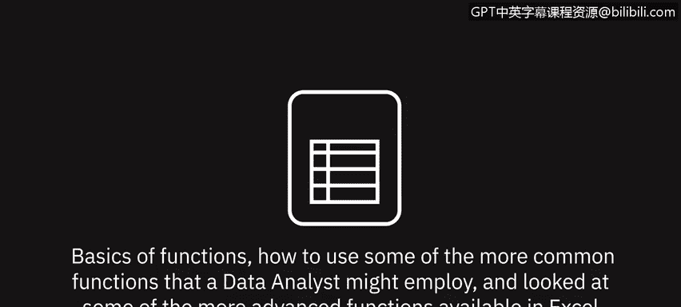
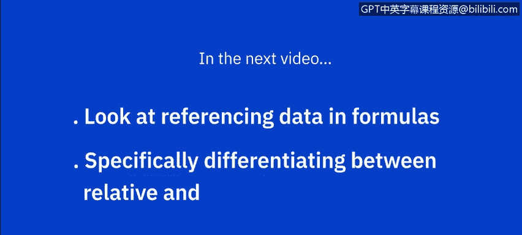

# 035：函数入门

在本节课中，我们将学习Excel函数的基础知识，包括常用统计函数的使用方法，并初步了解数据分析师可能用到的一些高级函数。通过本课，你将掌握如何利用函数高效处理数据。

---

## 📈 常用统计函数

上一节我们学习了公式基础、基本计算以及如何选择范围和复制公式。本节中，我们来看看如何使用Excel中的常用统计函数。

首先，我们为平均值、最小值、最大值、计数和中位数添加行标题。在单元格B20中，计算上方表格中全年汽车销售的平均值。

在“开始”选项卡的“编辑”组中，点击“自动求和”下拉列表，选择“平均值”。

由于“自动求和”默认会汇总该列上方的数值，我们需要将单元格范围修改为B2到B13。然后，我们可以使用填充柄（如前所述）将公式复制到E列。

对于B21中的最小值计算，我们从“自动求和”列表中选择“最小值”，同样需要修改单元格范围。此操作计算选定范围内的最低值，并填充到E列。

对于最大值计算，我们从列表中选择“最大值”，然后修改范围，并再次复制公式。此操作计算选定范围内的最高值。

在B23中，我们将计算“计数”，这基本上意味着选定范围内存在的数值个数。我们从列表中选择“计数”，然后修改范围。

对于中位数计算，我们可以从“自动求和”列表中选择“其他函数”，然后选择“统计”类别，向下滚动找到“中位数”函数。

中位数返回选定值范围的正中间值。请注意，如果选择奇数个数值，它将返回中间值；如果选择偶数个数值，它将返回两个中间值之间的平均值。同样，我们需要将单元格范围更改为B2到B13，然后将此公式复制到E列。

---

## 🔍 探索更多函数

你已经了解了“自动求和”和一些Excel中的常用统计函数，但Excel还提供了400多个其他函数。现在，让我们探索其中的一些。

在“公式”选项卡的“函数库”组中，有几个函数类别的下拉列表。

以下是各类别函数的简要介绍：

*   **最近使用的函数**：列表会根据你的使用情况自动更新。
*   **财务函数**：与财务计算相关的函数。将鼠标悬停在函数名称上，可以看到简短描述。例如，这里有“应计利息”函数和“利率”函数。
*   **逻辑函数**：包含布尔运算符函数，如`AND`、`IF`和`OR`。
*   **文本函数**：包含多个与文本相关的函数，例如`CONCAT`（这是旧函数`CONCATENATE`的更新版本，为向后兼容仍受支持）、`FIND`和`SEARCH`。
*   **日期与时间函数**：包含多个相关函数，如`NETWORKDAYS`、`WEEKDAY`和`WEEKNUM`。
*   **查找与引用函数**：包含诸如`AREAS`、`HLOOKUP`、`SORTBY`和`VLOOKUP`等函数。
*   **数学与三角函数**：包含许多有用的数学函数，如`POWER`、`SUMIF`和`SUMPRODUCT`，以及许多三角函数，如`COS`、`SIN`和`TAN`。
*   **其他函数**：提供更多函数类别，如“统计”、“工程”和“信息”。在“统计”列表中，你可以找到诸如`AVERAGE`、`COUNT`、`MAX`、`MEDIAN`和`MIN`等函数，我们在本视频前面已经看到过其中一些的使用。

---

## 🔎 如何查找函数

如果你在这些列表中难以找到所需的函数，也可以搜索函数。

只需点击“公式”选项卡上的“插入函数”按钮，然后可以浏览可用的类别列表，或选择“全部”并按字母顺序查找所需函数。

或者，键入你想要查找的函数名称并点击“转到”进行搜索，然后从返回的搜索结果中选择你需要的函数。

---

## 📝 课程总结

本节课中，我们一起学习了函数的基础知识，包括如何使用数据分析师可能用到的一些常见函数，并浏览了Excel中可用的一些更高级的函数。

在下一个视频中，我们将学习公式中的数据引用，特别是相对引用与绝对引用的区别，以及公式中的错误处理。