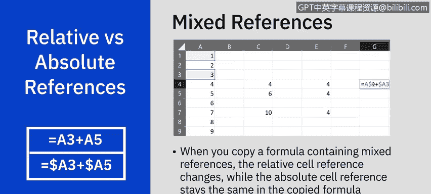
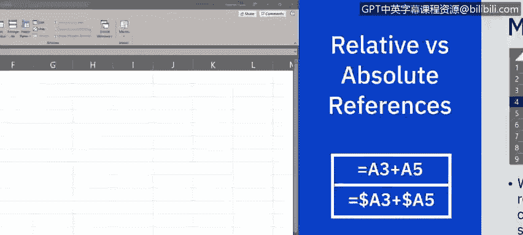
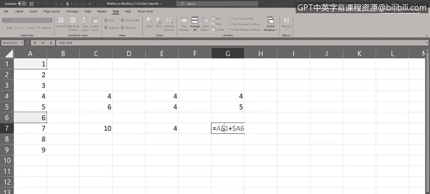
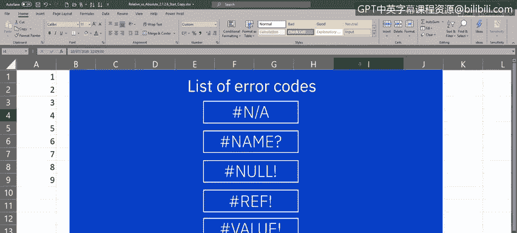
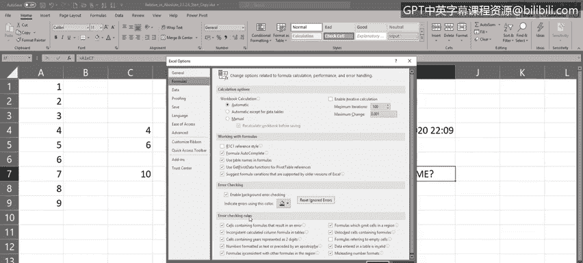
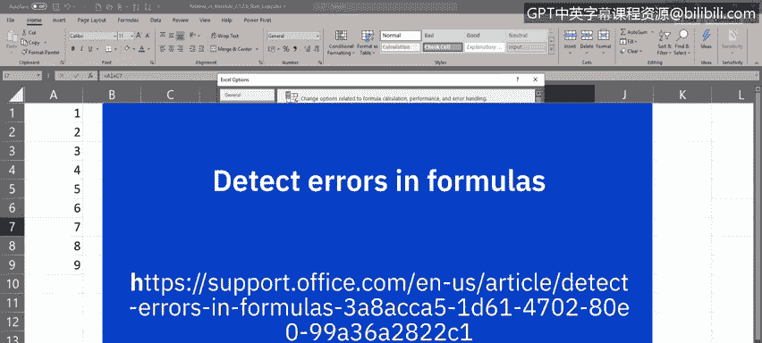

# 036：公式中的数据引用

在本节课中，我们将学习Excel公式中三种不同的单元格引用方式：相对引用、绝对引用和混合引用。我们还将了解如何识别和处理常见的公式错误。

---

## 🔗 理解相对引用、绝对引用和混合引用

上一节我们介绍了Excel函数，本节中我们来看看公式中引用单元格的不同方式。理解这些引用类型的区别对于创建准确且可复用的公式至关重要。

默认情况下，Excel中的单元格引用是**相对引用**。这意味着当你引用一个单元格时，实际上是在引用该单元格相对于公式所在单元格的位置。因此，当你复制公式时，引用的单元格地址会根据新位置自动调整。

有时，你希望公式中的单元格地址在复制时保持不变，这时就需要使用**绝对引用**。绝对引用在列标和行号前添加美元符号（`$`）来锁定。

此外，还存在**混合引用**的情况，即只锁定行或只锁定列。例如，`$A1`（绝对列，相对行）或`A$1`（相对列，绝对行）。复制包含混合引用的公式时，相对部分会改变，而绝对部分保持不变。

以下是三种引用类型的核心表示：

*   **相对引用**：`A1`
*   **绝对引用**：`$A$1`
*   **混合引用**：`$A1` 或 `A$1`

---

## 📝 引用类型使用示例

现在，我们通过具体例子来看看如何使用这三种引用。

### 相对引用示例

首先，让我们看一个在公式中使用相对引用的例子。

在单元格E4中输入公式 `=A1+A3`。注意，A1和A3单元格被高亮显示，表示它们被公式相对引用。

1.  使用填充柄将公式向下复制到E5单元格，结果会发生变化。
2.  查看E5中的公式，你会发现它变成了 `=A2+A4`。每个单元格引用都相对于新位置向下移动了一行。
3.  如果将公式复制粘贴到C7单元格，结果同样会变，公式会变为 `=C4+C6`。

### 绝对引用示例

接下来，我们看看如何在公式中使用绝对引用。

要使单元格引用变为绝对引用，需要在列标和行号前添加美元符号（`$`）。

在单元格E4中输入公式 `=$A$1+$A$3`。此时，A1和A3单元格被绝对引用。

1.  使用填充柄将公式向下复制到E5单元格，结果保持不变。
2.  查看E5中的公式，它仍然是 `=$A$1+$A$3`。单元格引用没有改变。
3.  将公式复制粘贴到E7单元格，结果和公式依然保持不变。

### 混合引用示例

最后，我们学习混合引用的用法。

在单元格G4中输入公式 `=A$1+$A3`。这里，`A$1`是列相对、行绝对，`$A3`是列绝对、行相对。

1.  使用填充柄将公式向下复制到G5单元格，结果会变化，但与纯相对引用的变化不同。
2.  查看G5中的公式，第一个引用 `A$1` 保持不变（行被锁定），第二个引用 `$A3` 变成了 `$A4`（行相对变化）。
3.  将公式复制粘贴到G7单元格，同样，只有相对部分（行号）发生了改变。

---

## ⚠️ 处理Excel公式错误

由于编写公式，尤其是复杂公式时容易出错，因此了解如何处理公式错误非常重要。公式错误通常会在结果单元格中显示特定的错误代码。

当单元格中显示一连串的井号（`#####`）时，这通常不是真正的公式错误，而是表示列宽不足以显示全部内容，或者包含了负的日期或时间值。调整列宽即可解决。

然而，如果输入了错误的公式，例如在I7单元格中输入 `=5X5` 并按下回车，你会看到 `#NAME?` 错误。这是因为Excel无法识别“X”作为乘号（正确的应为星号 `*`）。

请注意单元格左上角出现的绿色小三角，以及选中单元格时旁边出现的感叹号。点击感叹号下拉菜单，可以看到错误提示和多个选项：

*   **错误信息**：提供错误原因线索（如“无效名称错误”）。
*   **关于此错误的帮助**：打开帮助窗格，提供详细信息。
*   **显示计算步骤**：打开对话框，逐步评估公式，定位错误点。
*   **忽略错误**：如果你确认错误可以忽略。
*   **在编辑栏中编辑**：将光标定位到公式栏，方便你修改公式。
*   **错误检查选项**：打开Excel选项对话框，设置错误检查规则。

不同的错误代码（如`#DIV/0!`、`#N/A`、`#REF!`等）对应不同的原因和解决方法。如需了解更多错误代码的典型解决方案，可以参考课程提供的链接。

---

## 📚 课程总结

本节课中，我们一起学习了Excel公式中的数据引用。我们重点区分了相对引用、绝对引用和混合引用，并通过实例掌握了它们的使用方法。此外，我们还介绍了如何识别和处理常见的Excel公式错误，这将帮助你在数据分析工作中构建更健壮、准确的电子表格。