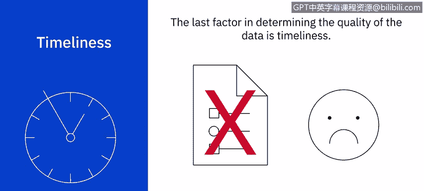

# 037：数据质量简介

在本节课中，我们将学习数据质量在数据分析中的核心作用，并了解评估数据质量的五个关键特征。确保数据准确、可靠是做出有效业务决策的基础。

数据分析在业务决策和流程中扮演着关键角色。为了利用数据做出正确的决策，我们必须为项目获取正确的信息，并且数据必须没有错误。

在本视频中，我们将学习如何通过数据剖析来发现不一致之处。无论我们处理的是小数据集，还是分析包含数千行的电子表格，数据分析中最困难的部分之一就是找到并保持数据的清洁。为了帮助这一过程并评估数据质量，我们需要关注以下五个特征。

以下是评估数据质量的五个核心特征：

*   **准确性**：这是数据质量首要且最重要的方面。数据分析师必须通过**删除重复项、纠正格式错误以及移除空行**来清理数据集。
*   **完整性**：另一个重要方面是判断完成数据集所需的信息是否易于获取。为什么这很重要？假设我们的任务是计算每个区域的销售总收入，但在收集数据后发现没有指定区域信息。那么这些数据就被视为不完整，必须考虑其他来源来获取所需数据。
*   **可靠性**：这是决定数据质量的另一个关键因素。例如，假设我们的任务是按客户确定代理收入。在收集数据时，我们发现代理们各自保存记录，并不总是将信息更新到共享的公司数据库中。考虑到这些因素，我们会判定共享公司数据库中的数据不可靠，需要建立新的流程来确保数据的可靠性。
*   **相关性**：这是优质数据的另一个特征。在收集信息时，数据分析师必须考虑所汇集的数据是否真的为项目所必需。例如，在审查每位客户的销售收入相关数据时，如果其中包含了客户生日等个人信息，早期就决定将这些个人信息排除在数据集之外，可以避免分析师审查不必要的信息。
*   **及时性**：决定数据质量的最后一个因素是及时性。这个特征指的是所选数据的可用性和可访问性。假设我们的销售报告将用于每周的员工评估，但报告每月才更新一次。这种数据刷新错误会导致报告过时，并对员工评估产生严重后果。

---

上一节我们介绍了评估数据质量的五个特征，本节我们来总结一下它们的重要性。

在本视频中，我们学习了数据分析师在通过考虑优质数据的五个特征来评估数据质量方面所扮演的重要角色。通过关注这些特征，分析师可以节省时间、避免严重问题，并获得没有错误的数据。

在下一个视频中，我们将获取收集到的数据，并学习如何将其导入到我们的电子表格中。