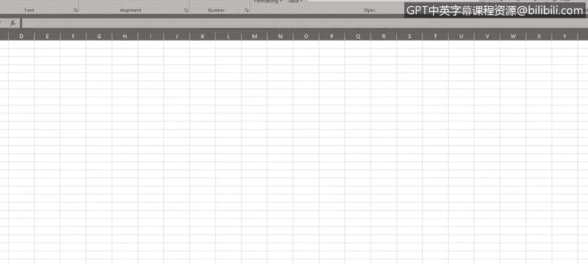
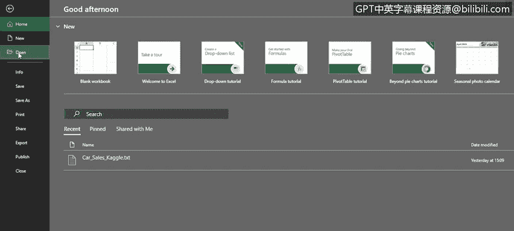
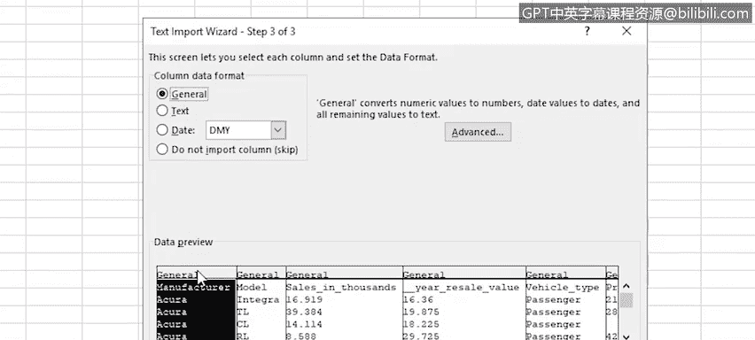
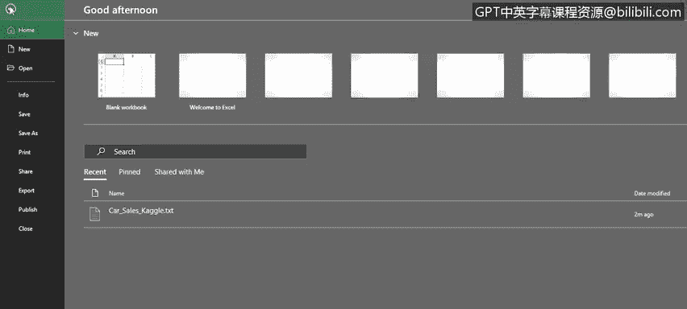
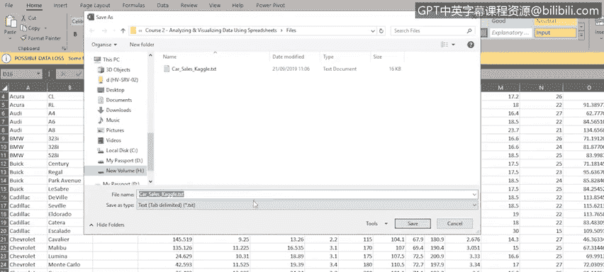
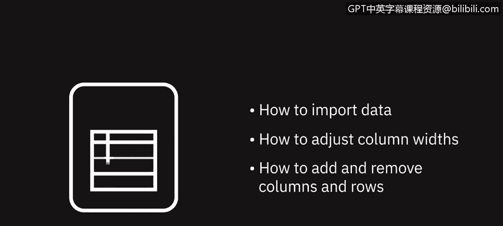

# 038：导入文本文件数据

在本节课中，我们将学习如何将文本文件中的数据导入到Excel中。你将掌握使用文本导入向导、调整列宽以及添加和删除行列的方法。这些技能对于处理来自不同来源的数据至关重要。

---

## 文本文件与Excel

默认情况下，Excel处理的是 `.xlsx` 或 `.xls` 格式的工作簿文件。然而，Excel也能导入其他格式的数据，例如纯文本文件，或使用逗号、制表符分隔的数据文件。这类文件通常以 `.txt` 扩展名保存，被称为文本文件；或以 `.csv` 扩展名保存，被称为CSV文件。

在记事本中打开一个关于汽车销售数据的文本文件，可以看到它使用了逗号分隔值（CSV）来分隔每条记录中的每个数据片段。文件的第一行包含标题，如制造商、型号、发动机排量等，每个标题之间用逗号分隔。我们希望这些标题在导入Excel后成为列标题。

标题行下方是第一行实际数据。同样，每个数据片段也用逗号分隔。总共有16个标题，标题下方的每一行数据也包含16个数据片段。滚动到文件底部，可以看到最后一条数据记录是关于沃尔沃S80的。

---

## 使用文本导入向导

要将文件在Excel中打开，请选择 **文件 > 打开**，然后从最近使用的列表中选择文件，或点击“浏览”找到要导入的文件。

打开文件时，文本导入向导会自动启动，并开始尝试判断你的文件类型。向导检测到这是一个分隔文件，即数据字段由逗号或制表符等字符分隔的文件。

由于我们希望标题行成为Excel中的列标题，需要确保勾选 **“我的数据包含标题”** 选项。可以在下方的预览框中看到数据的迷你预览。

然后，点击 **“下一步”** 继续。

在向导的第二步，需要选择分隔符，即分隔数据片段的字符。因此，我们选择 **“逗号”** 并取消选择其他选项。注意，数据预览现在开始显示导入后的数据样式。你可以滚动预览窗口，确保数据呈现的样式符合预期。

一切看起来都没问题，我们继续向导的第三步。

在第三步中，可以为每一列设置数据格式。例如，你可能希望将某列改为文本或日期格式。在本例中，我们可以直接接受默认的 **“常规”** 格式，然后完成导入向导。

---

## 调整列宽与行列操作

在Excel中，可以看到文本文件中的标题已作为标题行导入。但同时也注意到，有些列没有显示全部数据：部分标题未完全显示，一些数据也未显示，单元格中只看到一串井号（`####`）。这是因为某些列的宽度太窄。

如果你还记得，可以通过拖动列之间的分隔线来手动调整列宽。但要一次性调整所有列，可以先选中所有列，然后双击任意一个被选中的列分隔线。

对行也可以进行类似操作：拖动行分隔线来调整行高，或双击行分隔线以自动调整行高。

我们决定删除一些不需要的列，即“车辆类型”和“最新上市”。删除操作可以通过两种方式完成：
1.  在 **“开始”** 选项卡的 **“单元格”** 组中，使用 **“删除”** 下拉菜单，选择 **“删除工作表列”**。
2.  选中列后右键点击，选择 **“删除”**。

要添加一个新列，只需选中你希望新列出现位置右侧的那一列，然后右键点击并选择 **“插入”**。让我们给这个新列标题命名为“年份”。

要删除不需要的行，选中该行，右键点击并选择 **“删除”**。

要添加新行，选中你希望新行出现位置下方的那一行，右键点击并选择 **“插入”**。

---

## 保存为Excel文件

如果你想将文件保存为Excel文件，有两种方法：
1.  选择 **文件 > 另存为**。
2.  点击导入文件时出现在工作表顶部的黄色工具提示中的 **“另存为”**。

然后，在 **“保存类型”** 框中选择 **“Excel工作簿”** 或 `.xlsx` 格式。

---

## 本节总结

在本节课中，我们一起学习了如何使用文本导入向导导入数据、如何调整列宽，以及如何在行和列中添加和删除数据。这些是处理外部数据源的基础操作。

在下一个视频中，我们将讨论数据隐私的重要性，包括敏感信息和个人可识别数据。