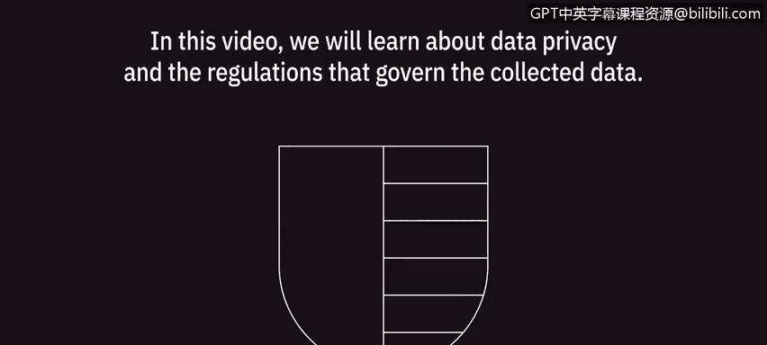
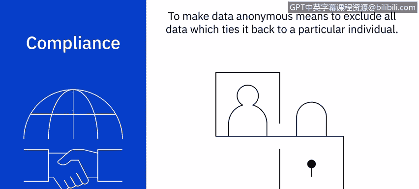
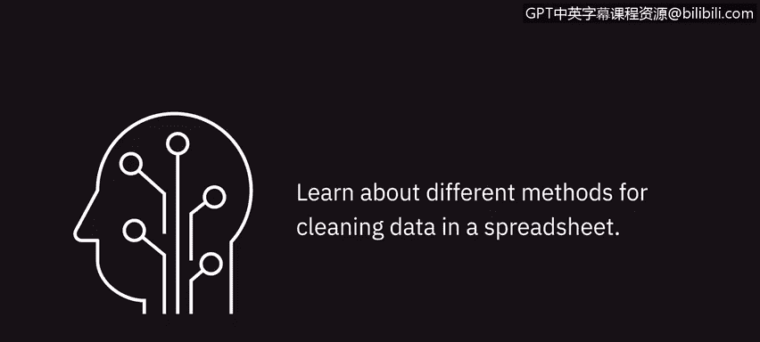

# 039：数据隐私基础

在本节课中，我们将学习数据隐私以及管理所收集数据的相关法规。

---

## 🛡️ 数据隐私的重要性与法规

当收集客户数据时，具体法规规定了这些数据的使用方式。理解数据隐私法规并熟悉以下三个基本原则，可以消除财务处罚的风险并保持客户的信任。

以下是三个核心原则：

*   **保密性**：这是数据隐私的重要元素，它承认客户的个人信息属于客户本人。
*   **收集与使用**：对数据如何被收集和使用的规范。
*   **合规性**：确保所有操作符合相关法律法规。

---

## 🔍 个人数据的类型

上一节我们介绍了数据隐私的基本原则，本节中我们来看看数据分析师需要识别的不同个人数据类型。

数据分析师可能接触的信息范围很广，从销售预测到员工信息，甚至患者记录。在处理这些记录时，分析师必须能够识别不同类型的个人数据。

以下是主要的个人数据类型：

*   **个人信息**：任何可以追溯到特定个人的信息，例如电子邮件或图像。
*   **个人可识别信息**：可用于识别个人的特定信息，例如社会安全号码或驾驶执照号码。
*   **敏感个人信息**：这类信息不一定能识别特定个人，但包含需要保护的私人信息，因为如果公开，可能会对个人造成伤害。例如种族、性取向、生物识别或遗传信息数据。

通过理解个人数据及相关法规，我们可以通过移除不必要的信息来有效地匿名化数据。这种做法有助于建立客户信心，并促进信息的自由流动。

---

## 🌍 地域与行业特定法规

理解了个人数据的分类后，我们来看看管理这些数据的具体法规。这些法规通常与数据收集的地理位置和行业密切相关。

在搜索数据时，分析师必须了解收集数据的公司所在地以及受访者所在地。了解数据收集地是数据隐私的关键要素，决定了必须适用哪些法规。

以下是主要的地域性法规：

*   **《通用数据保护条例》**：这是欧盟特有的法规，仅适用于欧盟境内的个人管辖范围。
*   **巴西《通用数据保护法》**：这项于2020年8月生效的新法律适用于巴西境内的个人，而不考虑数据处理者的位置。
*   **美国各州法规**：美国没有全国统一的数据隐私法，因此各州开始制定自己的法规。例如，加利福尼亚州制定了《加州消费者隐私法案》以更好地保护客户数据。

此外，还有行业特定的法规来管理敏感和个人数据的收集与使用：

*   **医疗保健行业**：HIPAA隐私规则管理受保护健康信息的收集和披露。
*   **零售行业**：PCI标准管理信用卡数据，未能保护持卡人信息可能导致巨额罚款。

对这些政策有基本了解后，我们就能在处理任何敏感信息时保持合规。不幸的是，客户数据泄露事件屡见不鲜，因此理解如何保持合规至关重要。

---

## ⚠️ 合规案例与数据匿名化

了解了主要法规后，我们通过一个案例来看看不合规的后果，并探讨如何通过匿名化避免隐私问题。

理解欧盟、美国及其他国家和行业的数据隐私法规是保护数据安全的关键。公司必须始终遵守这些隐私法规，并确保员工能够方便地获取相关政策。

例如，假设一名数据分析师下载了一份包含敏感信息的电子表格。为了在周一早上完成报告，该分析师决定周末将工作笔记本电脑带回家。开车回家后，分析师不小心将笔记本电脑留在了车里。第二天早上，他们发现汽车连同笔记本电脑一起被盗。由于公司有责任保护客户数据安全，当数据离开公司财产时，就构成了隐私泄露。这种行为不仅可能使公司面临巨额罚款，还可能降低客户信心，对收入造成重大影响。

虽然数据隐私适用于大多数收集的数据，但在某些情况下这些法规并不适用。为了使这些法律和法规不适用，特定的数据收集必须是完全匿名的。

**使数据匿名化意味着排除所有能将其与特定个人关联起来的数据。** 虽然这种方法在所有情况下可能都不切实际，但在收集数据时考虑到隐私可以消除隐私限制，使数据收集更容易进行。

---

## 📝 课程总结

本节课中，我们一起学习了数据隐私的重要性，以及数据分析师在收集和整理数据时可能面临的挑战。我们探讨了个人数据的类型、关键的地域与行业法规，并通过案例理解了合规的必要性和数据匿名化的方法。

在下一课的系列视频中，我们将学习在电子表格中清洗数据的不同方法。