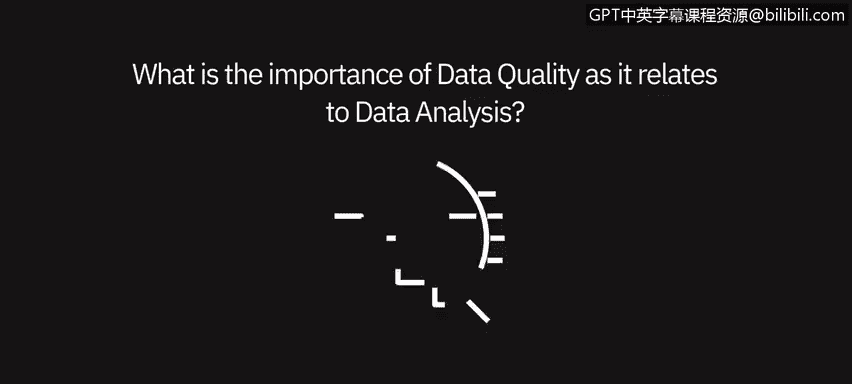
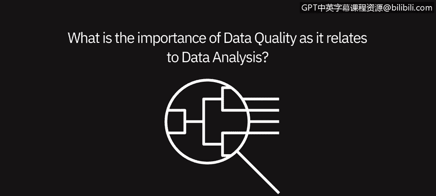
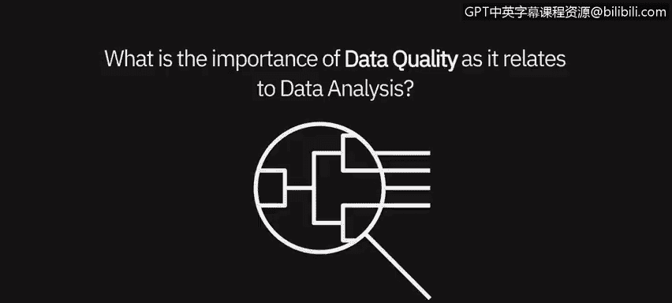
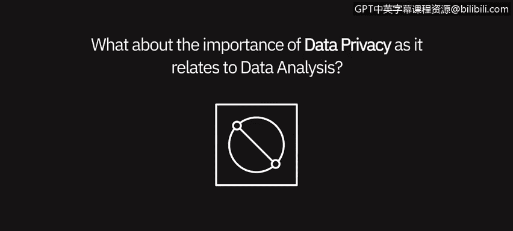

# 040：数据质量与隐私的重要性 👁️🗨️

在本节课中，我们将聆听几位数据专业人士的见解，探讨数据质量和数据隐私在数据分析中的重要性。

---

## 数据质量的重要性

上一节我们介绍了本课的主题，本节中我们来看看数据质量为何如此关键。多位专家强调了高质量数据是任何分析项目的基石。

以下是数据专业人士阐述数据质量重要性的几个核心观点：

*   **信任与可信度**：数据质量至关重要。当你的分析结果与他人的预期不符时，他们首先会质疑数据的来源、处理过程及转换方式。人们通常认为自己了解业务，如果你的数据质量不高、不干净或来源不可信，你将陷入无休止的争论，最终导致分析结论失去说服力。
*   **垃圾进，垃圾出**：任何成功数据分析项目的支柱都是高质量数据。计算机科学中有一个常见术语：**`垃圾输入，垃圾输出（Garbage In, Garbage Out）`**。其本质是，如果输入低质量数据，你只能得到低质量的结果。因此，数据分析中最重要的事莫过于确保你使用的是高质量数据。亲自检查数据并确信其质量极高，这一点非常重要。
*   **准确性至上**：数据准确性高于一切。分析低质量数据是浪费时间，并可能误导业务方向。你所使用或提供给他人使用的数据完整性至关重要。数据被用来决定产品发布的时间或地点，判断部门是否盈利。如果不关注细节，很容易混淆。以库存为例，如果你在SKU层面分析库存，却不小心选错了SKU进行分析，进而得出某个产品不盈利的结论，而事实却相反。这对公司来说显然是一个重大决策。因此，期望在分析初期就进行大量尽职调查。如果你从有问题的数据开始构建分析，之后才发现问题，你将损失时间、精力、努力，有时甚至是他人的信任。

---

## 数据隐私的重要性

了解了数据质量的基础作用后，我们接下来探讨另一个关键维度：数据隐私。在处理敏感信息时，保护数据隐私是重中之重。

以下是关于数据隐私重要性的主要观点：

*   **行业普遍要求**：数据隐私极其重要，尤其是在制药或医疗保健等行业，但这并非全部。我们必须有能力确保用户根据其角色和权限获得相应级别的数据。我们可以通过多种方式实现，例如为每个地区或职能提供特定的数据切片。在某些工具（如认知分析）中，我们可以在模型内部构建权限，指定谁可以访问什么，无论是细粒度地控制某人只能查看加拿大或美国的数据，还是简单地控制某人能否查看完整报告。处理方式多种多样，但数据隐私在所有行业都至关重要。
*   **保护个人信息**：在当今世界，数据隐私是一个重大问题。特别是在我们的税务业务中，我们拥有所谓的**`PII（个人可识别信息）`**，我们必须保护它。因此，我们不能仅仅通过电子邮件发送资料。我们不会通过电子邮件发送报税表，实际上，在我们的业务中，任何包含敏感PII数据的文件都不会通过普通邮件发送。我们会加密邮件，确保邮件被加密，或者使用特定软件来隐藏社会安全号码、姓名或出生日期等信息。这些信息会以特定序列呈现，我们通过电话与客户分享该序列，绝不会将其与加密信息放在同一封邮件中，以确保始终安全。我们必须不惜一切代价确保数据受到保护。

---

## 课程总结

本节课中，我们一起学习了数据质量和数据隐私在数据分析中的核心重要性。我们了解到，高质量的数据是产出可靠分析结果的先决条件，而保护数据隐私，尤其是在处理敏感个人信息时，是所有数据分析师必须遵守的伦理和法律准则。确保数据的准确性、完整性和安全性，是进行有效、负责任的数据分析的基础。