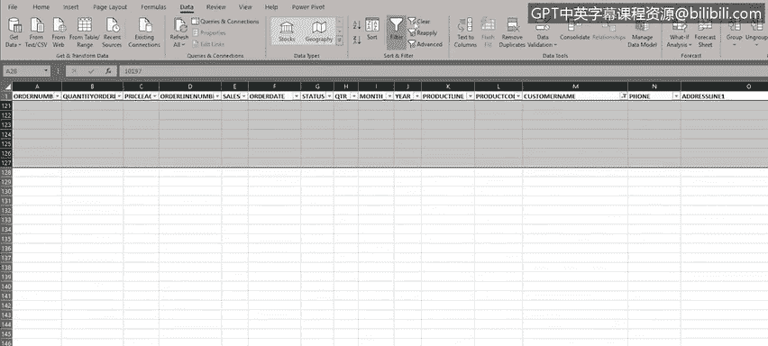
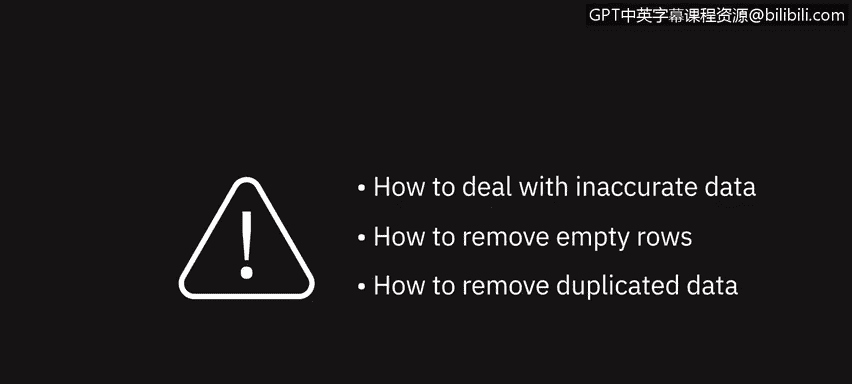

# 041：处理重复、不准确数据与空行 🧹

在本节课中，我们将学习如何处理数据中的不准确信息、删除空行以及移除重复数据。这些操作是数据清洗的基础步骤，能显著提升数据集的质量和可用性。

我们已经了解了数据质量和数据隐私的重要性。本节中，我们来看看如何具体处理数据中的常见问题。

在收集或导入数据时，无论是通过手动还是自动流程，数据中出现错误和不一致的情况都非常普遍。这些错误可能很简单，比如拼写错误、多余的空格、文本大小写错误，也可能是空行、缺失值、不准确或重复的数据。数据中的这些错误和不一致会导致公式无法正常工作、排序和筛选操作失败，进而影响数据可视化和分析结果的呈现。因此，我们需要执行数据清洗流程来改善数据的质量和可用性。

---

## 1. 拼写检查 ✏️

让我们从一项相对简单的任务开始：在Excel中进行拼写检查。其工作原理与你在Microsoft Word等文字处理软件中遇到的基本相同。

以下是操作步骤：

1.  首先，选择需要检查拼写的数据区域。例如，我们选择包含产品线数据的K列。
2.  然后，点击“审阅”选项卡下的“拼写检查”按钮。
3.  检查完成后，我们可以尝试检查包含国家信息的T列。这里发现了一个国家名称的拼写（或更可能是打字）错误。
4.  如果对拼写建议满意，点击“更改”。也可以从列表中选择其他建议，或者如果确认数据正确，可以选择“忽略”。在本例中，我们选择“更改”。
5.  继续处理该列中的其他拼写错误。
6.  最后，检查包含交易规模数据的X列。这里发现了“small”和“medium”的拼写错误，并进行更正。

---

## 2. 删除空行 🗑️

数据中的空行会导致许多问题，例如在数据间移动、使用公式以及排序和筛选时出现错误。因此，删除空行非常重要。

如果你还记得之前的课程，按 `Ctrl + ↓` 应该能跳转到该列数据的末尾。但在当前数据集中，光标遇到空行就会停止，这意味着数据集被这些空行分割成了多个部分。这很不理想，让我们来解决它。

我们有几个选择。一种方法是手动滚动工作表，寻找并逐个删除空行。这对于数据量小的情况是可行的。但如果你要处理成百上千甚至上万行数据，这将是一个非常耗时费力的过程。有一个更好的方法。

以下是使用筛选功能批量删除空行的步骤：

1.  首先，选中所有数据。可以使用鼠标，或按 `Ctrl + Shift + End` 快捷键。
2.  然后，在“数据”选项卡下点击“筛选”图标。现在，每个列标题旁边都会出现一个筛选图标。
3.  点击“客户名称”列（M列）的筛选图标。
4.  取消勾选“全选”。
5.  滚动到列表底部，勾选名为“空白”的项，然后点击“确定”。
6.  现在，工作表顶部将只显示空行。查看行号，可以看到第28、29、65、73、74、75和117行被列出并以蓝色高亮显示。
7.  选中这些行（可以使用鼠标，或先定位到第一个数据行A28，然后按 `Ctrl + Shift + End`）。
8.  删除这些空行。
9.  最后，清除筛选并关闭它，以重新查看完整数据。

现在，回到数据表顶部，再次尝试按 `Ctrl + ↓` 跳转到数据列末尾，操作将正常进行。

---

## 3. 删除重复数据行 🔍

导入的数据中常常存在重复的数据行，这可能是由人工输入错误或导入过程错误引起的。在Excel中有两种方法可以处理。

第一种方法允许你在删除前先预览计划删除的数据，以确保删除正确。这是我们推荐的方法，因为它提供了额外的数据安全保障。第二种方法更简单，但缺乏第一种方法的安全性，因为它不预先审查要删除的数据。

**重要提示**：需要选择一个你预期不会有重复值的列。例如，“单价”列很可能有很多重复值，因为某些产品的单价相同，因此不适合用来查找重复项。相反，我们可以使用“销售额”列，因为在正常流程中，每个订单的总销售额值重复的可能性要小得多。

### 方法一：使用条件格式标记并手动审查

以下是使用条件格式查找并手动删除重复项的步骤：

1.  选中“销售额”列（E列）。
2.  选择“开始”选项卡下的“条件格式”。
3.  选择“突出显示单元格规则”，然后选择“重复值”。
4.  点击“确定”后，滚动工作表，可以看到只有少数值被标记为重复。例如，第36至40行和第74至78行。
5.  经审查，这些确实是完全相同的重复条目，很可能是输入错误。
6.  例如，我们可以删除第二个重复部分（第74至78行），因为它们与摩托车销售相关，却错误地出现在船舶销售部分。

### 方法二：使用“删除重复项”功能直接删除

以下是使用内置功能直接删除重复项的步骤：

1.  回到工作表顶部，选中整个数据区域。
2.  在“数据”选项卡下，点击“删除重复项”按钮。
3.  在弹出的对话框中，先取消勾选所有列。
4.  然后，仅勾选“销售额”列。
5.  点击“确定”，重复的行将被直接删除。

---

## 4. 使用查找与替换功能修复数据 🔄

本视频中我们要看的最后一个清洗过程是使用“查找和替换”功能来修复“客户联系人”列中一些拼写错误的姓氏。

Excel中的查找和替换工具位于“开始”选项卡的“查找和选择”下拉菜单中。如果你使用过Word等其他Office产品，应该对此很熟悉。

假设我们收到一封瑞典客户的电子邮件，通知我们她的姓氏在订单中被拼错了。

以下是操作步骤：

1.  将拼错的姓氏输入“查找内容”框，点击“查找下一个”。
2.  再次点击以查看是否有多个错误条目。
3.  点击“查找全部”，所有实例都会被列出。
4.  切换到“替换”选项卡，在“替换为”框中输入正确的姓氏（例如，`Larsson`）。
5.  点击“全部替换”，所有错误拼写将被更正。

---

## 总结 📝

本节课中，我们一起学习了如何处理不准确数据、删除空行以及移除重复数据。我们掌握了拼写检查、利用筛选删除空行、通过条件格式或“删除重复项”功能处理重复数据，以及使用查找与替换修复特定错误。

在下一个视频中，我们将学习如何更改文本大小写、修复日期格式错误以及修剪数据中的多余空格。