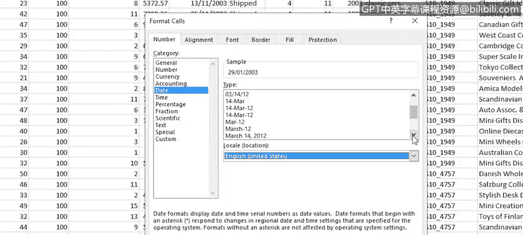

# 042：处理数据不一致性

在本节课中，我们将学习如何处理数据中的不一致性问题，包括文本大小写转换、日期格式修正以及清除多余空格。这些技能对于确保数据质量至关重要。

---

上一节我们介绍了如何处理不准确数据、删除空行和重复行。本节中，我们来看看如何通过改变文本大小写、修正日期格式和修剪空格来进一步清理数据。

从不同来源收集或接收数据时，数据中的文本大小写常常不一致。有些是大写，有些是小写，有些是首字母大写（也称为句首大写）。部分情况可能是故意的，但通常并非如此。Excel没有像Microsoft Word那样的“更改大小写”按钮，因此需要使用其他方法来完成此数据清理任务。

这些方法就是函数，即**UPPER**、**LOWER**和**PROPER**函数。你可以使用这些函数来更改数据中文本的大小写。

以下是使用这些函数的步骤：

1.  **使用PROPER函数将标题行转换为首字母大写**
    *   首先，在标题行下方插入一个辅助行。
    *   在辅助行的第一个单元格（例如A2）中输入公式：`=PROPER(A1)`。
    *   按Enter键，A2单元格将显示A1内容的首字母大写结果。
    *   要快速将公式应用到所有标题列，可以先选中A2到X2的单元格区域，然后按`F2`键将光标定位到A2，最后按住`Ctrl`键并按`Enter`键。
    *   复制辅助行的内容，在标题行使用“粘贴值”选项进行粘贴，然后即可删除辅助行。

2.  **使用UPPER函数将文本转换为大写**
    *   在需要更改的列右侧插入一个辅助列。
    *   在辅助列的第一个数据单元格（例如新列的第一个单元格）中输入公式：`=UPPER(T2)`（假设T2是原列的第一个数据单元格）。
    *   按Enter键，然后双击填充柄将公式复制到该列其余部分。
    *   复制辅助列的内容，在原列使用“粘贴值”选项进行粘贴，然后删除辅助列。

3.  **使用LOWER函数将文本转换为小写**
    *   在需要更改的列右侧插入一个辅助列。
    *   在辅助列的第一个数据单元格中输入公式：`=LOWER(K2)`（假设K2是原列的第一个数据单元格）。
    *   按Enter键，然后双击填充柄将公式复制到该列其余部分。
    *   复制辅助列的内容，在原列使用“粘贴值”选项进行粘贴，然后删除辅助列。

---

接收到的数据常常混合使用多种日期格式，或者使用了不适合你所在区域的日期格式。现在，让我们看看如何更改某些日期的格式。

如果日期当前使用的是“日-月-年”格式（例如英国格式），而你需要美国格式（月-日-年），可以按以下步骤操作：

1.  选中日期单元格。
2.  打开“设置单元格格式”对话框（通常在“开始”选项卡的“数字”组中）。
3.  在“区域设置”中，将“英语（英国）”更改为“英语（美国）”。
4.  从列表中选择一个合适的日期格式，例如使用完整月份名称的格式。
5.  点击“确定”应用格式。

如果你想使用自定义日期格式：

1.  在“设置单元格格式”对话框中，选择“自定义”类别。
2.  在“类型”框中，选择一个现有格式作为基础进行修改。例如，你可以创建格式 `dd-mmm-yyyy` 来显示“日-三字母月份-年”。
3.  点击“确定”应用。你可以使用格式刷工具或通过“设置单元格格式”对话框将此自定义格式应用到整列。

---

你的数据中可能包含一些多余的空格，例如开头、结尾或单词之间的双空格。我们将首先使用Excel的“查找和替换”功能来清理这些多余空格。

以下是操作步骤：

1.  选中所有数据。
2.  在“开始”选项卡上，点击“查找和选择”，然后选择“替换”。
3.  要删除双空格，在“查找内容”框中输入两个空格，在“替换为”框中输入一个空格。
4.  点击“查找下一个”，然后对每个需要更改的项点击“替换”。如果你非常确定更改无误，可以点击“全部替换”一次性完成所有修正。对于大型数据集，这可以节省大量时间。

然而，“查找和替换”功能可能无法清除所有空格，特别是单元格开头和结尾的单个空格。你不能用它来删除所有单个空格，否则会误删单词之间的正常空格。

此时，你可以使用**TRIM**函数来清除这些空格：

1.  在需要清理的列旁边插入一个辅助列。
2.  在辅助列的第一个单元格中输入公式：`=TRIM(M2)`（假设M2是原列的第一个数据单元格）。
3.  按Enter键，然后双击填充柄将公式复制到该列其余部分。
4.  复制辅助列的内容，在原列使用“粘贴值”选项进行粘贴。
5.  删除辅助列。现在，那些多余的空格已被清除（或者说被“修剪”掉了）。

---

本节课中，我们一起学习了如何通过**UPPER**、**LOWER**、**PROPER**函数改变文本大小写，如何调整日期格式以适应不同区域或自定义需求，以及如何使用“查找和替换”功能和**TRIM**函数来清除数据中的多余空格。这些技巧能有效提升数据的一致性和可读性。

在下一视频中，我们将讨论如何使用Excel的“快速填充”和“分列”功能来帮助清理数据。