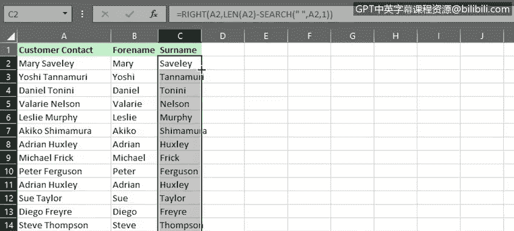

# 043：更多数据清洗功能

在本节课中，我们将学习如何使用Excel中的“快速填充”和“分列”功能来辅助清洗数据。这些工具能帮助我们高效地合并、拆分和格式化文本数据。

---

## 🧹 使用快速填充合并数据

上一节我们介绍了如何更改文本大小写、日期格式以及修剪空格。本节中，我们来看看如何使用“快速填充”功能来合并数据。

“快速填充”能识别数据模式，并自动填充数据。例如，我们可以将分开的“姓氏”和“名字”列合并为一个完整的“联系人姓名”列。

以下是具体操作步骤：

1.  在数据旁插入一个辅助列，例如命名为“联系人姓名”。
2.  在新列的第一行，按照你想要的格式输入第一个联系人的全名。例如，输入 `名字 姓氏`。
3.  按下回车键，然后在第二行开始输入第二个联系人的名字。
4.  此时，“快速填充”会显示剩余数据的预览。如果预览正确，直接按下回车键，Excel将自动填充整列。

即使原始列中包含复合名（如“Wing C”），此功能也能正常工作。

完成合并后，如果不再需要原始的“姓氏”和“名字”列，可以将其删除。

---

## 🔄 使用快速填充修改命名规范

在上一任务中，我们看到了如何合并两列数据。现在，让我们看看如何使用“快速填充”来修改一列数据中的命名规范。

假设我们有一列“客户联系人”数据，格式为“名字 姓氏”，我们希望将其改为“姓氏, 名字”的格式。

以下是具体操作步骤：

1.  在数据旁的新列（例如B列）的第一行，输入第一个联系人姓名，使用新的命名规范，例如 `姓氏, 名字`。
2.  按下回车键，然后在第二行开始输入第二个联系人的姓名。
3.  “快速填充”会检测到模式，并在你按下回车键后，自动用新格式填充B列的其余姓名。

之后，你可以复制粘贴列标题，并删除原始的A列。

---

## ✂️ 使用分列功能拆分数据

“快速填充”无法将包含两个名字的单列拆分为两列。这时，我们需要使用“分列”功能。

顾名思义，“分列”功能可以将包含多部分文本的列拆分为多个单独的列。这对于拆分姓名、地址等复合文本非常有用。

以下是使用“分列”拆分姓名的步骤：

1.  在数据右侧添加两列新的列标题。
2.  选中A列中需要拆分的数据（例如A2:A23）。
3.  在“数据”选项卡中，点击“分列”，启动向导。
4.  在向导第一步，确保选择“分隔符号”。
5.  在第二步，确保只勾选“空格”作为分隔符。
6.  在第三步，点击“目标区域”旁的小箭头，选择工作表上的B2单元格，然后返回向导。
7.  点击“完成”。

现在，A列中的完整客户姓名已成功拆分为B列（名）和C列（姓）。如果不再需要A列，可以将其删除。

---

## 📝 使用函数实现分列

如果你使用的是Excel网页版（在线版本），它没有“分列”功能，这时可以使用函数达到相同效果。使用函数还提供了更大的灵活性，尤其适用于处理包含连字符、中间名或不同数量中间名首字母的复杂姓名。

以下是使用函数拆分姓名的步骤：

1.  在数据右侧添加两列新的列标题。
2.  在B2单元格输入公式提取名字部分：
    `=LEFT(A2, 5)`
    此公式从A2单元格的左侧开始提取5个字符（包括空格）。
3.  在C2单元格输入公式提取姓氏部分：
    `=RIGHT(A2, 7)`
    此公式从A2单元格的右侧开始提取7个字符。
4.  双击B2单元格的填充柄，使用自动填充完成整列。
5.  同样，双击C2单元格的填充柄，完成该列的填充。

---

## 📚 课程总结

本节课中，我们一起学习了如何使用Excel的“快速填充”和“分列”功能来清洗数据。我们掌握了如何合并两列数据、修改一列数据的命名规范，以及如何将一列复合文本拆分为多列。我们还了解了在无法使用“分列”功能时，如何通过函数实现相同的效果。这些工具能显著提升数据整理的效率和准确性。