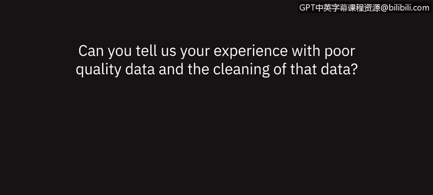

# 044：数据质量问题的观点与讨论 👩‍💼👨‍💼

在本节课中，我们将聆听几位数据专业人士围绕数据质量问题展开的讨论。我们将了解他们在工作中遇到的数据质量挑战、数据清洗的重要性，以及确保数据完整性对分析结果可靠性的关键影响。

---

## 数据质量问题的普遍性与影响

上一节我们介绍了数据分析的基本流程，本节中我们来看看数据质量这一基础却至关重要的环节。多位专业人士指出，数据质量问题是数据分析工作中的常见挑战。

一位在医疗保健领域工作的分析师提到，其大部分时间都花在了数据清洗上。由于大部分信息依赖于人工录入，而“人类无法被标准化校准”，不同的人对相似情况的描述可能存在细微差异。例如，一人可能将某物描述为“海军蓝”，另一人则描述为“深蓝色”，分析师需要将其统一整合为“蓝色”。虽然这只是一个示例，但其核心思想是：在进行分析之前，必须检查信息的完整性，以确保分析结果的准确性。

---

## 数据不完美的现实与清洗活动

认识到“没有数据是完美的”这一现实后，我们需要采取行动。数据通常为最广泛的用途而收集，因此常常会出现信息缺失或格式不符合特定分析需求的情况。

例如，日期和时间可能被记录在同一个字段中，而分析时我们可能需要将其拆分为**日、月、季度**等独立部分。为此，我们可以进行多种数据清洗活动。

以下是常见的数据清洗考虑事项：
*   **格式标准化**：如统一日期格式、文本大小写等。
*   **数据拆分**：将复合字段（如“日期时间”）拆分为独立字段。
*   **数据合并**：将相似但表述不同的值（如“海军蓝”与“深蓝色”）归类统一。
*   **缺失值处理**：识别并合理填充或标记缺失的数据。

这些清洗工作旨在将原始数据转化为**特定、可用**且符合你分析需求的形式。

---

## 财务数据分析中的质量挑战

从财务分析的角度看，数据质量问题同样突出。在审查财务报表、计算利润率与比率时，分析师必须质疑数据的正确性。

分析师需要思考以下关键问题：
*   数据在趋势上是否正确？
*   我查看的是正确的项目吗？
*   所有成本是否都与我所分析的期间相关？
*   所有数据是否都已完整捕获？例如，某个月份的收入数据是否齐全？

如果发现数据存在问题，就必须追溯数据源，仔细核对信息以验证其正确性。从会计角度看，如果数据错误或所属期间不对，就需要对存储这些数据的总分类账进行调整，以准确反映实际情况。

---

## 低质量数据的后果与应对策略

低质量的数据会引发一系列不良后果。它可能导致不必要的讨论，让你对自己的分析产生怀疑，并削弱你可靠地呈现数据和论据的能力。

面对数据质量问题，可以采取以下几种应对策略：
1.  **追溯源头**：确保源数据被正确提取和记录。
2.  **明确记录**：使用类似**知识目录（Knowledge Catalog）** 的工具，清晰、具体地记录对数据所做的所有转换或更改，并能向受众展示这一过程。
3.  **早期修复**：在数据筛选和排序过程中一旦发现错误，应立即回溯修正。否则，本可用于其他工作的时间将被浪费。

不断重做或重复处理数据的某些部分，会让人质疑数据的完整性，并且坦率地说，如果习惯性地这样做，会令人感到沮丧。因此，**关注细节**，避免在后期浪费时间回溯本可以早期修复的问题，是确保数据质量良好的众多益处之一。

---

## 总结与核心要点

本节课中，我们一起学习了数据专业人士对数据质量问题的见解。核心要点包括：

*   **数据清洗是数据分析的关键前置步骤**，占用大量时间。
*   **数据不完美是常态**，清洗旨在使其变得**特定、可用**。
*   在财务等严谨领域，必须验证数据的**完整性、相关性与准确性**。
*   低质量数据会导致**错误结论、时间浪费与信任丧失**。
*   应对策略包括：**追溯源头、明确记录转换过程、以及尽早发现并修复问题**。

记住，确保良好的数据质量，是产出可靠、可信分析结果的基石。