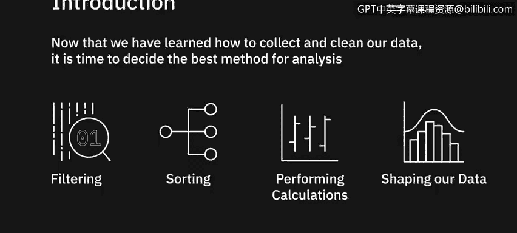
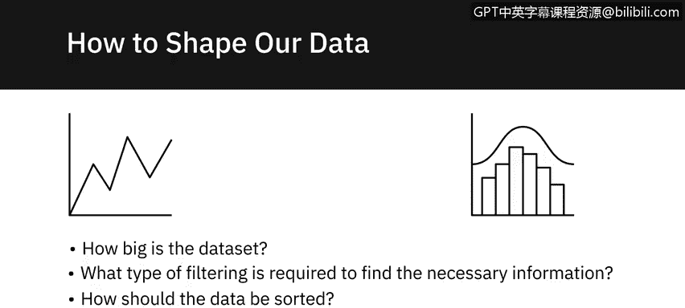
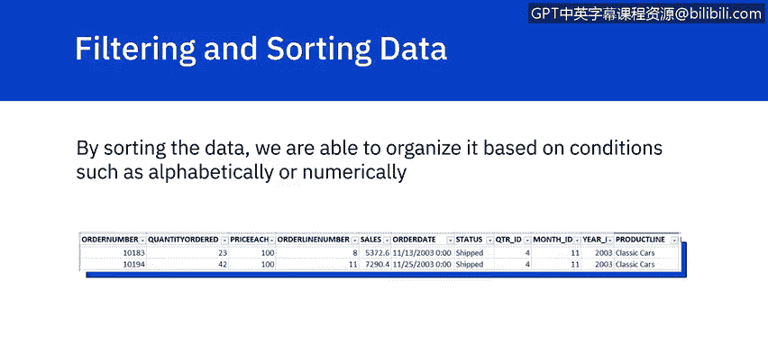
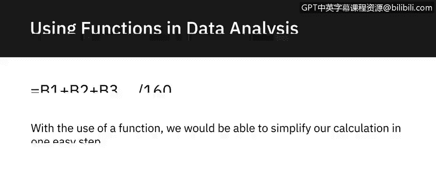
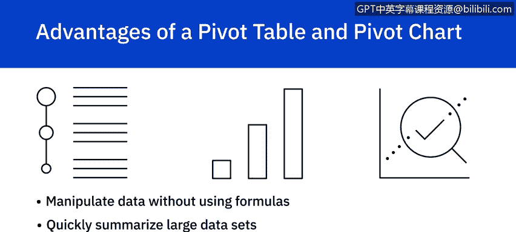
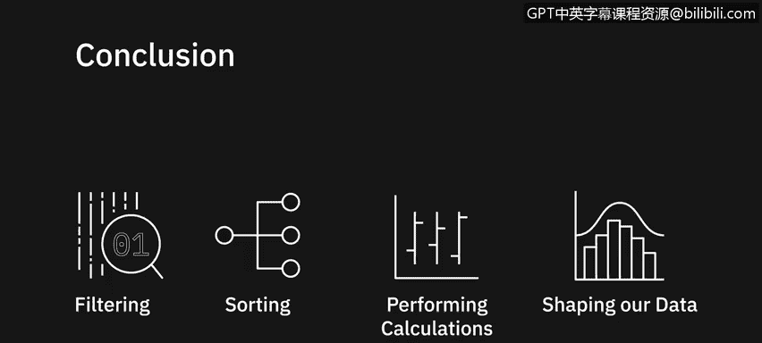

# 045：使用电子表格分析数据入门

在本节课中，我们将学习如何对已收集和清洗好的数据进行分析。我们将探讨筛选、排序、执行计算以及重塑数据的重要性，以从中提取有意义的信息。

---

## 🎯 分析前的规划

在开始对数据进行任何更改或调整之前，我们需要先设想最终的分析结果。以下是在开始分析任务前需要思考的几个问题：

*   数据集有多大？
*   需要何种筛选才能找到必要的信息？
*   数据应如何排序？
*   需要进行何种类型的计算？

---

## 🔍 筛选与排序：数据整理的基础

上一节我们介绍了分析前的规划，本节中我们来看看整理数据最基础的步骤：筛选和排序。

通过排序，我们可以根据字母顺序或数值大小等条件来组织数据。

例如，如果我们想检查是否有重复的订单号，可以对数据进行排序，从而快速发现重复项。在排序并删除重复行之后，我们可能发现视图仍需进一步细化以满足需求。

此时，我们可以决定只查看11月份的数据。通过添加筛选器，我们可以选择只显示“月份ID”等于11的行。筛选数据使我们能够只看到符合筛选条件的行，从而更好地分析信息。

---

## 🧮 使用函数进行计算

熟悉所有数据分析工具可能令人望而生畏，但使用电子表格的一个关键优势是能够利用函数。

Excel中的函数按多个类别组织，包括数学、统计、逻辑、财务以及日期和时间函数。

假设我们想计算公司6月份的平均收入。我们发现有超过100个项目需要计算。在正常情况下，要计算平均值，我们必须创建一个公式来将每一行相加，然后除以总行数。这种计算不仅非常冗长，还可能导致分析师犯错。

通过使用函数，我们可以将计算简化为一步：`=AVERAGE(B1:B160)`。

---

## 📋 将数据转换为表格的优势

虽然直接在电子表格上排序和筛选数据本身很有用，但首先将数据转换为表格会带来更多好处。将数据转换为表格后，我们能够更高效地进行筛选和计算。

一个例子是能够轻松计算列的总和。对于“MSRP”列，我们选择“求和”，就能快速计算出该列的总和。

如果我们随后只想计算与“日本”相关的MSRP总和，可以筛选“国家”列只显示日本，那么该列将只对与日本相关的行中的值进行求和。

虽然并非所有数据都适合放入表格，但将数据格式化为表格有不少优势：自动计算、筛选时列标题不会消失、使用交替行颜色使阅读更轻松，以及在添加新行时表格会自动扩展。

---

## 📊 使用数据透视表与图表进行深入分析

有时，数据需要比基础表格格式更高级的组织方式，而创建带有图表的数据透视表可能是分析和展示所需信息的更好方法。

在Excel中，我们可以选择创建数据透视表来显示和分析数据，并可选择性地创建关联的数据透视图。

例如，假设我们想知道10月份有哪些公司订购了产品。我们可以从原始数据表创建一个数据透视表来组织和分析所需数据，并配上一个数据透视图来展示信息。

然后，通过将月份筛选器添加到新创建的数据透视表中，我们不仅可以在表格中看到10月份的结果，而且这些变化会自动更新到数据透视图中。

当需要从大型数据集中提取特定信息时，数据透视表是一种很好的方式，可以只显示所需的信息。这使我们能够快速、轻松地浏览关键信息。

数据透视图是数据透视表的有力补充，它们允许我们以视觉方式处理数据，并且在大多数情况下，能让观众更快地掌握信息。

选择使用数据透视表和图表的主要优势包括：无需使用公式即可操作数据、快速汇总大型数据集、能够展示引人入胜的图表。

---

## 📝 课程总结

本节课中，我们一起学习了筛选、排序、执行计算和重塑数据以提供有意义信息的重要性，并了解了一些开始分析数据的工具。在下一个视频中，我们将更深入地学习如何筛选和排序数据。