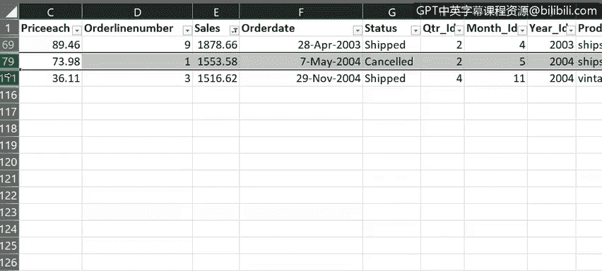
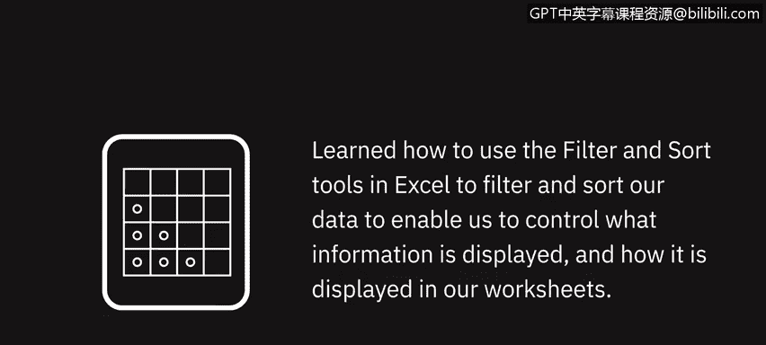

# 046：Excel中的数据筛选与排序 📊

在本节课中，我们将学习如何在Excel中使用筛选和排序功能。这些工具能帮助我们控制工作表中显示哪些数据，以及数据如何显示，从而更有效地分析和理解数据。

---

## 概述

上一节我们介绍了如何使用“快速填充”和“分列”功能来清理数据。本节中，我们来看看如何通过**筛选**和**排序**来进一步管理和组织数据。

筛选功能让你能根据特定条件，只显示符合要求的数据行。排序功能则允许你按字母、数字或日期顺序重新排列数据，使其更易于阅读和分析。

---

## 启用筛选功能

要筛选数据，首先需要开启筛选功能。操作非常简单。

1.  选中你的数据区域。
2.  转到 **“数据”** 选项卡。
3.  点击 **“筛选”** 按钮。

操作完成后，每个列标题的右侧都会出现一个小的筛选图标。

**注意**：如果你只想对特定的一列或多列应用筛选，可以先选中这些列，然后再点击“筛选”按钮。

**另一个注意点**：如果你将数据区域格式化为**表格**，筛选控件会自动添加到每一列。

---

## 应用筛选

现在，每一列都可以应用筛选器。例如，在“订单日期”列，你可以按年份筛选；在“产品线”列，可以按产品类型筛选；在“客户名称”列，可以按客户名称筛选。

让我们先按年份筛选。

以下是操作步骤：
1.  点击“订单日期”列的筛选图标。
2.  在列表中，仅勾选“2004”年，取消勾选其他年份。
3.  点击“确定”。

此时，工作表底部的状态栏会显示，当前仅显示了114条记录中的50条。

要清除一个筛选，可以点击该列的筛选图标，然后选择 **“从…中清除筛选”**，或者直接勾选列表中的 **“全选”**。

---

## 应用多个筛选

到目前为止，我们每次只应用了一个筛选。但你可以同时应用多个筛选来更精确地缩小数据范围。

例如，我们可以同时启用以下筛选：
*   “订单日期”为2004年。
*   “产品线”为“经典汽车”。
*   “客户名称”为“Many Gifts Distributors Ltd.”。

这样，我们就只显示了2004年销售给“Many Gifts Distributors Ltd.”公司的“经典汽车”订单。

**记住**：如果想单独清除某一个筛选，点击该列的筛选按钮并选择“从…中清除筛选”。如果想快速清除所有筛选，可以使用 **“数据”** 选项卡下 **“排序和筛选”** 组中的 **“清除”** 按钮。

---

## 使用自定义筛选

除了自动筛选，你还可以使用**自定义筛选**来指定更复杂的条件，特别是针对文本或数字。

例如，如果你想查看销售额超过特定数值的订单，可以使用数字筛选。

以下是操作步骤：
1.  点击“销售额”列的筛选图标。
2.  选择 **“数字筛选”** > **“大于”**。
3.  在弹出的对话框中输入 `2000`。
4.  点击“确定”。

状态栏会显示，现在显示了114条记录中的111条。清除这个筛选，再应用一个“小于2000”的筛选，可以看到只有3条记录。

**重要提示**：被筛选隐藏的数据行**并没有被删除**，它们仍然存在于工作表中，只是暂时不可见。左侧蓝色的行号会出现跳跃（例如从69直接跳到很大的数字），这表示数据集中存在比当前显示更多的行。

对于包含文本的列，筛选菜单会变为 **“文本筛选”**，并提供如“开头是”、“结尾是”、“包含”等多种选项。

要完全关闭工作表的筛选功能，只需再次点击 **“数据”** 选项卡上的 **“筛选”** 按钮。

---

## 数据排序

排序是数据分析师工作中的重要部分。通过按逻辑参数（如字母、数字、日期）组织数据，可以让你以更有意义的方式理解和可视化数据。

排序数据时，首先需要选择要排序的数据范围。

以下是基本排序操作：
*   **按文本排序**：要按客户名称字母顺序排序，先选中“客户名称”列中的一个单元格，然后点击 **“从A到Z排序”** 或 **“从Z到A排序”**。
*   **按数字排序**：要按销售额数值排序，先选中“销售额”列中的一个单元格，然后点击 **“从最小到最大排序”** 或 **“从最大到最小排序”**。
*   **按日期排序**：要按订单日期先后排序，先选中“订单日期”列中的一个单元格，然后点击 **“从最旧到最新排序”** 或 **“从最新到最旧排序”**。

---

## 多级排序

你还可以同时按多个列进行排序，这称为多级排序。

以下是操作步骤：
1.  选中数据区域内的任意单元格。
2.  转到 **“数据”** 选项卡，点击 **“排序”** 按钮。
3.  在弹出的“排序”对话框中：
    *   在 **“主要关键字”** 下拉列表中选择第一排序列（例如“订单日期”），并选择排序顺序（例如“从最旧到最新”）。
    *   点击 **“添加条件”** 按钮，添加第二个排序级别。
    *   在 **“次要关键字”** 下拉列表中选择第二排序列（例如“销售额”），并选择排序顺序（例如“从最大到最小”）。
4.  如果你的数据包含标题行（像我们这里一样），请确保勾选 **“数据包含标题”** 复选框。
5.  点击 **“确定”** 进行排序。

这样，数据会首先按订单日期从早到晚排序。对于同一天内的多个订单，则会再按销售额从高到低进行排序。

---

## 总结

本节课中，我们一起学习了如何在Excel中使用筛选和排序工具。**筛选**功能帮助我们根据条件显示特定数据，而**排序**功能则让我们能够按逻辑顺序组织数据。掌握这两个功能，能让你更高效地控制工作表中信息的显示方式和内容，为后续的数据分析打下坚实基础。