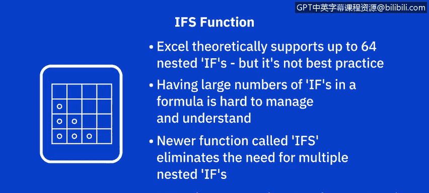
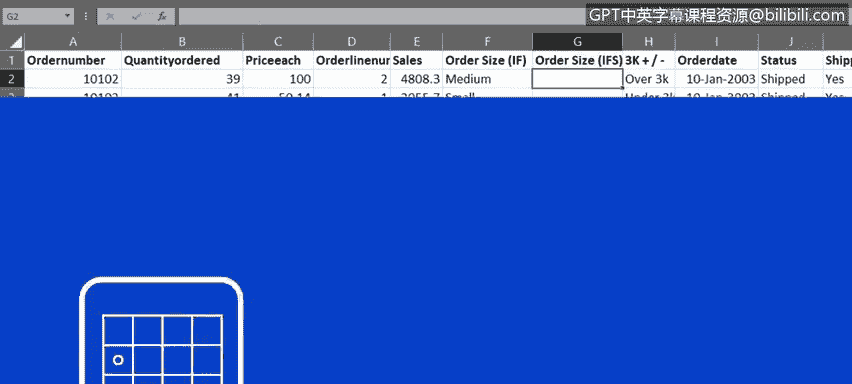
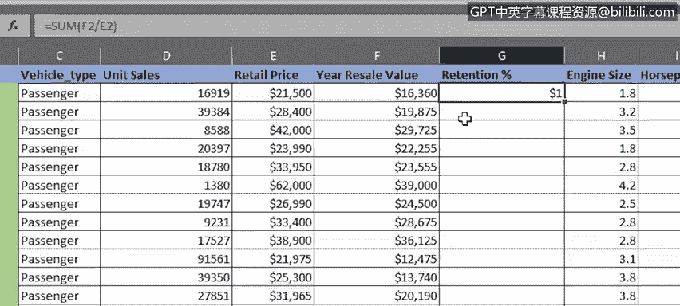
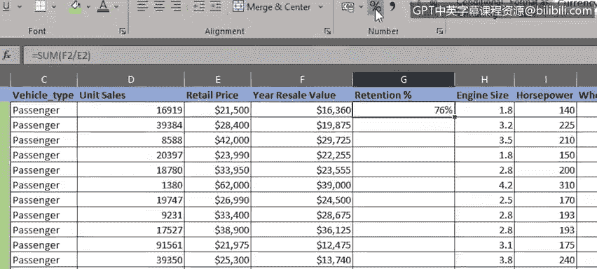
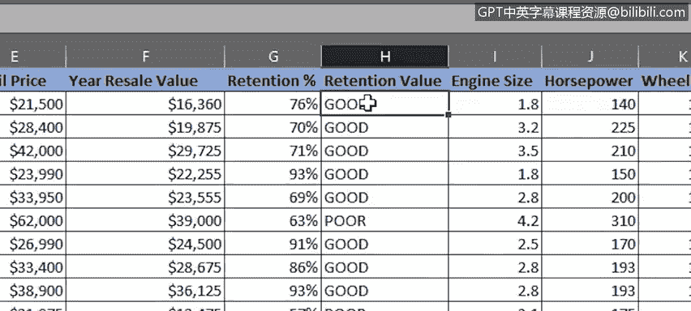
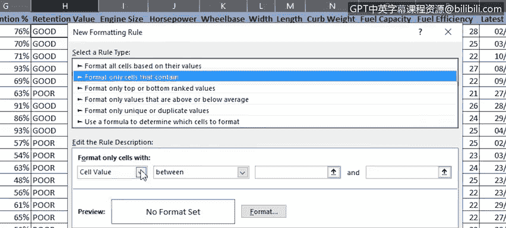
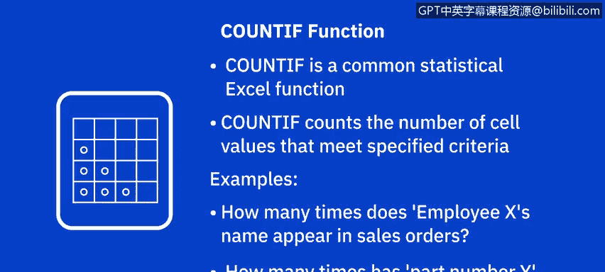
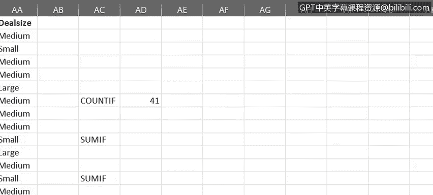
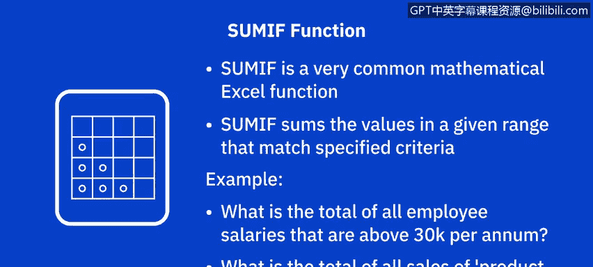
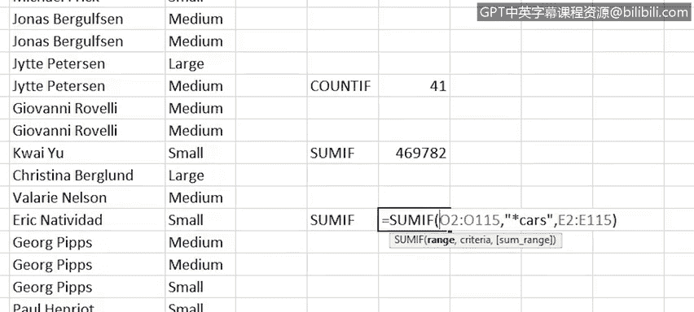

# 048：数据分析常用函数

在本节课中，我们将学习Excel中数据分析师最常用的几个函数：**IF**、**IFS**、**COUNTIF** 和 **SUMIF**。这些函数能帮助你根据条件进行逻辑判断、计数和求和，从而更高效地处理和分析数据。

---

## 🔍 IF 函数：基础逻辑判断

上一节我们介绍了如何使用筛选和排序工具来控制数据的显示方式。本节中，我们来看看如何利用IF函数进行逻辑比较。

IF函数是Excel中最常用的逻辑函数之一。它允许你根据设定的条件比较一个值，然后根据比较结果是真（TRUE）还是假（FALSE）返回相应的结果。这些结果可以是文本值或数字值。

IF函数的基本逻辑是：**如果某个条件成立，则返回一个值或执行一个操作；如果不成立，则返回另一个值或执行另一个操作**。

例如，在我们的“车辆玩具销售”工作表中，如果想添加一列来记录订单是否已发货，可以执行以下操作：

1.  在现有列的右侧添加一个新列，命名为“已发货”。
2.  在单元格H2中输入公式：`=IF(G2="shipped", "Yes", "No")`
    *   这个公式表示：如果G2单元格的文本是“shipped”，则返回“Yes”；否则返回“No”。
3.  使用填充柄将此公式复制到整列。

我们还可以使用IF函数来强调订单的规模。例如，添加一个名为“3K以上/以下”的新列，并在单元格F2中输入公式：`=IF(E2>3000, "Over 3K", "Under 3K")`，然后复制到整列。

---

## 🧩 嵌套 IF 与 IFS 函数：处理多个条件

在理想情况下，IF函数只应处理一两个条件。但有时你可能需要应用多个条件。这时，可以利用函数的嵌套功能，将多个IF语句组合在一个公式中，即**嵌套IF函数**。

例如，要按销售额将订单分为“大”、“中”、“小”，可以在单元格F2中输入类似以下的嵌套IF公式：
`=IF(E2>5000, "Large", IF(E2>2000, "Medium", "Small"))`

这个公式包含多个IF函数，每个条件需要一个，因此需要三组括号，相对较长且复杂。

尽管Excel技术上支持在一个公式中嵌套多达64个不同的IF函数，但这并非推荐的最佳实践。复杂的嵌套公式难以管理和理解。

为了解决这个问题，Excel引入了**IFS函数**。IFS函数可以替代单个公式中使用的多个嵌套IF函数，从而简化操作。该函数仅在Excel 2019、Microsoft 365版Excel和网页版Excel中受支持。

使用IFS函数重写上面的例子，公式为：
`=IFS(E2>5000, "Large", E2>2000, "Medium", TRUE, "Small")`

这个公式只有一组括号和一个函数，更加简洁清晰。

---

## 🎨 结合 IF 函数与条件格式

现在，让我们看一个结合使用IF函数和条件格式的例子。

切换到“汽车销售”工作表，在“年转售价值”列右侧添加一个名为“保值率”的新列。在单元格G2中输入公式：`=F2/E2`（用年转售价值除以原始零售价），将其格式设置为百分比，并复制到整列。

接下来，添加一列来突出显示每辆车的保值情况。在单元格H2中输入公式：`=IF(G2>0.69, "Good", "Poor")`，然后复制到整列。

我们还可以使用条件格式进一步突出显示“保值率”：

1.  选中H2单元格，在“开始”选项卡中点击“条件格式”，选择“新建规则”。
2.  规则类型选择“只为包含以下内容的单元格设置格式”。
3.  设置条件为：单元格值 **等于** `Good`。
4.  将格式设置为深绿色字体和浅绿色填充。
5.  将此条件格式复制到整列。

现在，包含“Good”的单元格已按我们定义的格式显示。我们可以再添加一个规则，将包含“Poor”的单元格格式设置为红色字体和粉色填充。

---

## 📊 COUNTIF 与 COUNTIFS 函数：按条件计数

接下来，我们快速了解如何使用COUNTIF函数。COUNTIF是Excel提供的统计函数之一，用于计算满足特定条件的单元格数量。

例如，在“车辆玩具销售”工作表中，想知道有多少销售订单来自英国的客户。我们在单元格AD7中输入公式：`=COUNTIF(C2:C100, "United Kingdom")`。请注意，当使用文本作为条件时，必须将文本用引号括起来。

结果显示有6个英国订单。同样，我们可以计算法国客户（14个订单）和美国客户（41个订单）的数量。注意，文本条件不区分大小写。

此外，还有一个较新的函数叫**COUNTIFS**，它可以跨多个范围应用条件，统计所有条件均满足的次数。这避免了在单个复杂公式中使用多个COUNTIF函数。COUNTIFS函数同样仅在Excel 2019、Microsoft 365版Excel和网页版Excel中受支持。

---

## ➕ SUMIF 与 SUMIFS 函数：按条件求和

最后，我们来看看如何使用SUMIF函数，这是Excel中非常常用的数学函数。SUMIF函数用于对指定范围内满足特定条件的值进行求和。

例如，我们想计算所有总额超过3000美元的订单的总和。在单元格AD10中输入公式：`=SUMIF(E2:E100, ">3000")`。请注意，因为使用了算术运算符（大于号），所以必须将条件用引号括起来。如果条件只是一个数字，则不需要引号。

结果显示，超过3000美元的订单总额约为470,000美元。

你还可以在搜索部分匹配时使用通配符（如问号`?`和星号`*`），并且可以指定从与条件列不同的列中提取值进行求和。例如，公式 `=SUMIF(B2:B100, "*Cars", E2:E100)` 将对产品线以“Cars”结尾的所有行，在E列（销售额）中进行求和。

同样，也有一个较新的**SUMIFS函数**，可用于基于多个条件对单元格求和，避免了使用多个SUMIF函数的复杂公式。SUMIFS函数也仅在上述新版Excel中受支持。

---

## 📝 总结

本节课中，我们一起学习了Excel中四个强大的数据分析函数：
*   **IF** 和 **IFS** 函数用于根据条件进行逻辑判断和返回结果。
*   **COUNTIF** 和 **COUNTIFS** 函数用于按条件计数。
*   **SUMIF** 和 **SUMIFS** 函数用于按条件求和。

掌握这些函数能让你更灵活地处理和解读数据。在下一个视频中，我们将学习如何使用VLOOKUP和HLOOKUP这两个引用函数。