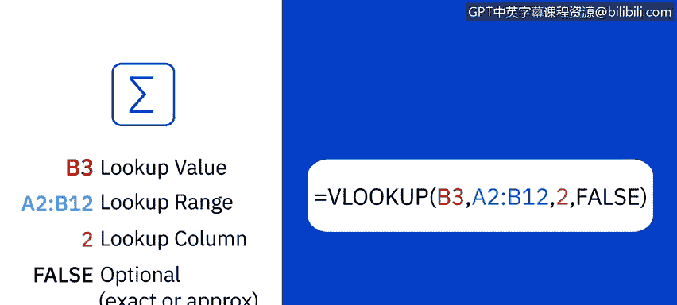
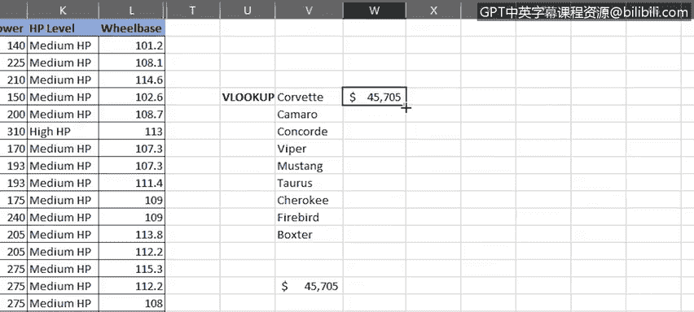
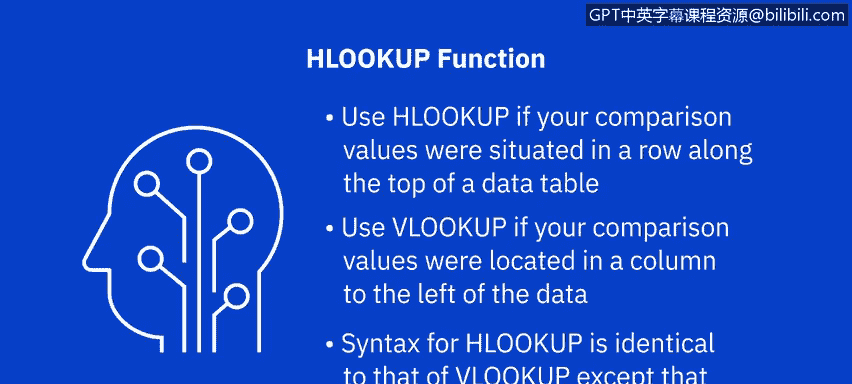
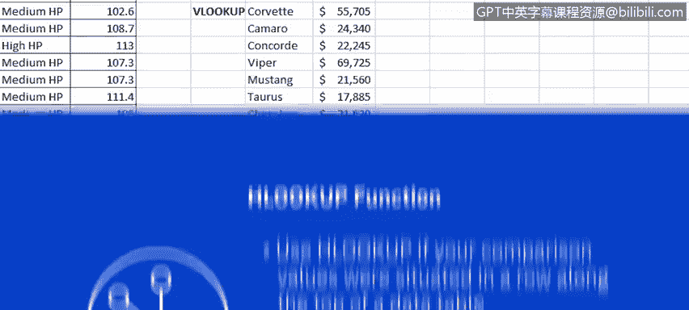
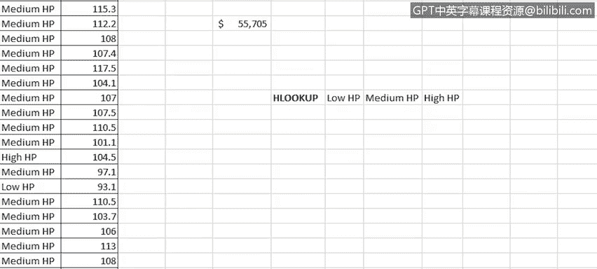
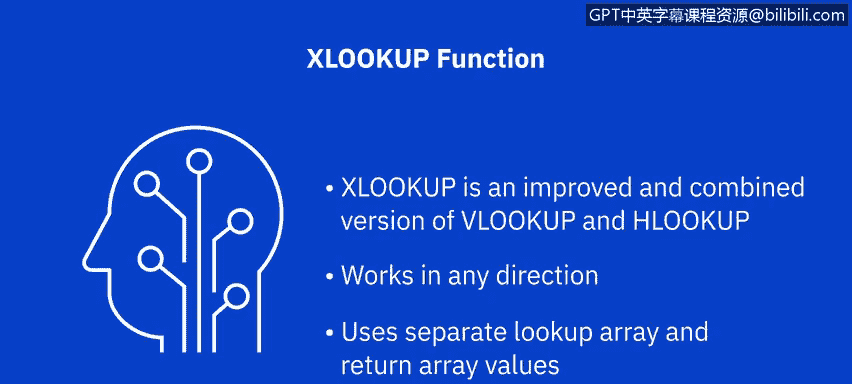

# 049：使用 VLOOKUP 与 HLOOKUP 函数 📊

在本节课中，我们将学习如何使用 Excel 中的 VLOOKUP 和 HLOOKUP 这两个重要的查找与引用函数。它们能帮助你在表格中快速定位并提取所需的数据。

## 函数概述与基本概念

上一节我们介绍了 IF、COUNTIF 和 SUMIF 等条件函数，本节中我们来看看如何利用 VLOOKUP 和 HLOOKUP 进行数据查找。

**VLOOKUP** 是 Excel 中最常用的引用类函数之一，它允许你根据查找值在指定的查找表中检索数据。其名称代表“垂直查找”，因此当你需要按行在表格或区域中查找内容时，它是一个非常有用的工具。稍后我们将介绍 **HLOOKUP**，它代表“水平查找”，其工作原理是按列查找数据。

VLOOKUP 通过源数据与查找表数据之间的共享关键字段进行工作。

## VLOOKUP 函数详解


一个典型的 VLOOKUP 公式结构如下：

```
=VLOOKUP(lookup_value, table_array, col_index_num, [range_lookup])
```

以下是公式中各个参数的含义：



*   **`lookup_value`**：查找值。即你想要查找的值或词语。
*   **`table_array`**：查找表或区域。即包含查找值的单元格区域。在公式中，Excel 将其引用为 `table_array`。查找表可以位于同一工作表或另一个独立的工作表中。
*   **`col_index_num`**：列索引号。即查找表中包含你所需返回值的列序号。在公式中，Excel 将其引用为 `col_index_num`。
*   **`[range_lookup]`**：这是一个可选参数，用于决定匹配类型是精确匹配还是近似匹配。使用 `FALSE` 表示要求精确匹配，使用 `TRUE` 表示允许近似匹配。在公式中，Excel 将其引用为 `[range_lookup]`。方括号表示该参数是可选的，而其他参数是必需的。如果你在公式中不指定这个可选参数，它将默认为 `FALSE`，即要求精确匹配。你也可以用数字 `0` 代替 `FALSE`，用数字 `1` 代替 `TRUE`。

## VLOOKUP 实战演练

现在让我们看看 VLOOKUP 函数的具体应用。

在“汽车销售”工作表中，假设我们想快速生成一份心仪汽车的价格清单。首先，我们需要将包含查找值的列置于最左侧，因为 VLOOKUP 要求如此。然后我们可以删除原始列。

接着，我们在单元格 V16 中输入公式。该公式在单元格 A2 到 G156 构成的 `table_array` 中查找词语“Corvette”，然后在匹配到“Corvette”所在的行中，返回第 5 列（在本例中是价格列）的值，结果为精确值 `45705`。

请注意，在此示例中，我们使用了现有数据表的一部分作为查找表或 `table_array`。

让我们将其格式设置为美元货币，并将小数位数设为零。

实际上，与其在公式中使用引用 A25，不如使用本工作表中我们心仪汽车列表小表格里“corvette”一词的引用，即 V5。这样公式仍然有效。

现在，让我们将该公式复制到工作表中上方的心仪汽车表格中。但出现了问题，因为当我们复制公式时，单元格引用发生了变化。

这是因为正如我们在本课程前面所学，单元格引用的默认状态是相对的，而在此例中我们需要它们是绝对的。因此，让我们撤销复制操作。

为了使单元格引用变为绝对引用，我们需要在公式中的所有单元格引用前添加美元符号 `$`。这可以手动完成，也可以将光标依次放在公式中的每个单元格引用上，然后按 `F4` 键自动添加美元符号。

让我们再次尝试复制公式。这次，它成功了。



如果我们使用单元格 W5 上的填充手柄将其向下复制到其余汽车，它并不奏效。实际上，每个单元格都得到了相同的结果。为什么？因为每个公式都引用了查找值中的相同单元格，因为我们使用了绝对引用。

我们现在需要做的就是修改公式，仅移除查找值部分中行参数的绝对引用，即删除美元符号。因此，在单元格 W5 中，我们将 `$V$5` 改为 `$V5`。然后当我们向下拖动填充手柄时，它将正确复制公式，所有价格都将更新以反映其正确的零售价。

最后，为了展示这两个表格现在通过 VLOOKUP 函数连接在一起，如果我们在主数据表的单元格 E25 中更改雪佛兰 Corvette 的零售价，心仪汽车价格列表中的价格也会相应改变。

## HLOOKUP 函数介绍

现在让我们看看 HLOOKUP 函数。正如前面提到的，它的功能与 VLOOKUP 函数几乎相同，但它是按列而不是按行查找数据。

因此，HLOOKUP 在表格的首行中查找一个词或值，然后从 `table_array` 中指定的行返回同一列中的值。所以，如果你的比较值位于数据表顶部的行中，你会使用 HLOOKUP。相反，如果你的比较值位于你想要查找的数据左侧的列中（如上一个任务那样），则使用 VLOOKUP。

在这两个函数中，VLOOKUP 的使用频率远高于 HLOOKUP，这是由于大多数数据表的性质决定的。





HLOOKUP 的语法与 VLOOKUP 完全相同，只是你指定的是一个行索引号（在公式中 Excel 将其引用为 `row_index_num`）。这表示查找表中包含你所需返回值的行号。

## HLOOKUP 实战演练

让我们在主数据表的右侧创建一个小型查找表。此工作表中隐藏了一些列以便于查看。



现在，我们的查找表顶行有了“低 HP”、“中 HP”和“高 HP”。接下来，我们将添加 Wingdings 符号作为三个马力等级的评分：1 个悲伤表情代表低马力评级，2 个中性表情代表中等评级，3 个笑脸代表高马力评级。

现在，让我们在“HP 等级”列的右侧添加一个新列，并将其命名为“HP 评分”。然后在单元格 L2 中输入 HLOOKUP 函数。此函数将查找单元格 K2 中的值（本例中为“中 HP”），并在单元格范围 Y21 到 AA22（即我们的小查找表）中查找它，然后返回它在表中“中 HP”下方第 2 行找到的答案，并使用精确值。请注意，我们在此公式中使用了一些绝对引用。

注意，返回的是文本“KK”，因此我们需要使用 Wingdings 字体格式化单元格。

现在，当我们双击填充手柄时，整列会显示与每行 HP 等级值相关的 HP 评分符号，这样我们就完成了。

## 关于 XLOOKUP 的说明

尽管 VLOOKUP 和 HLOOKUP 仍然是 Excel 中查找引用的常用函数，但有一个较新的函数叫做 **XLOOKUP**。此版本仅在 Excel 桌面版（从 Microsoft 365 版开始）、Excel 网页版以及 iPad、iPhone、Android 平板电脑和手机的 Excel 上受支持。

XLOOKUP 是 VLOOKUP 和 HLOOKUP 的改进和结合版本。它可以在任何方向（垂直或水平）上工作。它还使用独立的查找数组和返回数组值，而不是单一的表数组和列/行索引号。



## 课程总结


本节课中我们一起学习了如何在 Excel 中使用 VLOOKUP 和 HLOOKUP 函数，以在垂直和水平的查找表中查找并连接引用的数据。在下一课即将到来的视频中，我们将开始学习如何在 Excel 中使用数据透视表。