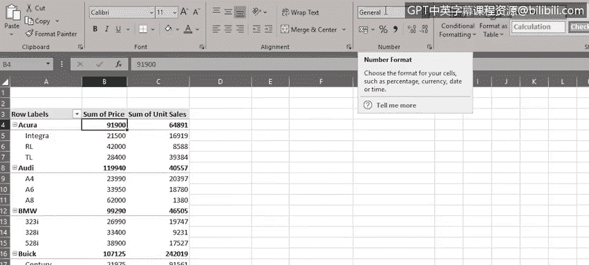

# 050：Excel数据透视表入门

在本节课中，我们将学习如何在Excel中创建和使用数据透视表。数据透视表是Excel中一个强大的数据分析工具，它能帮助我们快速汇总、分析数据，发现趋势和模式，并进行数据比较。

上一节我们介绍了VLOOKUP和HLOOKUP函数的使用，本节中我们来看看如何利用数据透视表进行更高效的数据分析。

## 🛠️ 准备工作：将数据格式化为表格

在创建数据透视表之前，先将原始数据格式化为Excel表格会非常有帮助。这样做不仅能使数据更整洁、美观，更重要的是，当向数据集中添加新记录时，表格格式能自动扩展，确保数据透视表的数据源始终完整。

以下是具体操作步骤：
1.  在数据区域内选中任意一个单元格。
2.  在“开始”选项卡的“样式”组中，点击“套用表格格式”。
3.  从样式库中选择一个你喜欢的样式。
4.  在弹出的对话框中，确认数据范围正确，并勾选“表包含标题”。
5.  点击“确定”。

完成格式化后，你会看到每列顶部都自动添加了筛选下拉箭头。当你滚动到表格底部并开始添加新一行数据时，新行会自动被纳入表格范围。

## ✅ 创建数据透视表前的检查清单

为了确保数据透视表能正确工作，你的数据源需要满足一些条件。以下是创建前应检查的事项：

*   **格式化为表格**：如前所述，这是最佳实践。
*   **确保列标题正确**：数据源应只有一行标题，这些标题将成为数据透视表中的字段名。
*   **删除空行和空列**：并尽量消除空白单元格。
*   **检查数值格式**：确保数值字段的格式是“数字”而非“文本”。
*   **检查日期格式**：确保日期字段的格式是“日期”而非“文本”。

## 📈 创建并配置基础数据透视表

现在，让我们开始创建第一个数据透视表。

首先，在已格式化的表格中选中任意单元格。然后，切换到“插入”选项卡，点击“数据透视表”。默认情况下，Excel会自动识别表格范围（例如 `表1`）。我们选择将数据透视表放置在新工作表中。

一个新的空白工作表会打开，左侧是数据透视表区域，右侧是“数据透视表字段”窗格。

要构建数据透视表报告，我们需要将字段从窗格顶部拖拽到底部的不同区域（行、列、值）。例如，如果我们想查看每个汽车型号的总销售额：

1.  将“制造商”字段拖到“行”区域。
2.  将“型号”字段也拖到“行”区域，并放置在“制造商”下方，这样逻辑更清晰。
3.  将“价格”字段拖到“值”区域。
4.  将“单位销量”字段也拖到“值”区域。

现在，数据透视表就显示了每个型号的单价和销售数量。你可以尝试将其他字段（如“车辆类型”）拖到“列”区域，如果觉得不适用，可以通过拖拽字段移出区域或使用下拉菜单将其移除。

## ➕ 在数据透视表中执行计算

数据透视表不仅能汇总数据，还能进行动态计算。例如，我们当前的“价格总和”列显示的是通用数字格式。我们可以先将其格式化为美元。

这可以通过修改“值”区域中该字段的“值字段设置”来完成：将数字格式设置为美元，并隐藏小数位。

接下来，我们添加一个计算字段来求出每个型号的总销售额（价格 × 单位销量）。

1.  点击数据透视表区域。
2.  在出现的“数据透视表分析”选项卡中，点击“字段、项目和集”，然后选择“计算字段”。
3.  在弹出的对话框中，为字段命名（例如“型号总销售额”）。
4.  在公式框中输入：`=价格 * 单位销量`
5.  点击“添加”，然后“确定”。

这个名为“型号总销售额”的新字段会自动添加到字段列表和“值”区域。我们可以再次将其格式化为美元。现在，数据透视表中出现了一个新列“型号总销售额的总和”。例如，我们可以看到“Acura Integra”型号的销售额超过3.6亿美元，而“Acura TL”型号的销售额超过10亿美元。

## 📝 课程总结

本节课中我们一起学习了：
1.  如何将数据格式化为Excel表格，为创建数据透视表做好准备。
2.  如何创建数据透视表，并通过拖拽字段到行、列、值区域来分析和组织数据。
3.  如何在数据透视表中执行计算，例如添加计算字段来生成新的汇总指标。

数据透视表是一个动态工具，当源数据发生变化时，分析结果也会自动更新，这使它成为数据分析师呈现数据洞察的利器。

在下一个视频中，我们将进一步探索数据透视表的其他高级功能。