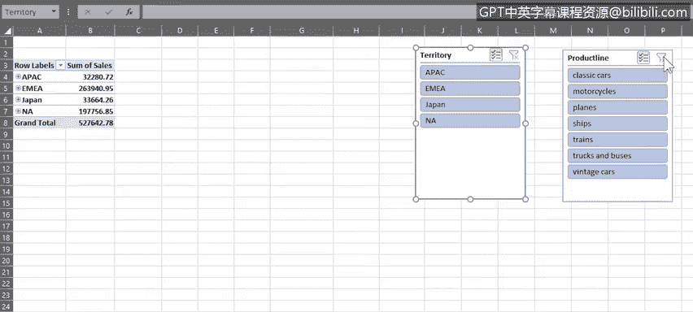
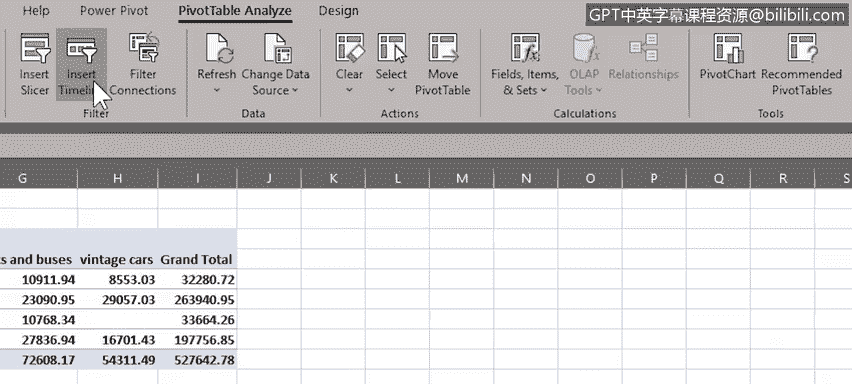
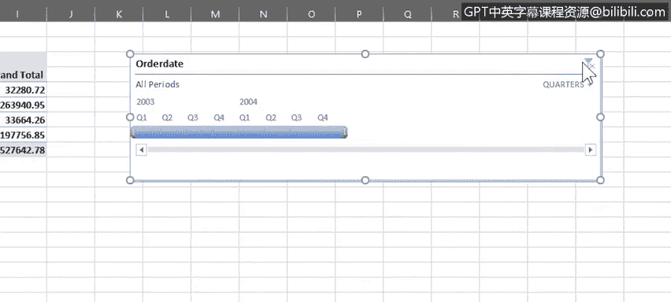

# 052：数据透视表高级功能

在本节课中，我们将学习数据透视表的一些高级功能，包括“推荐的数据透视表”、筛选器、切片器和时间线。这些工具能帮助你更高效地分析和探索数据。

---

## 🔍 推荐的数据透视表

上一节我们介绍了如何创建和使用数据透视表。本节中，我们来看看“推荐的数据透视表”功能。这并非一个独立的功能，而是一个基于所选数据、提供不同数据组合建议的列表。如果你对数据透视表经验不多，这是一个很好的起点。

例如，在“车辆玩具销售”工作表中，如果我们选中包含“订单数量”数据的B列，然后从“插入”选项卡选择“推荐的数据透视表”，系统会呈现一系列与订单数量信息相关的潜在数据组合。

然而，如果我们选中包含“订单规模”信息的F列，推荐的列表就会反映该数据。同样，选中包含“销售额”数据的E列，推荐的数据透视表就会与销售数据相关。

我们选择列表中的第三个选项：“按地区汇总的销售额”。这听起来能通过数据透视表获得有用的见解。

请注意，系统会打开一个包含推荐数据透视表的新工作表，同时右侧会打开一个名为“数据透视表字段”的新窗格。我们将工作表重命名为更有意义的名称。

在“数据透视表字段”窗格中，可以看到一些字段已自动添加到“行”和“值”区域。虽然是推荐的数据透视表，我们仍然可以通过添加更多字段来自定义它。例如，让我们使用拖放操作将“产品线”字段添加到“列”区域。现在，数据透视表中为每条产品线（如摩托车、轮船和火车）都设置了单独的列。

在数据透视表中，我们可以手动展开任何字段以查看其内容。这里可以看到，订单日期位于数据透视表中地区名称的下方。请注意，这与“数据透视表字段”窗格中“行”区域的字段顺序相匹配。

我们也可以手动折叠每个字段，但同时也有一次性展开或折叠所有字段的选项。

---

## 🎯 数据透视表筛选

接下来我们将深入探讨数据透视表筛选功能。数据透视表筛选器的工作方式与本课程前面使用的标准筛选器非常相似。

请注意，这个数据透视表中已经内置了一些筛选功能。例如，“行标签”标题就是一个筛选器，我们可以像使用标准筛选器一样，筛选列出的任何地区（如日本）。清除数据透视表中的筛选器也非常简单。

我们还有一个“列标签”筛选器，允许我们筛选此数据透视表中的任何产品线项目。例如，我们可以只显示“火车”产品的数据。

我们还可以选择将“产品线”字段作为标准筛选器（而非列标题）添加到数据透视表中。方法是在“数据透视表字段”窗格中将其拖到“筛选器”区域。然后，就可以像本课程前面所做的那样，将其用作标准筛选器。该筛选器还允许我们选择多个筛选项目。

但是，因为它现在被用作标准筛选器而不是列标题，所以我们无法看到这两个产品线上信息的拆分，只能看到合并的总计。而当筛选器作为列标题时，每个产品线的信息会分别显示在各列中。

让我们再次显示所有字段总计，并将“产品线”字段拖回之前的“列”区域，以便在数据透视表中看到不同产品线的拆分情况。

---

## 🧩 切片器

下一个要介绍的数据透视表功能是切片器。切片器本质上是屏幕上的图形化筛选对象，让你能够使用按钮来筛选数据。

切片器可以轻松快速地对数据透视表数据进行筛选，并且能显示当前的筛选状态，让你更容易了解和查看当前显示的数据以及被筛选隐藏的数据。

例如，如果我们通过将“产品线”字段拖出“数据透视表字段”窗格来将其从数据透视表中移除，然后从“数据透视表分析”选项卡点击“插入切片器”，并选择“地区”字段作为切片器。

可以看到，切片器可以在工作表的任何位置自由移动，并且包含每个地区名称（如EMEA、北美和日本）的按钮。如果需要，我们还可以选择“多选”按钮来筛选多个地区。我们可以点击“清除筛选器”按钮来清除所有切片器筛选。

让我们为“产品线”字段再添加一个切片器到工作表中。但是，请确保首先选中数据透视表中的一个单元格，否则“插入切片器”按钮将不起作用。

请注意，切片器也可以从“插入”选项卡的“筛选器”组添加，同样可以从“数据透视表分析”选项卡添加。这次我们选择“产品线”字段作为切片器，并将其拖到工作表的顶部附近。

和之前一样，我们可以只选择一个切片器项目，也可以开启“多选”并选择多个项目在切片器中进行筛选。

然后清除切片器筛选，现在让我们同时使用两个切片器进行筛选。

请注意，当使用多选筛选时，选择一个项目实际上是将其筛选出来。也就是说，你定义的是哪些项目将不会显示在数据透视表中。这与在切片器中选择单个项目时的行为相反。

所以，现在我们只显示EMEA和北美地区关于经典汽车、火车以及卡车和公共汽车产品的数据。

现在，让我们清除这些切片器筛选，并将“产品线”字段放回数据透视表的“列”区域，为接下来要探索的功能做好准备。

让我们把这些切片器移到工作表下方更远的位置。

---

## 📅 时间线

我们要了解的最后一个有用的数据透视表功能是时间线。时间线是另一种筛选工具，使你能够专门针对数据透视表中与日期相关的数据进行筛选。

这是一种比在日期列上创建和调整筛选器更快捷、更有效的动态日期筛选方式。

我们可以从“数据透视表分析”选项卡或“插入”选项卡为数据透视表添加时间线。再次强调，请确保先选中数据透视表中的任意单元格。

首先，我们选择“订单日期”字段作为时间线筛选器。

然后我们可以将其拖到工作表上方并放大。

此时间线的默认设置是按月显示数据，但你也可以按天或按季度筛选。你可以选择单个季度，也可以选择一个季度范围。在本例中，我们选择2003年第3季度到2004年第2季度之间的12个月。

你可以使用“清除筛选器”按钮清除时间线筛选。你也可以按年份筛选。例如，这里我们只选择了2003年。

你可以在数据透视表中将切片器和时间线结合使用作为筛选器。例如，这里我们可以筛选切片器，只显示EMEA和北美地区在2003年关于“火车”产品的数据。

如果我们改为筛选2004年，你会看到没有数据显示，这意味着在2004年，EMEA或北美地区都没有火车产品的销售。

当你选中时间线或切片器时，功能区会出现它们各自的选项卡，可以修改其属性以改变外观和工作方式。例如，让我们将这个时间线改为浅绿色阴影。

再把这个切片器改成漂亮的橙色。最后，要删除时间线或切片器，可以选中后按`Delete`键，或者右键点击并选择“剪切”。

---

## 📝 总结

在本节课中，我们一起学习了Excel中可与数据透视表配合使用的一些其他功能，即推荐的数据透视表、筛选器、切片器和时间线。这些工具能极大地增强你分析和呈现数据的能力。

