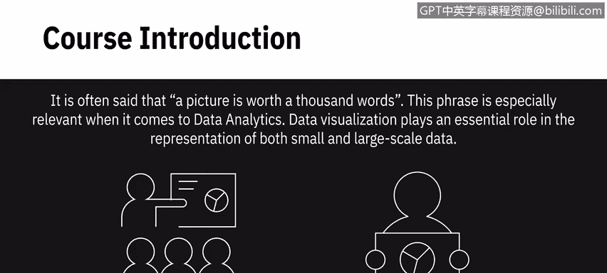
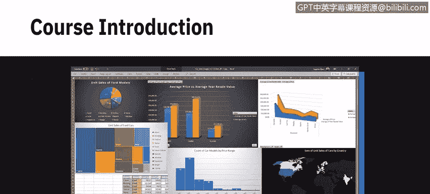
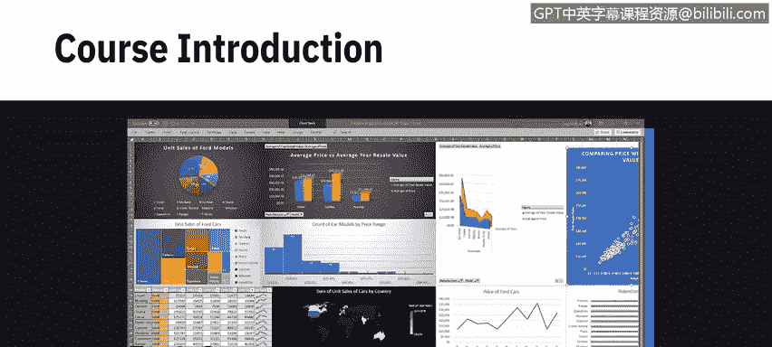
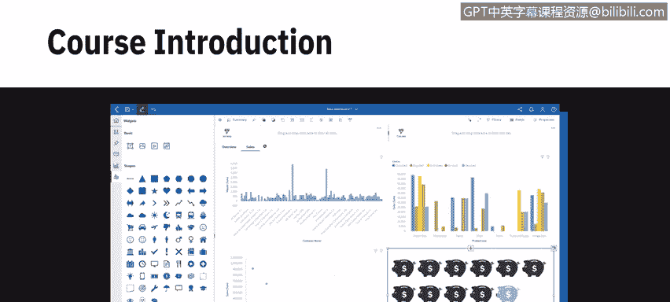
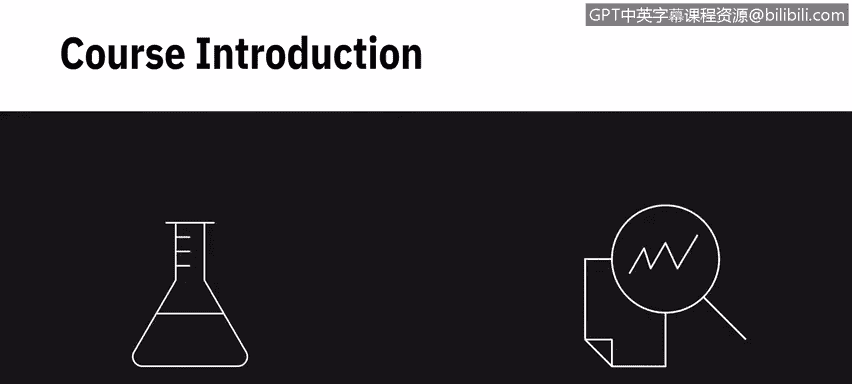
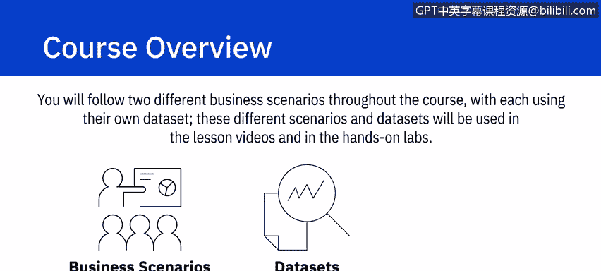
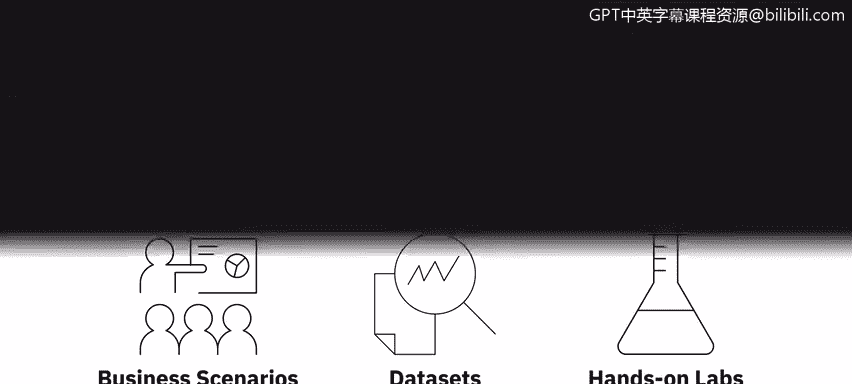
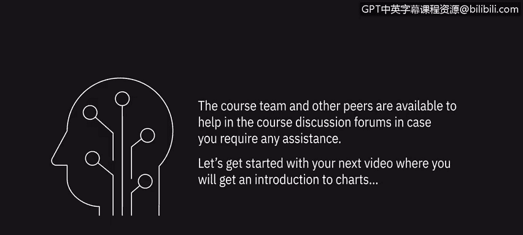

# 001：《用Excel、Cognos做数据可视化、看板》📊 - 课程介绍

在本节课中，我们将要学习IBM数据分析师系列课程的第三部分，其核心是掌握使用Excel和Cognos Analytics进行数据可视化与看板构建的技能。数据可视化是数据分析中不可或缺的一环，它能将复杂的数据转化为直观的图表，帮助我们更好地讲述数据背后的故事。

## 课程概述 📋

常言道，一图胜千言。这句话在数据分析领域尤为贴切。数据可视化在呈现不同规模的数据集时扮演着至关重要的角色。本课程旨在帮助你运用多种可视化技术，利用数据讲述引人入胜的故事。

你将通过Excel和Cognos Analytics进行实践，掌握创建各类图表、图形以及构建交互式看板的基本技能。这些是成为一名数据分析师所需知识体系的重要组成部分。

## 课程内容与结构 🗂️

本课程不仅教授使用Excel和Cognos进行数据可视化的技术，还通过贯穿始终的多个动手实验和作业让你进行实践。

课程内容分为四个主要模块，每个模块都聚焦于不同的核心技能。

### 模块一：基础图表与Excel功能

在模块一中，你将学习不同类型的图表，以及用于创建基础图表和数据透视表可视化的Excel函数。通过操作这些功能并创建可视化图表，你将开始理解图表在讲述数据驱动型故事时的重要作用。

### 模块二：高级图表与Excel看板基础

上一节我们介绍了基础图表，本节中我们来看看更高级的内容。在模块二中，你将学习创建高级图表，了解看板的基础知识，并学习如何在Excel中创建简单的看板。你还将了解看板如何用于提供关键绩效指标的实时快照。

### 模块三：Cognos Analytics入门与高级功能

在模块三中，你将学习Cognos Analytics，包括如何注册、如何在其界面中导航，以及如何轻松创建出色的看板。你还将学习Cognos Analytics中一些更高级的看板功能，并使你的看板具备交互性。

### 模块四：综合实践作业

在最后的模块中，你将完成一个包含两部分的动手实践期末作业。该作业将指导你如何在Excel中创建可视化，以及如何在Cognos Analytics中创建可视化和看板。这需要你理解业务场景需求，然后创建相应的可视化和看板来满足这些需求。

## 实践场景与学习目标 🎯

在整个课程中，你将跟随两个不同的业务场景，每个场景都使用其独有的数据集。这些不同的场景和数据集将应用于课程视频和动手实验中。

完成本课程后，你将能够达成以下学习目标：

以下是课程结束后你将掌握的核心技能列表：
*   解释可视化在传达数据故事中的作用。
*   在Excel电子表格中创建基础图表、数据透视表和高级图表。
*   使用Excel创建简单的看板。
*   在云中配置Cognos Analytics实例。
*   在Cognos Analytics界面中导航，并利用其丰富的可视化功能。
*   使用Cognos Analytics构建包含各种基础和高级可视化组件的交互式看板。

此外，你还将执行一些中级水平的数据可视化和看板创建任务，以应对特定的业务场景。如果在学习过程中需要任何帮助，课程团队和其他学员将在课程讨论区为你提供支持。

## 总结

本节课中，我们一起学习了IBM数据分析师课程第三部分的整体介绍。我们了解了数据可视化的重要性，预览了课程将涵盖的四个核心模块内容，并明确了完成课程后你将能够达成的具体学习目标。现在，让我们开始观看下一个视频，正式进入图表世界的介绍。

