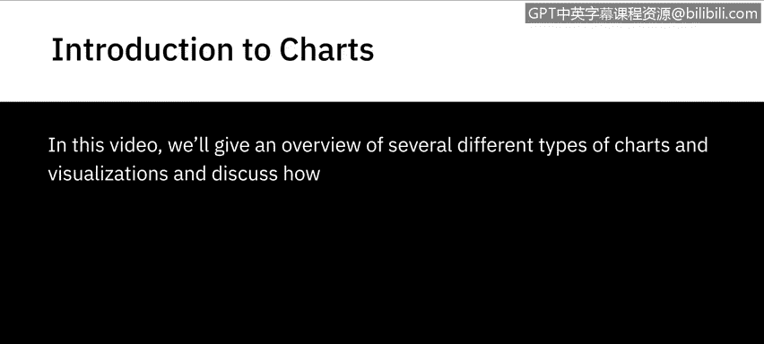
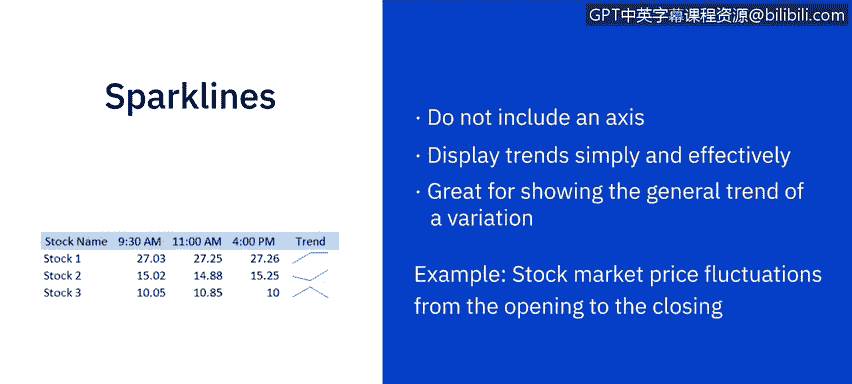
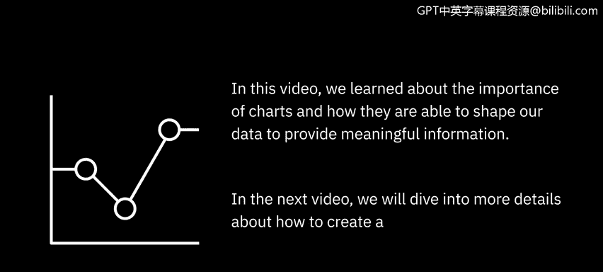

# 002：图表介绍

在本节课中，我们将概述几种不同类型的图表和可视化方式，并讨论如何利用它们来讲述数据故事。

## 📈 折线图

上一节我们介绍了图表的基本概念，本节中我们来看看折线图。折线图适用于比较不同但相关的数据集。

折线图是展示信息的绝佳方式。它们能够显示趋势，并展示数据值如何随连续变量变化。例如，如果时间是连续变量，折线图可以展示一个或多个产品的销售情况如何随时间变化。

## 🥧 饼图

接下来，我们介绍饼图。这种图表可以展示一个实体如何分解为若干子部分，以及这些子部分之间的比例关系。

以下是饼图的特点：
*   饼图的每一部分代表一个静态值或类别。
*   所有类别的总和等于100%。

在此示例中，我们有一个包含四个不同类别的营销活动：社交媒体、原生广告、付费影响者和线下活动。通过这种数据表示方式，我们可以轻松查看每个类别产生的潜在客户总数。

## 📊 条形图

我们现在来看最常用的图表之一：条形图。这种图表最为常见，因为它们易于创建，并且非常适合比较相关数据集或整体的各个部分。

以下是条形图的应用示例：
*   在此条形图中，我们可以看到10个不同国家的人口数量，以及它们之间的比较。
*   我们还可以使用堆叠条形图，其中每个条形被划分为首尾相接的子条形。在此堆叠条形图中，我们可以看到每个国家的人口按四个年龄段划分的情况。

## 📏 柱状图

如果您希望图表垂直显示而非水平显示，那么柱状图将是一个很好的选择。这种图表可以非常有效地展示随时间的变化，并并排比较数值。

例如，展示网站页面浏览量与会话时长如何逐月变化。虽然这种图表看起来与条形图相似，但它们并不总是可以互换使用。例如，柱状图可能更适合显示负值和正值。

## 🗺️ 树状图

接下来是树状图，它对于使用嵌套矩形显示复杂的层次结构非常有用。

在此示例中，树状图描绘了去年一个国家人口中各州的就业率。矩形的大小代表人口数量，颜色代表就业率。我们可以点击任何区域，查看所选区域内子区域的就业数据。

## 🎯 漏斗图

想要展示管道或连续流程的不同阶段？那么漏斗图是理想的选择。

在此示例中，漏斗图展示了销售流程从潜在客户生成到最终销售的每个阶段的转化率。

## 🔵 散点图

另一种出色的图表是散点图。在这种图表中，圆圈颜色代表数据的类别，圆圈大小表示数据量。

例如，在此散点图中，我们可以看到每个产品线按销售数量和带来的收入分布。散点图非常适合揭示数据点之间的趋势、集群、模式和相关性。

## 🫧 气泡图

接下来我们看气泡图。这是散点图的一种变体，对于比较少数几个类别的相对重要性非常有用。

例如，了解组织销售预算中重大支出的领域。

## 📉 迷你图

最后，我们有迷你图。迷你图不包含坐标轴，但它们能简单有效地显示趋势。

这些图表非常适合展示变化的一般趋势。例如，股票市场价格从交易日开盘到收盘的波动情况。

## 🎓 总结

在本节课中，我们一起学习了图表的重要性，以及它们如何塑造我们的数据以提供有意义的信息。我们介绍了折线图、饼图、条形图、柱状图、树状图、漏斗图、散点图、气泡图和迷你图等多种图表类型及其适用场景。

在下一个视频中，我们将深入探讨如何在Excel中创建和配置不同类型的图表。