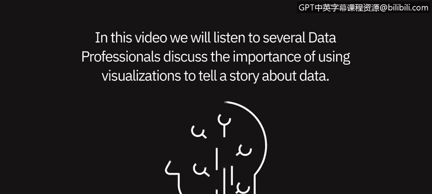
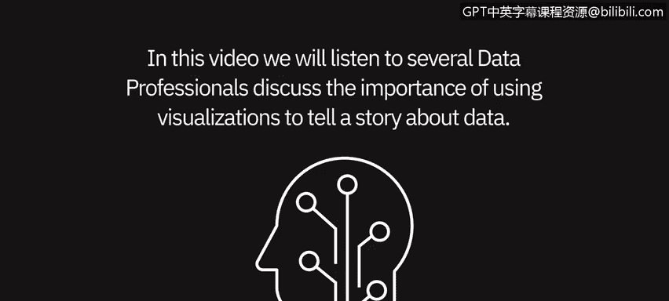
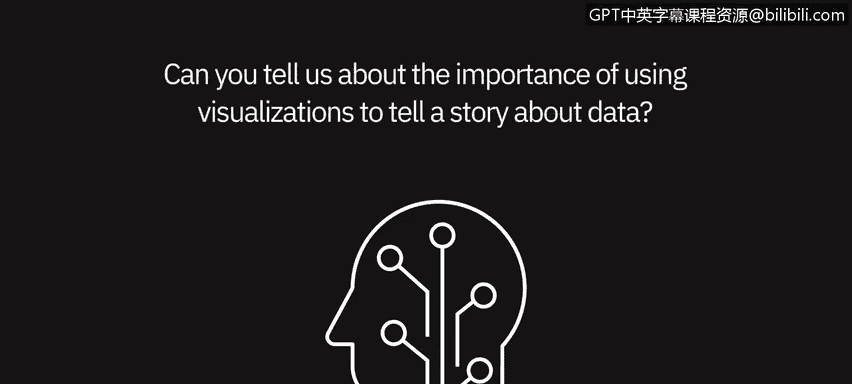

# 003：使用可视化讲述数据故事 📊

在本节课中，我们将聆听几位数据专业人士讨论使用可视化来讲述数据故事的重要性。通过他们的见解，我们将理解为什么可视化是数据分析中不可或缺的一环，以及它如何帮助分析师和利益相关者更有效地沟通。

---

## 可视化在数据叙事中的核心作用

上一节我们介绍了课程概述，本节中我们来看看专业人士如何看待可视化的重要性。可视化对于用数据讲故事至关重要。

“一图胜千言”这句话在这里非常贴切。如果你拥有清晰、整洁的数据可视化，你就能更清楚地了解数据的状况。数据可视化对创建它们的分析师也极有帮助，因为它迫使他们做出选择，决定哪些信息真正重要、哪些不重要。

例如，如果你在考虑是否应该按时间维度查看数据，你可以这样思考：**整体趋势是最重要的吗？如果是，我应该做时间序列数据可视化。我认为比较不同组别更重要吗？那么你更可能选择条形图或柱状图。** 因此，可视化在厘清数据分析师的思路方面非常重要。

---

## 可视化如何助力清晰沟通

可视化在向利益相关者讲述清晰、简洁的故事方面非常重要。人类是视觉动物，你更有可能通过视觉效果讲述一个引人入胜的故事并获得支持。

我曾通过一份用Tableau创建的可视化简历获得了一份工作机会。呈现数据的最佳方式之一就是可视化。数字本身在很大程度上往往会让人不知所措。

例如，如果我在公司会议上说：“去年，也就是2019年，我们创造了10万美元的收入。” 或者，我可以给你一张图表，上面显示：2018年，我们创造了7.5万美元；2019年，我们创造了10万美元；2020年，我们预计将创造12.5万美元。如果我把这些数据做成图表，让它突出、美观，非会计或非数据专业的人也会被吸引，这会促使他们提出不同的问题、产生不同的想法。

---

## 利用工具创建有效的可视化

通过使用PowerPoint甚至Excel（在Excel中你可以从数据创建图表），使其美观，并确保它不仅美观，还能突出你想要表达的重要信息，这将围绕需要做什么以及如何最好地运营业务或做出不同决策来创造和推动对话。

数据可视化是帮助人们理解你试图呈现的数字的一个非常重要的部分。我们倾向于使用可视化的原因在于大脑的工作方式。与查看电子表格中的100行或100条数据相比，大脑更能处理一个高条形与一个低条形的对比。

使用可视化，特别是为给定任务使用适当的可视化，确实有助于确保用户以最简单的方式理解信息。

---

## 可视化作为故事叙述的起点

正如我们所讨论的，故事叙述是我们实现这一目标的重要方式。通过可视化，我们才能真正讲述一个故事。我们可以用文本来增强它（无论是用户生成的还是系统生成的），引导人们进一步深入理解。

但**从可视化开始是帮助人们快速、有效地理解当前情况的最简单方法**，然后你们可以围绕具体在做什么进行更深入的讨论。

---

## 总结

本节课中，我们一起学习了数据专业人士对数据可视化价值的见解。我们了解到，可视化不仅是呈现数据的工具，更是厘清分析思路、与利益相关者有效沟通以及驱动业务决策的关键。通过选择合适的图表类型并注重清晰美观的设计，我们可以将复杂的数据转化为引人入胜的故事，从而促进更深层次的理解与讨论。