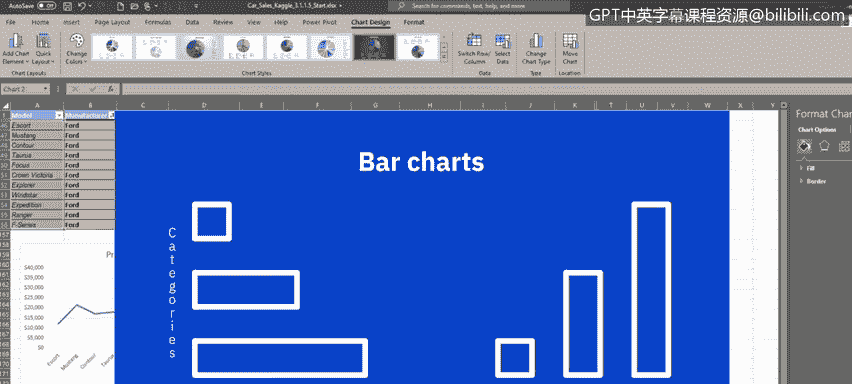

# 004：在Excel中创建基本图表 📊

在本节课中，我们将学习如何在Excel中创建几种基本类型的图表。我们将首先创建**线图**，然后是**饼图**，最后是**柱状图**。掌握这些基础图表是进行数据可视化的第一步。

## 创建线图 📈

上一节我们介绍了本课程的目标，本节中我们来看看如何创建线图。线图是一种用于显示数据点并通过直线连接这些点的图表类型。在**线图**中，水平轴通常代表时间或类似类别，而垂直轴通常代表数值。由于线图可以在给定时间段内显示连续数据，因此非常适合展示在等时间间隔（如天、月、季度或年）内的数据趋势。

以下是创建线图的步骤：
1.  在“汽车销售”工作簿的“汽车销售”工作表中，首先筛选数据，仅显示四种汽车型号。
2.  选择两个不相邻列的数据，本例中为“型号”和“价格”。
3.  在“图表”组的“二维线图”类别中选择“线图”。
4.  双击图表标题文本框，将标题更改为“福特汽车价格”。
5.  将生成的浮动图表区域移动到工作表数据下方的左侧。

现在，我们看到了一个显示福特各型号汽车价格趋势的线图。

## 创建饼图 🥧

了解了线图的创建后，我们接下来看看饼图。**饼图**是一种圆形图表，用于显示不同类别（我们视为切片）对整体总量（我们视为整个饼）的相对贡献。饼图上的数据点（即切片）表示为整个饼的百分比。饼图提供了非常简单的数据结果可视化，易于理解。当您只有一个数据系列且数据类别不超过十几个时，最适合使用饼图，否则图表会显得杂乱且难以阅读。

以下是创建饼图的步骤：
1.  使用福特制造的型号名称及其单位销量数据。
2.  选择两个不相邻列的数据，本例中为“型号”和“单位销量”。
3.  在“图表”组的“二维饼图”类别中选择“饼图”。
4.  生成的浮动图表区域包含我们的饼图，它显示了各个福特汽车型号单位销量的相对贡献（即饼图的切片），它们共同构成了福特汽车单位销量的总和（即整个饼）。
5.  可以从图库中选择众多样式来更改图表样式以自定义饼图外观，甚至可以组合多种样式。例如，选择样式3和样式7，可以在每个切片中显示百分比值，并拥有漂亮的深色对比背景。
6.  将此图表移动到工作表数据下方的中心位置。

## 创建柱状图 📊

最后，让我们看看柱状图。**柱状图**是一种用于比较不同类别值的图表，可以使用垂直条（在柱形图中）或水平条。在**柱状图**中，类别通常排列在垂直轴上，数值在水平轴上；而在**柱形图**中，类别通常排列在水平轴上，数值显示在垂直轴上。

以下是创建柱状图的步骤：
1.  再次选择两个不相邻列的数据，本例中为“型号”和“留存百分比”。
2.  在条形图的“二维条形图”类别中选择一种柱状图样式。
3.  新的浮动图表区域包含我们的柱状图，它使用水平条显示不同福特型号留存百分比的比较值。
4.  可以单击“更改颜色”按钮，然后从列表中选择调色板，以基于颜色调色板（而非样式）更改图表颜色来自定义柱状图外观。
5.  将此图表移动到工作表数据下方的右侧。

## 总结

本节课中，我们一起学习了如何在Excel中创建**线图**、**饼图**和**柱状图**。这些基础图表是数据分析和可视化的核心工具。在下一视频中，我们将探讨如何在Excel中使用数据透视表图表功能。