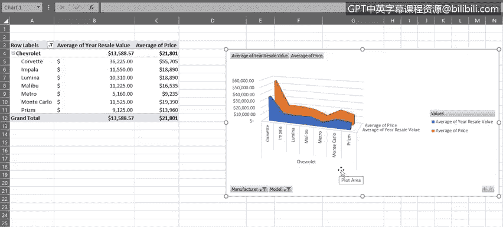
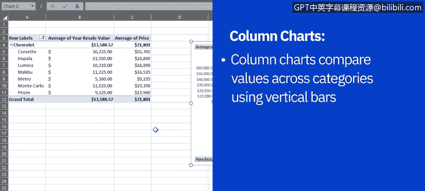
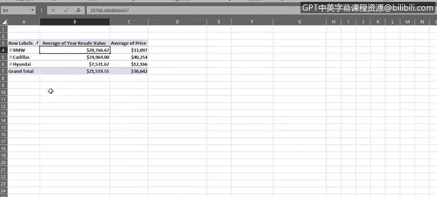
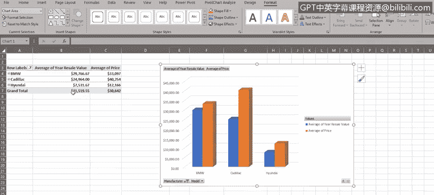

# 005：使用Excel的数据透视图功能 📊

在本节课中，我们将学习如何利用Excel中的数据透视图功能，从数据透视表创建面积图和柱形图。我们将了解透视图与普通图表的区别，并掌握如何通过透视图直接筛选和展开数据。

---

在上一节中，我们学习了如何在Excel中创建几种基础图表。本节中，我们将看看如何利用Excel数据透视表的“数据透视图”功能来创建其他基础图表。

我们将首先从数据透视表创建面积图，然后创建柱形图。请注意，本示例数据集中的价格和转售价值并非真实数据，仅用于解释和演示目的。

数据透视图用于展示数据系列、类别和图表轴，其方式与基础图表相同，但它是与数据透视表相连接的。简而言之，数据透视图就是Excel中数据透视表的图形化表示。当我们拥有包含复杂数据的数据透视表时，透视图可以帮助我们更好地理解这些数据。

## 创建面积图 📈

面积图是一种用于显示信息的图表类型，它通过直线连接一系列数据点，并在其下方填充区域。

与折线图类似，面积图可以处理正值和负值。

以下是创建面积图的步骤：

1.  首先，复制“汽车销售”工作簿中的“Pivo1”工作表。
2.  在这个复制的工作表中，首先筛选数据透视表的数据，使其仅显示丰田（Toyota）车型。
3.  展开“丰田”字段，我们可以看到丰田不同车型的详细信息，例如每款车型的平均价格和平均一年转售价值。
4.  现在，使用数据透视图功能基于此数据创建面积图。选择面积图类型，并选择“三维面积图”。

此时，我们会看到一个浮动图表，其中包含了我们的面积图。该图表显示了丰田各车型的平均价格以及平均一年转售价值的趋势。

需要注意的是，我们也可以直接在数据透视图中筛选数据，而无需在数据透视表中操作。这是标准图表与数据透视图之间的一个关键区别。

因此，在我们的透视图中，让我们筛选数据以仅显示雪佛兰（Chevrolet）车型。展开字段后，透视图在此处显示我们的数据。我们可以看到，与低价位车型相比，高价位车型在一年后似乎不太能保值。

我们还可以使用数据透视图中的“型号”筛选下拉列表来筛选型号。现在，我们的数据透视图及其关联的数据透视表中仅显示了九款雪佛兰车型中的七款。

由此可见，当我们在数据透视图中直接进行更改（例如添加筛选器）时，这些更改会立即反映在我们的数据透视表数据中。反之亦然。如果我们在数据透视表中进行更改，该更改也会立即在数据透视图中可见。

## 创建柱形图 🏛️

上一节我们介绍了面积图，本节中我们来看看柱形图。柱形图是一种使用垂直条形图来比较不同类别数值的图表类型。在柱形图中，类别通常排列在水平轴上，数值显示在垂直轴上。

以下是创建柱形图的步骤：

1.  首先，再次复制“汽车销售”工作簿中的“Pivo1”工作表。
2.  在这个复制的工作表中，再次筛选数据透视表的数据，但这次仅显示宝马（BMW）、凯迪拉克（Cadillac）和现代（Hyundai）车型。
3.  现在，使用数据透视图功能基于此数据创建柱形图。
4.  选择柱形图类型，并选择“三维簇状柱形图”。

新的浮动区域包含了我们的柱形图，它使用垂直条形图显示了宝马、凯迪拉克和现代汽车的平均价格以及平均一年转售价值的比较值。

从该图表数据中，我们可以看到，现代和宝马系列的一年转售价值似乎都比凯迪拉克车型保值。

现在，让我们通过展开数据透视表中的单元格来查看表格和图表中的所有宝马车型。但请注意，我们也可以使用图表中的“+”和“-”按钮来展开和折叠数据视图。

如果你在数据透视图字段窗格的轴或类别部分有多个字段，这些按钮可以向下钻取（展开）或向上钻取（折叠）多个类别级别。例如，如果我们将车型进一步细分为型号变体，再细分为发动机排量，然后是颜色等等。

现在，我们可以在柱形图中看到所有三个制造商的所有车型。但请注意，这些按钮只能用于展开或折叠所有字段。如果你只想展开或折叠某一个字段，则需要在数据透视表中操作，而不是在图表中，就像我们上一步所做的那样。

让我们更改图表样式以自定义柱形图的外观。图库中有多种样式可供选择。例如，这里我们选择了样式9，它为我们提供了漂亮的深色对比背景。

---

在本节课中，我们一起学习了如何利用Excel数据透视表的透视图功能创建面积图和柱形图。我们还学习了如何使用数据透视表或数据透视图来筛选数据，以及如何使用两者来展开和折叠数据层级。

在下一个视频中，我们将探讨Excel中提供的一些高级图表。

