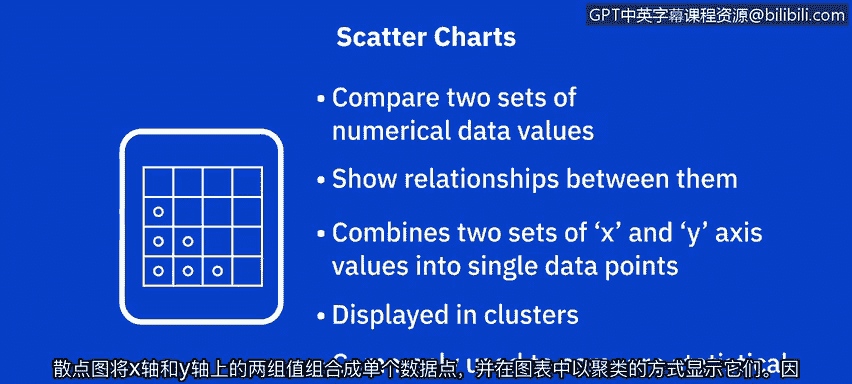
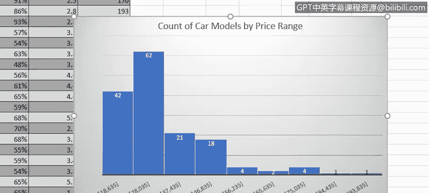

# 006：创建树状图、散点图与直方图 📊

在本节课中，我们将学习如何在Excel中创建三种高级图表：树状图、散点图和直方图。这些图表能帮助我们更深入地分析和展示数据关系与分布。请注意，本示例数据集中的价格和转售价值并非真实数据，仅用于教学演示。

## 创建树状图 🌳

上一节我们介绍了基础图表，本节中我们来看看如何创建树状图。树状图用于比较层级结构中的数值，并通过矩形大小展示各层级内的比例关系。它能在一个图形中有效展示大量数据，利用颜色和矩形面积来表示层级数据类别，这是其他图表类型难以实现的。

在“Car sales”工作簿的“TMap”工作表中，我们首先需要选择数据。

以下是创建树状图的步骤：

1.  选中“Model”（车型）和“Unit Sales”（单位销量）这两列非相邻数据。
2.  在“插入”选项卡的“图表”组中，选择“层次结构”类别下的“树状图”图表。
3.  此时会出现一个包含树状图的浮动图表区，它通过矩形显示了福特各车型销量占总销量的比例。
4.  双击图表标题文本框，将标题修改为“Unit Sales of Ford Car”。
5.  在“图表设计”选项卡中，可以从“图表样式”库中选择样式以自定义外观，例如选择“样式2”。

通过此树状图，我们可以清晰地看到F系列车型的销量占比最大，其次是Explorer和Touristus车型，它们占比相近，而Contour车型的销量占比最小。

## 创建散点图 📈

接下来，我们看看散点图。散点图用于比较两组数值数据，并显示它们之间的关系。它将X轴和Y轴上的两组值组合成单个数据点，并在图表中以簇的形式显示，因此有时也被称为XY图。它常用于比较统计、科学或工程数据值。

在“Car sales”工作簿的“Scatter”工作表中，我们首先需要选择数据。

以下是创建散点图的步骤：

1.  选中相邻的“Price”（价格）和“Year Resale Value”（年度转售价值）两列数据。
2.  在“插入”选项卡的“图表”组中，选择“XY（散点图）”类别下的“散点图”。
3.  生成的图表会比较所有制造商汽车的价格与其年度转售价值。
4.  双击图表标题文本框，将标题修改为“Comparing Price with Year Resale Value”。
5.  在“图表设计”选项卡中，选择“图表样式”库中的样式以自定义外观，例如选择“样式8”。
6.  为水平（X）轴和垂直（Y）轴添加坐标轴标题。将水平轴标题设为“Retail Price”，垂直轴标题设为“Year Resale Value”。

从这张散点图中可以看出，随着零售价格的上涨，零售价与年度转售价值之间的差额也趋于增大。总体而言，低价汽车在一年后的转售价值保持得比高价汽车更好。

## 创建直方图 📊

最后，我们来学习直方图。直方图是一种显示数据分布情况的图表，数据被分组到各个“箱”中。虽然直方图看起来可能像柱形图或条形图，但它们完全不同。条形图用于比较数据，而直方图用于展示数据的分布。

在“Car sales”工作簿的“Histogram”工作表中，我们首先需要选择数据。

以下是创建直方图的步骤：

1.  选中“Model”（车型）和“Price”（价格）这两列非相邻数据。
2.  在“插入”选项卡的“图表”组中，选择“统计图表”类别下的“直方图”。
3.  新的浮动图表区包含了我们的直方图，它显示了所有制造商汽车价格的频率分布。
4.  请注意，Excel会自动将不同的价格范围划分为9个大小相等的独立箱。例如，第一个箱包含价格在$9,235到$18,635之间的汽车，第二个箱包含价格在$18,635到$28,035之间的汽车，依此类推，直到最高价格范围$84,435到$93,835。
5.  双击图表标题文本框，将标题修改为“Count of Car Models by Price Range”。
6.  在“图表设计”选项卡中，选择“图表样式”库中的样式以自定义外观，例如选择“样式3”。此样式会在每个价格区间的矩形上直接显示计数值，而不是在Y轴上使用垂直刻度。

从这张直方图中，我们可以轻松看出，最大比例的车型处于$18,635到$28,035的价格区间，该区间有62个车型；其次是$9,235到$18,635的最便宜价格区间，有42个车型；而车型数量最少的区间是两个最贵的价格区间，每个箱中只有1个车型。

虽然创建直方图时Excel会自动选择箱的范围，但你可以根据需要调整箱的大小。

以下是自定义箱设置的步骤：

1.  双击图表中的水平轴，打开“设置坐标轴格式”窗格。
2.  在“坐标轴选项”部分，可以通过“箱宽度”或“箱数”等选项来调整显示方式。
    *   例如，更改“箱宽度”值后，图表中会显示15个箱，因为价格范围划分得更细了。此时，箱2和箱3的计数最高，分别为34和33，而箱14在此价格范围内没有车型。
    *   如果选择按“箱数”显示并指定数量（例如10个），直方图会相应更新，将价格范围划分为指定数量的箱。同样可以看到箱2在其价格区间内的车型比例最大。
3.  如果选择“自动”，直方图将恢复为我们开始时的格式。

本节课中，我们一起学习了如何在Excel中创建树状图、散点图和直方图。在下一个视频中，我们将探讨Excel中其他一些高级图表，例如填充地图图表和迷你图。