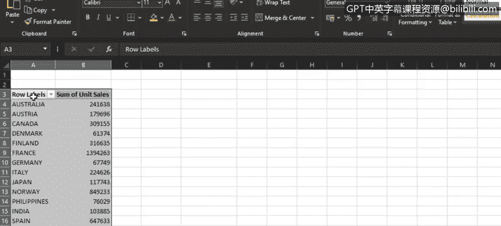
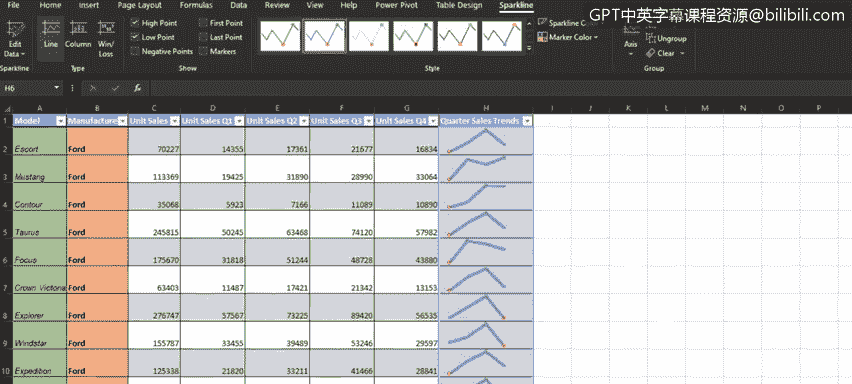

# 007：创建填充地图图表和迷你图 📊🗺️

在本节课中，我们将学习如何在Excel中创建两种高级图表：填充地图图表和迷你图。我们首先会介绍填充地图图表的创建与应用，然后讲解迷你图如何用于展示数据趋势，最后将简要概述Excel中其他几种可用的图表类型。

## 创建填充地图图表 🗺️

填充地图图表是一种用于比较数值并在地理区域间展示类别的图表。它特别适合包含国家、州或邮政编码等地理区域的数据。

上一节我们介绍了基础图表，本节中我们来看看如何利用地理数据创建填充地图图表。

在“Car sales”工作簿的“map chart”工作表中，我们首先需要准备数据。

以下是创建填充地图图表的步骤：

1.  从数据透视表中复制包含“销售国家”和“单位销售总和”的数据。
2.  将复制的数据粘贴到表格旁边。
3.  选中这些数据，在“插入”选项卡的“图表”组中，选择“地图”类别下的“填充地图”。
4.  一个新的浮动图表区域将出现，其中包含了我们的填充地图图表，它展示了不同销售国家的汽车单位销售总和。

我们可以通过双击图表标题文本框，将标题修改为“各国汽车销售单位总和”。

为了自定义填充地图的外观，我们可以更改图表样式。样式库中有多种样式可供选择，以适应您的偏好。

从这张填充地图可视化中，我们可以看到，代表较高销售量的深蓝色覆盖了美国区域。代表中等销售量的浅蓝色覆盖了加拿大、西欧和斯堪的纳维亚等地区。而代表最低销售量的近乎白色的区域，则主要覆盖了东欧、印度、日本和澳大利亚。

## 添加迷你图 📈

迷你图是放置在单个单元格内的小型图表，用于表示选定范围的数据。它们通常用于展示数据趋势，例如季节性增减、经济周期或股价波动，也可以用来突出显示最大值和最小值。

上一节我们创建了宏观的地图视图，本节中我们来看看如何在数据旁边添加微观的趋势视图——迷你图。

在“Car sales”工作簿的“Sp lines”工作表中，我们首先需要选中数据。

以下是创建迷你图的步骤：

1.  选中“单位销售 Q1”、“单位销售 Q2”、“单位销售 Q3”和“单位销售 Q4”这四列相邻的数据。
2.  在“插入”选项卡的“迷你图”组中，选择“折线图”类型。
3.  在弹出的对话框中，需要指定迷你图在工作表中的显示位置。您可以在“位置范围”框中键入单元格引用，或者更简单的方法是直接点击工作表中您希望放置迷你图的单元格，Excel会自动为您填充。
    *注意：Excel会通过添加美元符号（`$`）来使用绝对引用。*
4.  创建第一个迷你图后，可以将其向下拖动填充整列。

现在，我们看到了一个包含迷你图的列，它展示了福特各车型在一年四个季度中的单位销售趋势。

我们可以将包含迷你图的列标题命名为“季度销售趋势”，并调整列宽和行高，以便更清晰地显示迷你图。

为了增强迷你图的信息量，我们可以进行以下自定义设置：

*   **显示极值**：勾选“显示”组中的“高点”和“低点”，以突出显示每个趋势线中的最大值和最小值。
*   **更改样式**：在“样式”库中选择不同的样式，以自定义迷你图的外观。
*   **调整线宽**：在“样式”组中调整“迷你图颜色”和“标记颜色”下的线宽，使线条更加突出。

通过这些迷你图，我们可以看到福特Escort的销量在第一季度较低，在第二、三季度上升，然后在第四季度再次下降。我们还可以判断出，在大多数福特车型中，第三季度是一年中单位销售最好的季度，但也有少数例外，例如Mustang在第四季度，Focus车型在第二季度表现更好。

## Excel中的其他图表类型概览 📊

最后，让我们简要了解一下Excel中其他几种可用的图表类型，它们各自适用于不同的数据分析场景。

以下是几种特殊用途的图表简介：

*   **瀑布图**：用于显示一系列正值和负值的累积效应。适合表示流入和流出数据，如财务数据。
*   **漏斗图**：用于显示流程中逐渐缩小的阶段。适合展示比例逐渐减少的数据。
*   **股价图**：用于显示股票随时间变化的走势。最适合包含一系列股票价格值（如成交量、开盘价、最高价、最低价和收盘价）的数据。
*   **曲面图**：用于在三维曲面区域或二维等高线图中展示跨两个维度的趋势和数值。当类别和数据系列都是数值时最为适用。
*   **雷达图**：用于显示相对于中心点的数值，当类别不直接可比时最为适用。

## 总结

本节课中，我们一起学习了如何在Excel中创建填充地图图表和迷你图。填充地图帮助我们在地理维度上直观比较数据，而迷你图则能在单元格内简洁地展示数据趋势。我们还快速回顾了瀑布图、漏斗图等几种其他图表类型及其适用场景。掌握这些高级图表工具，能让你的数据分析和可视化报告更加专业和富有洞察力。