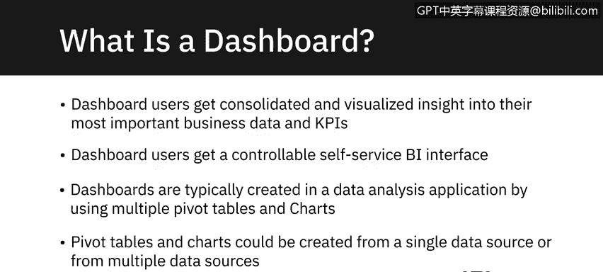
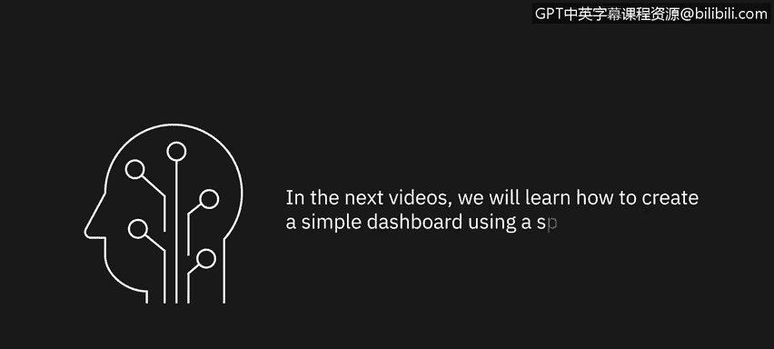

# 008：仪表板入门 📊

在本节课中，我们将对仪表板进行简要介绍，包括其定义、构成要素，以及为何它是数据分析师工具包中的重要组成部分和必备技能。

仪表板这一术语源自汽车工业。汽车设计师将最重要的仪表和其他显示信息，例如发动机油温、当前速度、当前转速、剩余油量等，集中在一个便于驾驶员查看和理解的图形化显示面板上。最初，这些显示是模拟式的，但现在大多数已数字化，并采用多种可视化形式，包括数字仪表和迷你图表。你可以将同样的理念应用于数据分析应用中的仪表板。

这类仪表板的设计者希望以图形化显示的形式，将关键业务信息集中在一处，以便查看者更容易理解。仪表板还可以更进一步，允许用户通过仪表板上提供的工具与之交互，并精确修改他们看到的信息。因此，仪表板用户不仅能获得其业务数据和关键绩效指标（**KPI**）的整合视图，还能通过使用筛选器，获得一个可控的自助式商业智能（**BI**）界面，从而精确控制所看到的信息。

仪表板通常在数据分析应用中创建，使用多个数据透视表、图表、地图图表和迷你图等可视化元素，以及切片器和时间线等筛选工具。这些数据透视表和图表可以基于单一数据源或多个数据源创建。

---

在数据分析应用中使用仪表板，可以获得以下益处：

*   **提供关键数据洞察**：它们能揭示数据中的模式和趋势。
*   **提供交互式用户体验**：允许用户筛选他们想查看的数据。
*   **动态更新**：随着源数据的变化而自动更新。
*   **提供集中统一的业务数据视图**：将信息整合在一个界面中。

仪表板在以下业务领域可以成为非常有用的工具：

*   财务预测与报告
*   项目管理
*   高管报告
*   人力资源
*   客户服务
*   服务台问题追踪
*   医疗健康监测
*   呼叫中心分析
*   社交媒体营销
*   以及更多其他领域

---

对于一名成长中的数据分析师而言，仪表板是必须添加到技能库中的关键技能，因为大多数雇主将其视为必备技能，而非锦上添花。如果你能展示出创建出色、壮观、交互性强且易于查看和使用的仪表板的技能，无论是在 Microsoft Excel 或 Google Sheets 等电子表格应用中，还是在使用更高级的数据分析和可视化应用（如 **Bokeh**、**Dash (Python)**、**R Shiny**、**Tableau** 或 **IBM Cognos Analytics**）时，这都将极大地助力你未来的数据分析师职业生涯。

---

本节课中，我们一起学习了仪表板的简要介绍，包括其定义、构成要素，以及为何它是数据分析师工具包中的重要组成部分和必备技能。在接下来的视频中，我们将学习如何使用电子表格应用创建一个简单的仪表板。