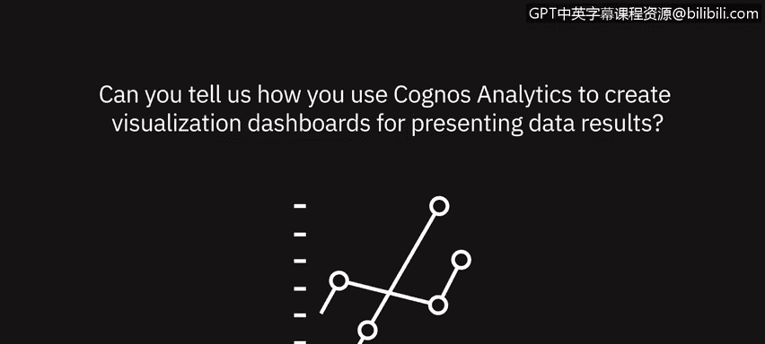

# 009：使用仪表板展示数据结果的访谈 📊

在本节课中，我们将学习数据专业人士如何利用仪表板来展示数据结果。课程分为两部分：首先，我们将听取多位专家分享仪表板在呈现数据时的核心价值与最佳实践；随后，我们将了解IBM Cognos Analytics工具如何帮助您创建出色的可视化仪表板。

---

## 第一部分：仪表板在展示数据结果中的作用

上一节我们介绍了课程的整体安排，本节中我们来听听数据专业人士对仪表板价值的看法。

仪表板能够过滤冗余信息，实时展示最重要的内容。您可以根据需要设计其外观。但需注意，避免在一个仪表板中塞入过多数据，导致信息过载。保持具体和简洁至关重要。

以下是仪表板的主要优势：

*   仪表板非常适合高管或业务负责人移动办公时使用。在移动设备上查看时，空间有限，仪表板能高效地在短时间内提供关键信息。
*   只要明确交付成果以及利益相关者希望看到和用于决策的关键内容，仪表板就能发挥巨大效用。

以易于受众理解的方式呈现信息非常重要。这能确保人们从您的工作中获得价值。数据分析师有时被认为只是“数字处理员”，部分原因在于我们没有很好地解释数字背后的含义。

因此，我们需要借助工具和方法来更好地传达信息：

*   使用带有图表的PPT演示文稿。
*   利用关键绩效指标，以不同方式分解信息并突出重点。
*   学会“察言观色”。如果在会议中大家因枯燥的数字而目光呆滞，您应该主动询问他们需要什么信息、什么对他们最重要。这样，在下次创建报告或仪表板时，您就能突出受众关心的内容。

我们始终需要展示自身价值，帮助他人理解并接受教育，从而提升他们的知识水平。这有助于消除人们对数字的恐惧。实现这一目标的方法不是堆砌数字使人不知所措，而是通过图形、仪表板、KPI等方式，将数据直观地、真实地呈现给他们。

在电子表格中，仪表板是行动的指示器。就像汽车仪表板一样，如果看到低油量指示灯，就意味着需要加油。

因此，电子表格中的仪表板也应如此简单明了：

*   它应该告诉人们需要立即关注什么，或者指示哪些方面需要改变（例如数据向错误方向上升或下降）。
*   不要在仪表板上放置“仅供参考”的信息，而应基于“需要知道”的原则，特别是当您希望推动行动时。

---

## 第二部分：使用Cognos Analytics创建可视化仪表板

上一节我们探讨了仪表板的核心价值，本节中我们来看看IBM Cognos Analytics工具如何帮助您创建出色的可视化仪表板。

IBM Cognos Analytics能从多个方面帮助您创建更好的可视化和仪表板。

首先，它提供了丰富的模板功能：

*   您可以从模板库中快速选择，并简单地将可视化组件拖放到指定位置，从而轻松、高效地创建视觉上引人注目的仪表板。

其次，工具内置了可视化推荐器：

*   如果您将几个字段拖放到画布上，系统会推荐一种可视化图表。如果您不喜欢最初的推荐，可以轻松地从推荐列表中选择其他可视化类型。

此外，该工具还开始融入人工智能能力：

*   系统可以为您自动生成完整的仪表板。您可以与AI助手对话、提出问题。当您聚焦到感兴趣的特定领域时，只需说“生成仪表板”，系统就会为您创建一个布局精美、可直接使用的仪表板，作为进一步讨论的起点。

以下是Cognos Analytics的一些突出功能：

1.  **高级分析能力**：无论是通过关键驱动因素分析等可视化功能，还是通过AI赋能的预测分析。
2.  **便捷的共享功能**：只需点击几下，即可分享您的可视化和仪表板。可以通过系统链接分享、通过电子邮件推送，甚至推送到Slack频道，以便在那里展开讨论。

---

## 总结

本节课中，我们一起学习了仪表板在数据展示中的关键作用，以及如何利用IBM Cognos Analytics工具高效创建可视化仪表板。核心要点包括：仪表板应简洁、聚焦于驱动行动的关键信息；优秀的可视化能有效传递洞察、消除理解障碍；而现代工具（如Cognos Analytics）通过模板、AI推荐和便捷共享等功能，极大地简化了创建出色仪表板的过程。