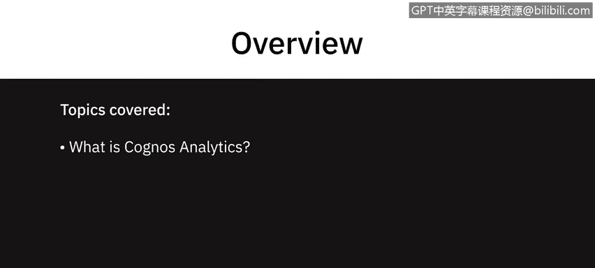
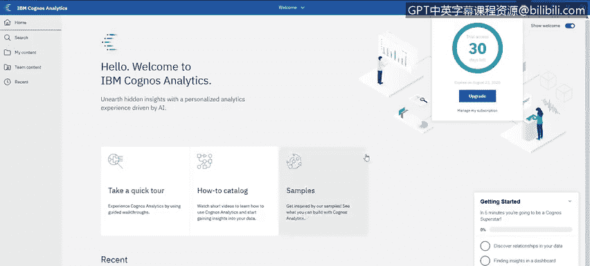

# 010：Cognos Analytics 介绍及注册指南 📊

在本节课中，我们将学习什么是 IBM Cognos Analytics，并掌握如何注册其试用版本。Cognos Analytics 是一个功能强大的商业智能工具，能够帮助用户进行数据建模、探索、可视化以及创建报告和仪表板。

---

## 什么是 Cognos Analytics？ 🤔

上一节我们明确了本课的学习目标，本节中我们来看看 Cognos Analytics 的核心定义。

Cognos Analytics 是一个多功能工具，允许用户在同一产品内执行模式一和模式二类型的分析。它包含多种不同的功能组件。

以下是其主要功能概述：
*   **数据建模**：具备对数据进行建模的能力。
*   **数据探索**：提供探索数据的功能。
*   **高级分析可视化**：能够创建引人注目且高级的分析可视化图表，例如关键驱动因素分析。
*   **自然语言生成**：可以基于您的数据展示自然语言生成的洞察。
*   **定制化报告**：能够创建针对特定用户的定制化报告，这可以通过过滤器或创建“突发报告”功能来实现。

此外，Cognos Analytics 还拥有创建出色仪表板的能力，这将是本课程的重点内容。

---

## 如何注册试用版？ 📝

了解了 Cognos Analytics 的基本功能后，接下来我们看看如何获取并使用它。

要注册试用版，请访问 IBM 官方提供的注册链接：**`IBM.biz/try_cognos`**。

访问该链接后，您将看到注册页面。如果您已经拥有账户，可以在此处直接登录，并且只需填写部分表单信息。如果您是新用户，则需要完整填写注册表单。

以下是注册时需要特别注意的一项：
*   **选择数据中心**：关键步骤是选择一个在您所在地区地理位置相近的数据中心。

填写并提交表单后，系统将为您启动试用环境。您可以直接在此工作流程中启动 Cognos Analytics。

成功进入系统后，您可以通过界面上的按钮管理订阅。或者，您也可以始终通过提供的特定 URL 重新访问该系统。

---

## 总结与预告 🎯

本节课中，我们一起学习了 IBM Cognos Analytics 的核心功能概述，并完成了试用账户的注册流程。您现在已经拥有了一个可以开始探索和实践的环境。

在下一个视频中，我们将带您初步了解如何导航和使用 Cognos Analytics，并重点介绍其仪表板功能。

