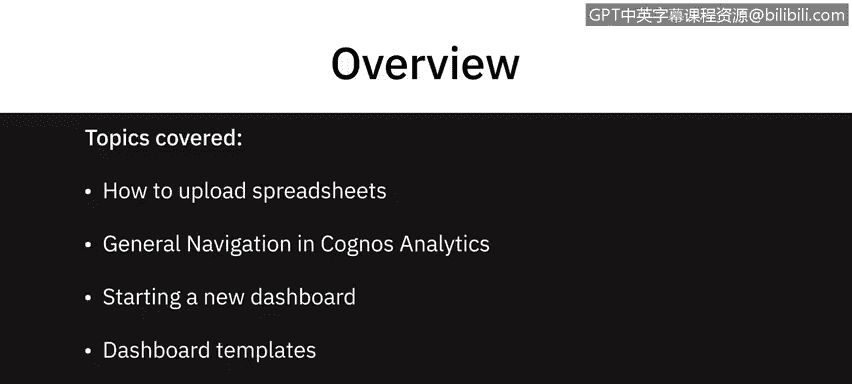
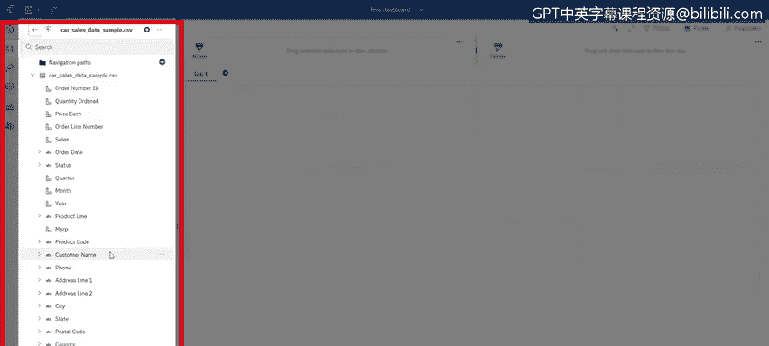
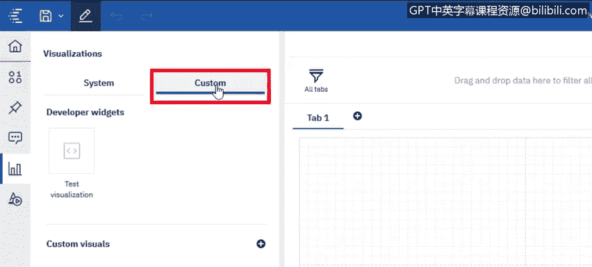

# 011：在Cognos Analytics中导航 🧭

在本节课中，我们将学习如何在Cognos Analytics中上传电子表格、进行基本导航、创建新的仪表板、使用仪表板模板，以及熟悉Cognos Analytics仪表板环境的主要界面元素。

---

## 上传数据文件 📤

上一节我们介绍了课程目标，本节中我们来看看如何将数据导入Cognos Analytics。Cognos可以连接多种数据库，但本课我们将从上传一个Excel文件开始。

上传文件主要有两种方式：
1.  点击界面上的“新建”按钮，选择“上传文件”，然后浏览并选择目标文件。
2.  将文件直接拖拽到主登录页面区域。

无论采用哪种方式，上传的内容都会默认存放在左侧导航栏的“我的内容”区域。之后，你可以将其移动到“团队内容”等共享区域。

文件上传过程中，系统会显示“正在分析”的状态。这个过程是为了整合数据，理解数据结构，以便在后续构建内容时为你提供更好的建议和决策支持。

---

## 创建与选择仪表板模板 🎨

上传数据后，我们要开始构建仪表板。第一步是选择一个模板。

以下是系统提供的部分模板，你可以根据想要实现的目标、所需可视化图表的数量和类型来选择。例如，我选择了一个包含四个小区域和一个较大区域的模板。

---

## 仪表板界面导航详解 🧭

进入仪表板编辑界面后，你会看到包含已上传文件列标题的面板。为了帮助你更好地在Cognos Analytics中操作，这里有几个关键的导航功能需要了解。

以下是界面中几个核心功能区域的介绍：

*   **可视化重用面板**：第二个图钉图标面板，允许你将不同的可视化组件固定，以便在系统内的其他仪表板中重复使用。
*   **智能助手**：我们将在后续视频中详细介绍，它允许你用自然语言提问，系统会据此告诉你一些关于数据的信息，并提供相应的可视化建议。
*   **可视化组件库**：这里展示了仪表板支持的所有可视化图表类型。如果现有图表无法满足你的需求，系统还支持上传你自己的自定义可视化组件。
*   **附加组件库**：最后一个区域提供了额外的控件，包括文本、图像、视频、超链接以及这里显示的各种形状。

---

## 总结 📝

本节课中，我们一起学习了Cognos Analytics的基本导航操作。我们掌握了如何上传Excel数据文件，了解了创建新仪表板时如何选择模板，并熟悉了仪表板编辑环境中的主要功能区域，包括数据面板、可视化重用、智能助手、图表库和附加组件库。

在下一个视频中，我们将更深入地探讨如何具体创建和定制仪表板。

