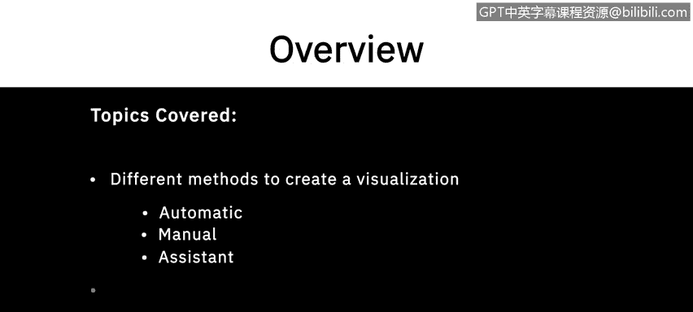
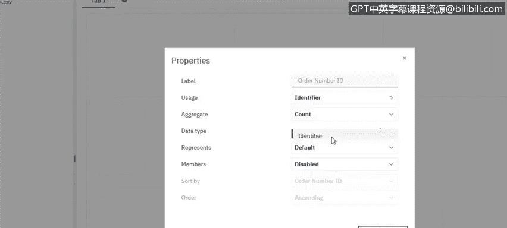
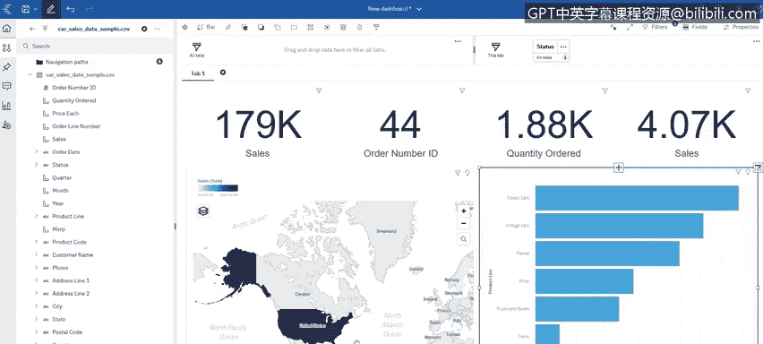

# 012：在Cognos中创建简单的仪表板 📊

在本节课中，我们将学习如何在Cognos Analytics中创建简单的仪表板。我们将介绍多种创建可视化的方法，并了解如何在仪表板内应用筛选器。

---

## 创建可视化图表

上一节我们介绍了数据准备，本节中我们来看看如何将数据转化为可视化图表。在Cognos Analytics中，有多种方法可以创建可视化。

### 方法一：拖放自动生成

首先，我们可以直接从左侧的数据树中将字段拖放到画布上。系统会根据字段的数据类型（如标识符或度量）自动推荐合适的可视化图表。

例如，将“订单ID”拖到画布上时，系统识别其为标识符，并自动生成了一个列表。我们可以手动将其更改为汇总卡片，以显示订单总数。

以下是创建关键绩效指标（KPI）的步骤：
1.  将“订单ID”拖到画布，并将其可视化类型从“列表”更改为“摘要”。
2.  将“订购数量”字段拖到画布，创建一个显示总订购量的KPI。
3.  将“销售额”字段拖到画布，在属性面板中将其汇总方式从“总和”改为“平均值”，以创建平均销售额KPI。

通过以上步骤，我们就拥有了几个用于监控和跟踪的KPI卡片。

### 方法二：手动选择图表类型

如果我们对想要的可视化类型有明确想法，可以先选择特定的图表，再为其配置数据。

例如，如果我们想查看全球各国的销售额分布，可以按以下步骤操作：
1.  从左侧的可视化面板中，将“地图”图表拖到画布上。
2.  从数据树中找到“国家”字段，将其拖放到地图的“位置”区域。
3.  将“销售额”字段拖放到地图的“颜色”区域。

这样，我们就创建了一个按国家显示销售额的热力地图。我们可以手动调整图表的大小和位置，画布会显示其占用的百分比。

每个可视化图表都有丰富的属性可以调整，如果需要对图表进行任何定制，查看属性面板通常能找到相应选项。

### 方法三：使用智能助手

最后，我们还可以借助智能助手来探索数据并生成可视化。

如果我们不确定从何开始，可以点击助手并选择“建议问题”，它会提供一些可能被忽略的数据洞察。

例如，我们可以询问助手：“哪个产品线的销售额最高？” 助手会生成相应的图表（如柱状图），并提供其他可选的图表类型。如果对生成的视图满意，只需将其从助手面板拖放到主画布上即可。

---

## 应用交互式筛选器 🎛️

我们创建的仪表板是交互式的。这意味着我们可以通过点击图表中的元素来筛选整个仪表板的数据视图。

例如，在“产品线销售额”柱状图中，如果点击“经典汽车”类别，仪表板上的所有其他图表（如KPI卡片和世界地图）都会立即更新，只显示与“经典汽车”相关的数据。

除了点击筛选，我们还可以通过拖放字段来创建筛选器。

具体操作如下：
1.  从数据树中，将想要作为筛选依据的字段（例如“订单状态”）拖到画布顶部的筛选器区域。
2.  在弹出的选项中，可以选择将此筛选器应用于“所有选项卡”或仅“当前选项卡”。
3.  在筛选器控件中，选择一个或多个值（例如“On Hold”）。

应用后，仪表板上的所有可视化图表都会更新，仅反映“状态为On Hold”的订单数据。例如，世界地图可能只会高亮显示存在此类订单的国家。

---

## 总结

本节课中，我们一起学习了在Cognos Analytics中创建简单仪表板的三种核心方法：**拖放自动生成**、**手动选择图表类型**以及**使用智能助手**。我们还掌握了如何通过点击图表或添加筛选器字段来实现仪表板的交互式数据筛选，从而从不同维度动态探索数据。

在下一个视频中，我们将深入探讨仪表板更多的高级功能。