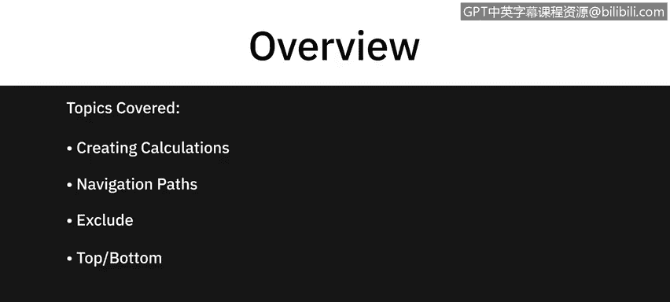
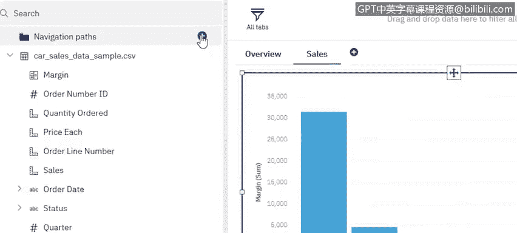
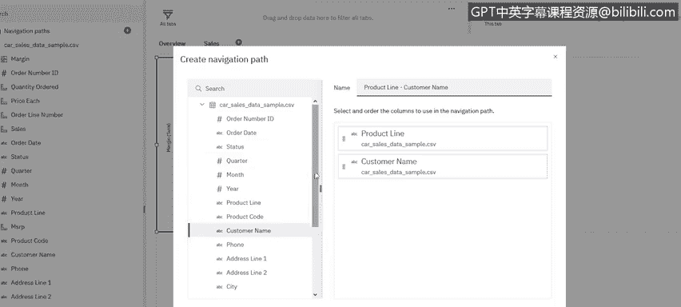
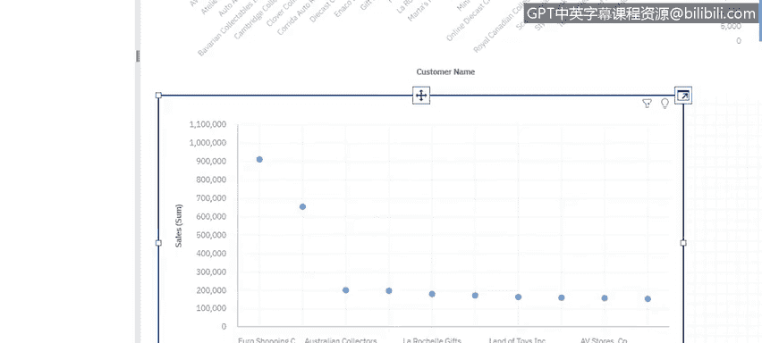

# 013：Cognos Analytics仪表板的高级功能 🚀

在本节课中，我们将学习Cognos Analytics仪表板的几项高级功能。这些功能能帮助你更深入地分析数据，并创建更具洞察力的可视化图表。我们将涵盖如何创建计算字段、利用导航路径、从可视化中排除特定数据，以及设置可视化中的“前N项”筛选。

---



## 创建计算字段 🔢

与Excel类似，Cognos仪表板也支持创建计算字段。这允许你基于现有数据生成新的指标。

以下是创建计算字段的步骤：
1.  在数据面板中，点击“创建计算”按钮。
2.  系统会列出多种函数选项供你选择，你也可以直接开始输入公式。
3.  输入时，系统会提供智能建议。

例如，我们想计算每件商品的利润率。我们可以创建一个名为“利润率”的计算字段，公式为：`[建议零售价] - [销售单价]`。

**公式示例：**
```
利润率 = [建议零售价] - [销售单价]
```

创建完成后，这个计算字段会像其他数据字段一样出现在面板中。我们可以将其与“产品线”字段一起使用，创建一个图表来查看各产品线的平均利润率。通过图表，我们可能发现“火车模型”产品线的利润率为负值。

---

## 利用导航路径进行钻取 🔍

上一节我们创建了计算字段来识别问题，本节我们来看看如何深入探究具体原因。导航路径功能允许你通过点击图表中的数据点，层层下钻查看更详细的数据。



设置导航路径的方法如下：
1.  在图表上右键点击，选择“创建导航路径”。
2.  在弹出的窗口中，按顺序选择你想要钻取的字段层级。例如，我们可以设置路径为：**产品线 -> 客户名称 -> 订单号**。



设置完成后，当你点击图表中的“火车模型”数据点时，就可以下钻查看购买该产品线的客户列表。进一步点击某个客户，则可以查看该客户的具体订单，从而精准定位导致负利润的订单。

---

## 从可视化中排除数据 🚫

有时，某些数据可能会掩盖整体趋势。例如，在分析各产品线不同订单状态的销售额时，“已发货”状态的订单数量可能远多于其他状态，导致图表难以清晰展示“待处理”、“已取消”等状态的情况。

这时，我们可以使用“排除”功能：
1.  在图表图例中，找到你想要排除的数据类别（如“已发货”）。
2.  右键点击该类别，选择“排除”。
3.  该类别数据会立即从当前可视化图表中隐藏，让你能更清晰地分析剩余数据。

---

## 设置“前N项”筛选 📊

当面对大量数据点（例如成百上千个客户）时，我们通常只关注最重要的部分。Cognos的“前N项”功能可以轻松实现这一点。

操作步骤如下：
1.  在一个包含大量类别的图表上（如按客户名称显示的销售额），右键点击数值轴或图例中的度量字段（如“销售额”）。
2.  选择“显示前N项”，通常默认显示前10项。
3.  图表会自动刷新，只显示销售额最高的前10位客户，帮助你快速聚焦于关键客户。

---

## 快速创建信息图 🎨

除了传统图表，Cognos还允许你快速创建生动的信息图，让数据展示更具吸引力。

创建方法非常简单：
1.  从左侧的“可视化”面板中，选择一个图形元素（例如一个“储蓄罐”图标）。
2.  将这个图形拖放到画布上。
3.  将你的数据字段（如“总销售额”）拖放到这个图形上。
4.  图形会自动根据数据值调整大小或填充比例，瞬间变成一个直观的信息图。

---



## 总结 📝

本节课中，我们一起学习了Cognos Analytics仪表板的四项高级功能：
1.  **创建计算字段**：通过自定义公式生成新的分析指标。
2.  **导航路径**：通过交互式钻取，深入分析数据细节。
3.  **数据排除**：隐藏特定数据以更清晰地观察整体模式。
4.  **前N项筛选**：快速聚焦于最重要的数据子集。
5.  **快速信息图**：使用图形元素直观展示关键数据。

掌握这些功能，将使你能够构建更强大、更灵活、更具洞察力的数据分析仪表板。