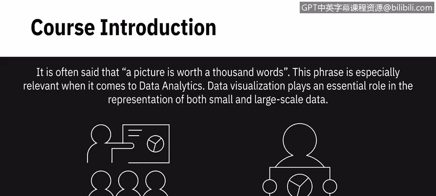
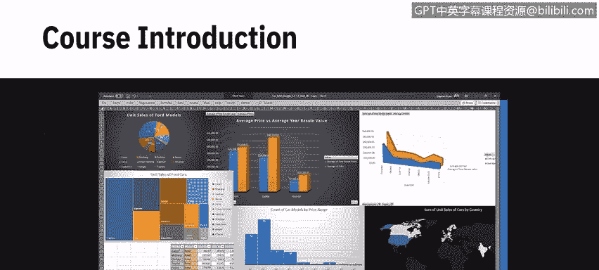
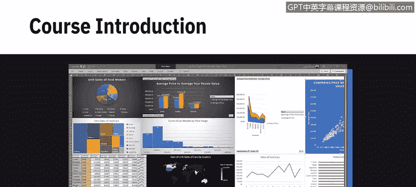
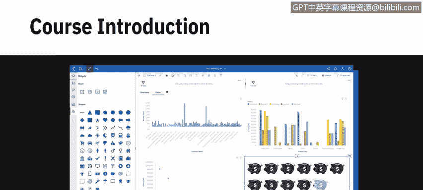
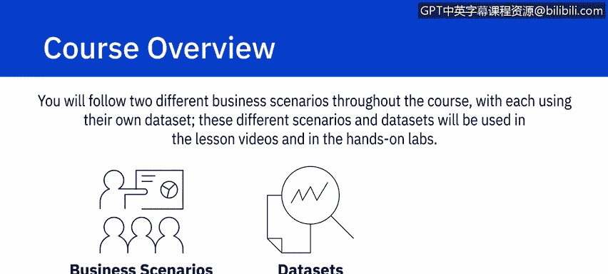
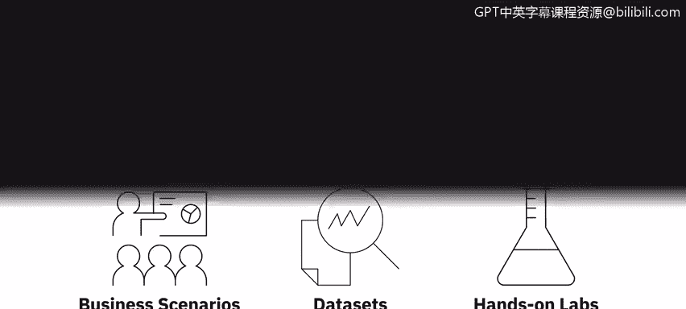
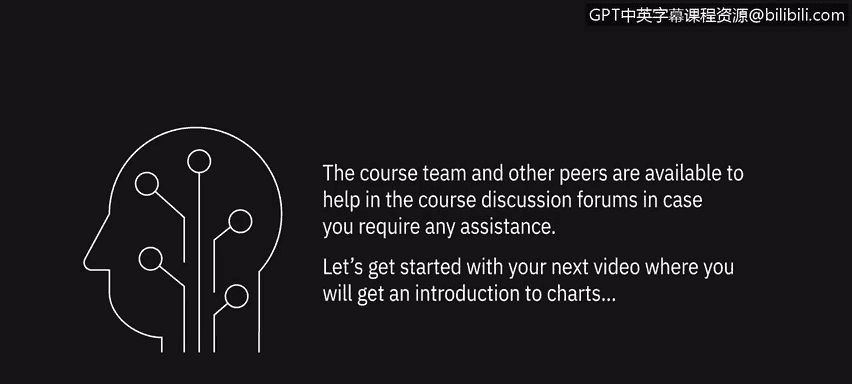

# 014：《用Excel、Cognos做数据可视化与看板》📊

## 课程概述

在本节课中，我们将要学习数据可视化的核心概念及其在数据分析中的重要性。课程将引导你掌握使用Excel和Cognos Analytics创建图表、图形和交互式看板的基本技能，这些都是成为数据分析师所需知识体系的重要组成部分。

常言道，一图胜千言。

这句话在数据分析领域尤为贴切。

数据可视化在呈现小规模和大规模数据方面都扮演着至关重要的角色。

这门来自IBM的课程旨在帮助你运用各种可视化技术，用数据讲述引人入胜的故事。

你将同时使用Excel和Cognos Analytics来学习创建不同类型绘图、图表和图形所需的基本技能，并构建交互式看板。

你不仅将学习使用Excel和Cognos Analytics的数据可视化技术，还将在整个课程中通过多个动手实验和作业进行实践。

## 课程模块详解

上一节我们概述了课程目标，本节中我们来看看具体的课程模块安排。

以下是本课程包含的四个核心模块：

1.  **模块 1：基础图表与数据故事**
    你将学习不同类型的图表，以及用于创建基础图表和数据透视表可视化的Excel函数。通过学习如何操作这些功能并创建可视化，你将开始理解图表在讲述数据驱动故事中所扮演的重要角色。

2.  **模块 2：高级图表与Excel看板基础**
    你将学习创建高级图表，并了解看板的基础知识以及如何在Excel中创建简单的看板。你还将学习看板如何用于提供关键绩效指标的实时快照。

3.  **模块 3：Cognos Analytics 入门与高级功能**
    你将学习关于Cognos Analytics的知识，包括如何注册、如何在其界面中导航，以及如何轻松创建出色的看板。你还将学习Cognos Analytics一些更高级的看板功能，并使你的看板具有交互性。

4.  **模块 4：综合实践与最终作业**
    在最后一个模块中，你将完成一个包含两部分的动手实践最终作业实验。该实验将指导你如何在Excel中创建可视化，以及如何在Cognos Analytics中创建可视化和看板。这需要你理解业务场景需求，然后创建可视化和看板来满足这些需求。

在整个课程中，你将跟随两个不同的业务场景，每个场景使用其独有的数据集。

这些不同的场景和数据集将用于课程视频和动手实验之中。

## 学习成果总结

本节课中我们一起学习了课程的整体框架。完成本课程后，你将能够达成以下目标：

以下是完成本课程后你将掌握的核心技能列表：

*   解释可视化在传达数据故事中的作用。
*   在Excel电子表格中创建基础图表、数据透视表图表和高级图表。
*   使用Excel创建简单的看板。
*   在云中配置Cognos Analytics实例。
*   在Cognos Analytics界面中导航并利用其丰富的可视化功能。
*   使用Cognos Analytics构建包含各种基础和高级可视化的交互式看板。
*   执行一些中级水平的数据可视化和看板创建任务，以应对业务场景。

如果你在学习过程中需要任何帮助，课程团队和其他同学可以在课程讨论区为你提供支持。

让我们开始观看下一个视频，在那里你将获得关于图表的介绍。

